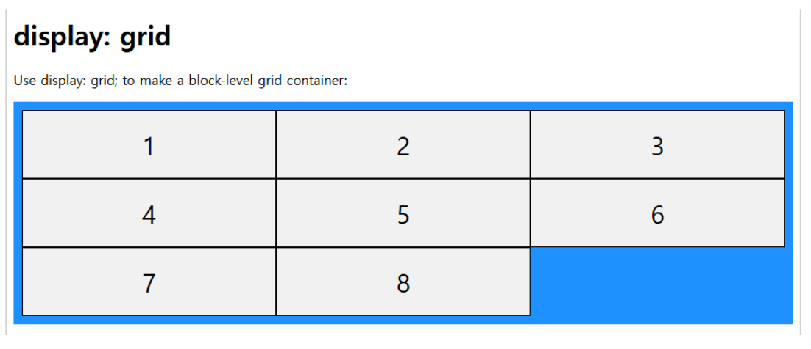

# CSS
## grid
### 1. CSS Grid의 기본 개념
```
● 컨테이너(container): display: grid를 적용하는 부모 요소.
● 아이템(item): Grid 컨테이너 내부에 있는 직계 자식 요소.
● 행(row)과 열(column): Grid는 행과 열로 구성되며, 각 셀에 아이템이 배치됩니다
```
### 2. CSS Grid 기본 설정
#### 컨테이너에 Grid 설정
```
Grid를 사용하려면 컨테이너에 display: grid를 설정해야 합니다.
```
```html
<!DOCTYPE html>
<html>

<head>
    <style>
        .grid-container {
            display: grid;
            /* Grid 레이아웃 활성화 */
            grid-template-columns: 1fr 1fr;
            /* 두 개의 열 */
            grid-template-rows: auto auto;
            /* 두 개의 행 */
            gap: 10px;
            /* 셀 간격 */
            background-color: dodgerblue;
        }

        .grid-container>div {
            background-color: #f1f1f1;
            text-align: center;
            padding: 20px 0;
            font-size: 30px;
        }
    </style>
</head>

<body>
    <div class="grid-container">
        <div>1</div>
        <div>2</div>
        <div>3</div>
        <div>4</div>
    </div>
</body>

</html>
```
```
grid-template-columns: 1fr 1fr; /* 두 개의 열 */
grid-template-rows: 1fr auto; /* 첫 번째 행은 남는 공간을 차지, 두 번째 행은 내용 크기만큼 */
grid와 inline-grid의 차이는 그리드에 내용을 꽉 채우고 싶으면 grid 공관을 만들고 싶으면 inline-grid를 사용하면된다.
```
#### 2fr의 의미
```
● fr(fraction, 비율 단위)은 사용 가능한 공간을 나누는 단위입니다.
● grid-template-rows: 2fr 1fr; 이라고 하면:
  ○ 첫 번째 행이 전체 가용 공간의 2배를 차지
  ○ 두 번째 행이 1배를 차지
```
### grid와 inline-grid
|속성|동작 방식|기본 크기|다른 요소와의 배치|사용 예|
|-|-|-|-|-|
|grid|블록 요소처럼 동작|부모 컨테이너의 너비를 채움|다른 블록 요소와 줄 바꿈|페이지의 주요 레이아웃 구조|
|inline-grid|인라인 요소처럼 동작|내부 콘텐츠 크기에 따라 크기 결정|다른 인라인 요소와 한 줄에 배치|텍스트, 버튼 등과 함께 사용|
#### grid

#### inline-grid

```
grid는 화면 전체를 차지하고 grid-inline은 내용 만큼만 차지 한다.
```
```html
<!DOCTYPE html>
<html>

<head>
    <style>
        .container {
            display: inline-grid;
            /* display: grid; 모양이 달라진다.*/
            grid-template-columns: auto auto auto;
            background-color: dodgerblue;
            padding: 10px;
        }

        .container>div {
            background-color: #f1f1f1;
            border: 1px solid black;
            padding: 20px;
            font-size: 30px;
            text-align: center;
        }
    </style>
</head>

<body>
    <h1>display: inline-grid</h1>
    <p>Use display: inline-grid; to make an inline grid container:</p>
    <div class="container">
        <div>1</div>
        <div>2</div>
        <div>3</div>
        <div>4</div>
        <div>5</div>
        <div>6</div>
        <div>7</div>
        <div>8</div>
    </div>
</body>

</html>
```
### 3. 간격 설정
```
● gap: 행과 열 간격을 동시에 설정.
● row-gap 및 column-gap: 각각 행과 열의 간격 설정.
```

```css
.grid-container {
    display: grid;
    grid-template-columns: 1fr 1fr;
    gap: 20px; /* 모든 간격 20px */
}
.container {
    display: grid;
    column-gap: 50px; /*컬럼 간격 50px*/
}
```

```html
<!DOCTYPE html>
<html>

<head>
    <style>
        .grid-container {
            display: grid;
            grid-template-columns: auto auto auto;
            gap: 10px;
            background-color: dodgerblue;
            padding: 10px;
        }

        .grid-container>div {
            background-color: #f1f1f1;
            text-align: center;
            padding: 20px 0;
            font-size: 30px;
        }

        .item1 {
            grid-column-start: 1;
            grid-column-end: 3;
        }
    </style>
</head>

<body>
    <h1>Grid Lines</h1>
    <div class="grid-container">
        <div class="item1">1</div>
        <div class="item2">2</div>
        <div class="item3">3</div>
        <div class="item4">4</div>
        <div class="item5">5</div>
        <div class="item6">6</div>
        <div class="item7">7</div>
        <div class="item8">8</div>
    </div>
    <p>You can refer to line numbers when placing grid items.</p>
</body>

</html>
```

```html
<!DOCTYPE html>
<html>

<head>
    <style>
        .grid-container {
            display: grid;
            grid-template-columns: auto auto auto;
            gap: 10px;
            background-color: dodgerblue;
            padding: 10px;
        }

        .grid-container>div {
            background-color: #f1f1f1;
            text-align: center;
            padding: 20px 0;
            font-size: 30px;
        }

        .item1 {
            grid-row-start: 1;
            grid-row-end: 3;
        }
    </style>
</head>

<body>
    <h1>Grid Lines</h1>
    <div class="grid-container">
        <div class="item1">1</div>
        <div class="item2">2</div>
        <div class="item3">3</div>
        <div class="item4">4</div>
        <div class="item5">5</div>
        <div class="item6">6</div>
        <div class="item7">7</div>
        <div class="item8">8</div>
    </div>
    <p>You can refer to line numbers when placing grid items.</p>
</body>

</html>
```
### 전체 코드 예제

```html
<!DOCTYPE html>
<html lang="en">

<head>
    <meta charset="UTF-8">
    <meta name="viewport" content="width=device-width, initial-scale=1.0">
    <title>CSS Grid Example</title>
    <style>
        .grid-container {
            display: grid;
            /* Grid 레이아웃 활성화 */
            grid-template-columns: 100px 100px 100px;
            /* 3개의 열, 각각 100px */
            grid-template-rows: 50px 50px 50px;
            /* 3개의 행, 각각 50px */
            gap: 10px;
            /* 셀 간격 */
            border: 2px solid black;
        }

        .grid-container div {
            background-color: lightblue;
            border: 1px solid blue;
            display: flex;
            align-items: center;
            justify-content: center;
        }

        .grid-container div:nth-child(1) {
            grid-column: 1 / 3;
            /* 1번째 열부터 2번째 열까지 차지 */
            grid-row: 1 / 2;
            /* 1번째 행만 차지 */
            background-color: lightcoral;
        }

        .grid-container div:nth-child(2) {
            grid-column: 3 / 4;
            /* 3번째 열만 차지 */
            grid-row: 1 / 3;
            /* 1번째 행부터 2번째 행까지 차지 */
            background-color: lightgreen;
        }

        .grid-container div:nth-child(3) {
            grid-column: 1 / 2;
            /* 1번째 열만 차지 */
            grid-row: 2 / 4;
            /* 2번째 행부터 3번째 행까지 차지 */
            background-color: lightyellow;
        }

        .grid-container div:nth-child(4) {
            grid-column: 2 / 4;
            /* 2번째 열부터 3번째 열까지 차지 */
            grid-row: 3 / 4;
            /* 3번째 행만 차지 */
            background-color: lightpink;
        }
    </style>
</head>

<body>
    <div class="grid-container">
        <div>1</div>
        <div>2</div>
        <div>3</div>
        <div>4</div>
    </div>
</body>

</html>
```
#### 첫 번째 아이템
```css
.grid-container div:nth-child(1) {
    grid-column: 1 / 3; /* 1번째 열부터 2번째 열까지 차지 */
    grid-row: 1 / 2; /* 1번째 행만 차지 */
    background-color: lightcoral;
}
```
```
● grid-column: 1 / 3: 첫 번째 열부터 세 번째 열 직전(두 번째 열)까지 차지.
● grid-row: 1 / 2: 첫 번째 행만 차지.
● 배경색을 lightcoral로 설정.
```
#### 두 번째 아이템
```css
.grid-container div:nth-child(2) {
    grid-column: 3 / 4; /* 3번째 열만 차지 */
    grid-row: 1 / 3; /* 1번째 행부터 2번째 행까지 차지 */
    background-color: lightgreen;
}
```
```
● grid-column: 3 / 4: 세 번째 열만 차지.
● grid-row: 1 / 3: 첫 번째 행부터 세 번째 행 직전(두 번째 행)까지 차지.
● 배경색을 lightgreen으로 설정.
```
#### 세 번째 아이템
```css
.grid-container div:nth-child(3) {
    grid-column: 1 / 2; /* 1번째 열만 차지 */
    grid-row: 2 / 4; /* 2번째 행부터 3번째 행까지 차지 */
    background-color: lightyellow;
}
```
```
● grid-column: 1 / 2: 첫 번째 열만 차지.
● grid-row: 2 / 4: 두 번째 행부터 네 번째 행 직전(세 번째 행)까지 차지.
● 배경색을 lightyellow로 설정.
```
#### 네 번째 아이템
```css
.grid-container div:nth-child(4) {
    grid-column: 2 / 4; /* 2번째 열부터 3번째 열까지 차지 */
    grid-row: 3 / 4; /* 3번째 행만 차지 */
    background-color: lightpink;
}
```
```
● grid-column: 2 / 4: 두 번째 열부터 네 번째 열 직전(세 번째 열)까지 차지.
● grid-row: 3 / 4: 세 번째 행만 차지.
● 배경색을 lightpink로 설정.
```
#### 결과
```
1. 아이템들이 지정된 행과 열에 맞게 배치됩니다.
2. Grid의 셀 간격, 크기 및 배경색으로 구분하기 쉬운 레이아웃이 생성됩니다.
```