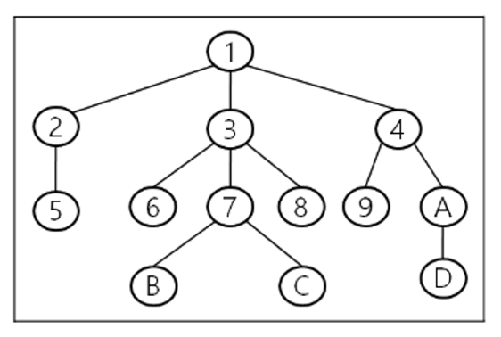

# CSS
## 가상 선택자 ([의사클래스](https://developer.mozilla.org/ko/docs/Web/CSS/Pseudo-classes))
|선택자|설명|
|-|-|
|[:link](https://developer.mozilla.org/ko/docs/Web/CSS/:link)|a태그의 상태 중 사용자가 한번도 방문하지 않은 상태를 의미한다.<br>`a:link {}`|
|[:visited](https://developer.mozilla.org/ko/docs/Web/CSS/:visited)|a태그에서 사용자가 이미 방문한 상태를 의미한다.<br>`a:visited {}`|
|[:active](https://developer.mozilla.org/ko/docs/Web/CSS/:active)|a태그에서 사용자가 태그를 클릭 하였을 때를 의미한다.<br>`a:active {}`|
|[:hover](https://developer.mozilla.org/ko/docs/Web/CSS/:hover)|태그에 마우스 포인터가 올라갔다 나오는 상태를 의미한다.<br>`a:hover {}`|
|[:focus](https://developer.mozilla.org/ko/docs/Web/CSS/:focus)|특정 태그가 선택되어 활성화 되었을 때를 의미한다.<br>`a:focus {}`|
|[:enabled](https://developer.mozilla.org/ko/docs/Web/CSS/:enabled)|form컨트롤 중에서 사용 가능한 컨트롤을 선택한다.<br>`input:enabled {}`|
|[:disabled](https://developer.mozilla.org/ko/docs/Web/CSS/:disabled)|form컨트롤 중에서 사용 불가능한 컨트롤을 선택한다.<br>`input:disabled {}`|
|[:checked](https://developer.mozilla.org/ko/docs/Web/CSS/:checked)|form컨트롤 중에서 선택된 컨트롤을 선택한다.<br>`input:checked {}`|
### 형제 기준 가상 선택자
|선택자|설명|
|-|-|
|[선택자:nth-child(n)](https://developer.mozilla.org/ko/docs/Web/CSS/:nth-child)|모든 형제 노드들을 기준으로 앞에서 부터 n번째 위치에 있는 element가 선택자와 일치하면 선택된다.|
|[선택자:nth-last-child(n)](https://developer.mozilla.org/en-US/docs/Web/CSS/:nth-last-child)|모든 형제 노드들을 기준으로 뒤에서 부터 n번째 위치에 있는 element가 선택자와 일치하면 선택된다.|
|[선택자:nth-of-type(n)](https://developer.mozilla.org/en-US/docs/Web/CSS/:nth-of-type)|선택자와 동일한 형제 노드들을 기준으로 앞에서 부터 n번째 위치에 있는 element가 선택자와 일치하면 선택된다.|
|[선택자:nth-last-of-type](https://developer.mozilla.org/en-US/docs/Web/CSS/:nth-last-of-type)|선택자와 동일한 형제 노드들을 기준으로 뒤에서부터 n번째 위치에 있는 element가 선택자와 일치하면 선택된다.
|[선택자:first-child](https://developer.mozilla.org/ko/docs/Web/CSS/:first-child)|모든 형제 노드들을 기준으로 첫번째 자식이 선택자와 일치하면 선택된다.|
|[선택자:last-child](https://developer.mozilla.org/ko/docs/Web/CSS/:last-child)|모든 형제 노드들을 기준으로 마지막 자식이 선택자와 일치하면 선택된다.|
|[선택자:first-of-type](https://developer.mozilla.org/ko/docs/Web/CSS/:first-of-type)|선택자와 동일한 형제 노드들을 기준으로 첫번째로 선택자와 일치하는 element가 선택된다.|
|[선택자:last-of-type](https://developer.mozilla.org/en-US/docs/Web/CSS/:last-of-type)|선택자와 동일한 형제 노드들을 기준으로 마지막으로 선택자와 일치하는 element가 선택된다.|
|[선택자:empty](https://developer.mozilla.org/en-US/docs/Web/CSS/:empty)|텍스트 및 공백을 포함하여 자식요소가 없는 선택자가 선택된다.|

## 트리 선택자 

```
트리 구조를 사용하여 원하는 노드를 찾을 수 있다.

트리는 노드와 간선으로 구성되어 있다.
노드는 동그라미를 의미하고
간선은 노드와 노드를 연결한 선을 의미한다.
트리는 노드와 노드를 간선을 통하여 이동하였을 때 이동할 수 있는 방법이 하나만 존재한다.

트리는 위 이미지와 같이 트리를 거꾸로 놓아둔 모양처럼 생겨서 트리라 부른다.
1번을 뿌리(root)라 하고
5,6,B,C,8,9,D를 리프(leaf)라 부른다.
뿌리를 기준으로 노드 아래쪽에 위치한 노드를 자손이라 하고,
바로 아래의  자손을 자식이라 한다.

노드 위쪽에 위치한 노드를 조상이라 하고,
바로 위에 위치한 노드를 부모라고 한다.
부모가 같은 자식을 형제라고 한다.
```
```
다음은 트리 구조를 사용하여 태그를 선택하는 방법이다.
확인해보자.
```
|선택자|방법|설명|
|-|-|-|
|[자손 선택자](#자손-선택자)([자손 결합자](https://developer.mozilla.org/ko/docs/Web/CSS/Descendant_combinator))|선택자1 선택자2|선택자1보다 아래쪽에 있는 모든 선택자2를 선택|
|[자식 선택자](#자식-선택자)([자식 결합자](https://developer.mozilla.org/ko/docs/Web/CSS/Child_combinator))|선택자1>선택자2|선택자1의 자식 중 선택자2를 선택|
|[그룹 선택자](#그룹-선택자)([선택자 목록](https://developer.mozilla.org/ko/docs/Web/CSS/Selector_list))|선택자1,선택자2|선택자1과 선택자2를 모두 선택|
|[단일 형제 선택자](#단일-형제-선택자)([인접 형제 결합자](https://developer.mozilla.org/ko자docs/Web/CSS/Next-sibling_combinator))|선택자1+선택자2|선택자1 바로 오른쪽에 있는 선택자2를 선택|
|[다중 형제 선택자](#다중-형제-선택자)([일반 형제 결합자](https://developer.mozilla.org/ko/docs/Web/CSS/Subsequent-sibling_combinator))|선택자1~선택자2|선택자1 오른쪽에 있는 선택자2 여러개를 선택|
### 자손 선택자
```html
<style>
/*
 * 자손 선택자 (자손 결합자)
 * https://developer.mozilla.org/ko/docs/Web/CSS/Descendant_combinator
 */
div p {
    background-color:yellow;
}
</style>
<div>
    선택안됨
    <h2>선택안됨</h2>
    <p>선택됨</p>
</div>
<div>
    선택안됨
    <span><p>선택됨</p></span>
</div>
<p>선택안됨</p>
```
### 자식 선택자
```html
<style>
/*
 * 자식 선택자 (자식 결합자)
 * https://developer.mozilla.org/ko/docs/Web/CSS/Child_combinator
 */
div > p {
    background-color: yellow;
}
</style>
<div>
    선택안됨
    <h2>선택안됨</h2>
    <p>선택됨</p>
</div>
<div>
    <span><p>선택안됨</p></span>
</div>
<p>선택안됨</p>
```
### 그룹 선택자
```html
<style>
/*
 * 그룹 선택자 (선택자 목록)
 * https://developer.mozilla.org/ko/docs/Web/CSS/Selector_list
 */
div, p {
    background-color: yellow;
}
</style>
<div>
    선택됨
    <h2>선택안됨</h2>
    <p>선택됨</p>
</div>
<div>
    선택됨
    <span><p>선택됨</p></span>
</div>
<p>선택됨</p>
```
### 단일 형제 선택자
```html
<style>
/*
 * 단일 형제 선택자 (인접 형제 결합자)
 * https://developer.mozilla.org/ko/docs/Web/CSS/Next-sibling_combinator
 */
div + p {
    background-color: yellow;
}
</style>
<div>
    <p>선택안됨</p>
    <p>선택안됨</p>
    <p>선택안됨</p>
</div>
<h2>선택안됨</h2>
<p>선택안됨</p>
<p>선택안됨</p>
<div>
    <p>선택안됨</p>
    <p>선택안됨</p>
    <div>선택안됨</div>
    <p>선택됨</p>
    <p>선택안됨</p>
</div>
<p>선택됨</p>
```
### 다중 형제 선택자
```html
<style>
/*
 * 다중 형제 선택자 (일반 형제 결합자)
 * https://developer.mozilla.org/ko/docs/Web/CSS/Subsequent-sibling_combinator
 */
div ~ p {
    background-color: yellow;
}
</style>
<div>
    <p>선택안됨</p>
    <h2>선택안됨</h2>
    <p>선택안됨</p>
</div>
<h2>선택안됨</h2>
<p>선택됨</p>
<p>선택됨</p>
<div>
    <p>선택안됨</p>
    <p>선택안됨</p>
    <div>선택됨</div>
    <p>선택됨</p>
    <p>선택됨</p>
</div>
<p>선택됨</p>
```