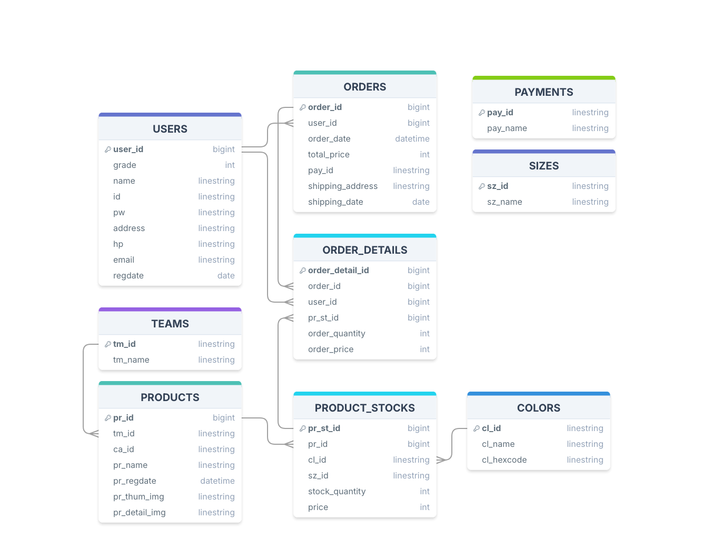

# SQL
## User Creation
### Windows
```powershell
sqlplus "/as sysdba"
```
### MacOS
```shell
sqlplus system/password@//localhost:1521
```
### Create User
```sql
--  c## 없이 접속하기 위한 설정
ALTER SESSION SET "_ORACLE_SCRIPT" = TRUE;
-- 신규계정 생성
CREATE USER JDBCPROJ IDENTIFIED BY 1234;
-- 권한부여
GRANT CONNECT, RESOURCE, DBA TO JDBCPROJ;
-- 테이블 데이터 권한부여
GRANT UNLIMITED TABLESPACE TO JDBCPROJ;
-- 접속확인
conn JDBCPROJ/1234;
```
## ERD

## Create Table
```sql
DROP TABLE ORDER_DETAILS;
DROP TABLE SHOPPING_CARTS;
DROP TABLE USERS;
DROP TABLE ORDERS;
DROP TABLE PRODUCT_STOCKS;
DROP TABLE USER_GRADES;

CREATE TABLE PRODUCT_STOCKS (
    product_stock_id NUMBER NOT NULL GENERATED ALWAYS AS IDENTITY PRIMARY KEY,
    product_id NUMBER NOT NULL,
    color_id NUMBER NOT NULL,
    size_id NUMBER NOT NULL,
    quantity NUMBER NOT NULL,
    price NUMBER NOT NULL
);
CREATE TABLE USER_GRADES (
    grade NUMBER NOT NULL GENERATED ALWAYS AS IDENTITY PRIMARY KEY,
    name VARCHAR(2000) NOT NULL
);
CREATE TABLE ORDERS (
    order_id NUMBER NOT NULL GENERATED ALWAYS AS IDENTITY PRIMARY KEY,
    order_date DATE NOT NULL
);
CREATE TABLE SHOPPING_CARTS (
    cart_id NUMBER NOT NULL GENERATED ALWAYS AS IDENTITY PRIMARY KEY,
    user_id NUMBER NOT NULL,
    product_stock_id NUMBER NOT NULL,
    order_quantity NUMBER NOT NULL,
    FOREIGN KEY (product_stock_id) REFERENCES PRODUCT_STOCKS (product_stock_id)
);
CREATE TABLE USERS (
    user_id NUMBER NOT NULL GENERATED ALWAYS AS IDENTITY PRIMARY KEY,
    user_pw NUMBER NOT NULL,
    grade NUMBER NOT NULL,
    address VARCHAR(2000) NOT NULL
    phone NUMBER NOT NULL,
    created_at DATE NOT NULL,
    FOREIGN KEY (grade) REFERENCES USER_GRADES (grade)
);
CREATE TABLE ORDER_DETAILS (
    order_detail_id NUMBER NOT NULL GENERATED ALWAYS AS IDENTITY PRIMARY KEY,
    order_id NUMBER NOT NULL,
    cart_id NUMBER NOT NULL,
    FOREIGN KEY (cart_id) REFERENCES SHOPPINGCARTS (cart_id),
    FOREIGN KEY (order_id) REFERENCES ORDERS (order_id)
);
```
