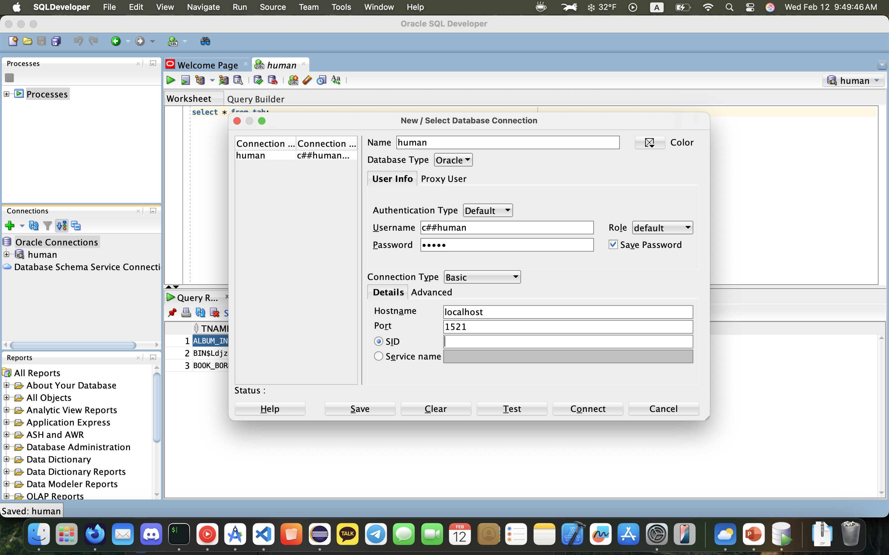

# SQL Developer 사용해보기

```
위 사진과 같이 SID를 지우고 연결을 해보았더니 연결이 되었다.
```
> IP 주소
- 컴퓨터나 네트워크 장치를 고유하게 식별하는 숫자
- IPv4 주소는 보통 "xxx.xxx.xxx.xxx" 형식으로 표현되며, 각 부분은 0부터 255까지의 숫자

> localhost
- 현재 사용 중인 컴퓨터를 가리키는 호스트 이름
> 포트
- 네트워크 연결에서 서비스를 식별하기 위한 숫자
```
IP로 상대방 컴퓨터까지 찾아오면 컴퓨터 안에 네트워크를 사용하는 여러 응용프로그램이 있다. 
여러 응용프로그램중 누구에게 데이터를 줄것인가를 포트로 결정할 수 있다.
택배 보내면 주소와 받을 사람 이름을 쓰는데 주소는 IP, 포트는 받을 사람 이름이라고 생각하면 된다.
```

# c##scott/tiger 계정 및 테이블 만들기
```
sqlplus system/oracle@//localhost:1521
create user c##scott identified by tiger;
grant connect,resource,dba to c##scott;
conn c##scott/tiger@//localhost:1521

-- 테이블 만들기
DROP TABLE EMP;--이미 해당 이름으로 만들어진 테이블이 있으면 지우고 만들려고 추가하자
CREATE TABLE EMP(
EMPNO NUMBER(4), ENAME VARCHAR2(10), JOB VARCHAR2(9),
MGR NUMBER(4), HIREDATE DATE, SAL NUMBER(7,2), COMM NUMBER(7,2),
DEPTNO NUMBER(2)
);
DROP TABLE DEPT;
CREATE TABLE DEPT(
DEPTNO NUMBER(2), DNAME VARCHAR2(14) , LOC VARCHAR2(13)
) ;
DROP TABLE BONUS;
CREATE TABLE BONUS(
ENAME VARCHAR2(10), JOB VARCHAR2(9), SAL NUMBER, COMM NUMBER
);
DROP TABLE SALGRADE;
CREATE TABLE SALGRADE(
GRADE NUMBER, LOSAL NUMBER, HISAL NUMBER
);

-- emp 테이블 데이터
INSERT INTO EMP VALUES(7369,'SMITH','CLERK',7902,to_date('1980:12:17 00:00:00','YYYY:MM:DD HH24:MI:SS'),800,NULL,20);
INSERT INTO EMP VALUES(7499,'ALLEN','SALESMAN',7698,to_date('1981:02:20 00:00:00','YYYY:MM:DD HH24:MI:SS'),1600,300,30);
INSERT INTO EMP VALUES(7521,'WARD','SALESMAN',7698,to_date('1981:02:22 00:00:00','YYYY:MM:DD HH24:MI:SS'),1250,500,30);
INSERT INTO EMP VALUES(7566,'JONES','MANAGER',7839,to_date('1981:04:02 00:00:00','YYYY:MM:DD HH24:MI:SS'),2975,NULL,20);
INSERT INTO EMP VALUES(7654,'MARTIN','SALESMAN',7698,to_date('1981:09:28 00:00:00','YYYY:MM:DD HH24:MI:SS'),1250,1400,30);
INSERT INTO EMP VALUES(7698,'BLAKE','MANAGER',7839,to_date('1981:05:01 00:00:00','YYYY:MM:DD HH24:MI:SS'),2850,NULL,30);
INSERT INTO EMP VALUES(7782,'CLARK','MANAGER',7839,to_date('1981:06:09 00:00:00','YYYY:MM:DD HH24:MI:SS'),2450,NULL,10);
INSERT INTO EMP VALUES(7788,'SCOTT','ANALYST',7566,to_date('1987:07:13 00:00:00','YYYY:MM:DD HH24:MI:SS'),3000,NULL,20);
INSERT INTO EMP VALUES(7839,'KING','PRESIDENT',NULL,to_date('1981:11:17 00:00:00','YYYY:MM:DD HH24:MI:SS'),5000,NULL,10);
INSERT INTO EMP VALUES(7844,'TURNER','SALESMAN',7698,to_date('1981:09:08 00:00:00','YYYY:MM:DD HH24:MI:SS'),1500,0,30);
INSERT INTO EMP VALUES(7876,'ADAMS','CLERK',7788,to_date('1987:07:13 00:00:00','YYYY:MM:DD HH24:MI:SS'),1100,NULL,20);
INSERT INTO EMP VALUES(7900,'JAMES','CLERK',7698,to_date('1981:12:03 00:00:00','YYYY:MM:DD HH24:MI:SS'),950,NULL,30);
INSERT INTO EMP VALUES(7902,'FORD','ANALYST',7566,to_date('1981:12:03 00:00:00','YYYY:MM:DD HH24:MI:SS'),3000,NULL,20);
INSERT INTO EMP VALUES(7934,'MILLER','CLERK',7782,to_date('1982:01:23 00:00:00','YYYY:MM:DD HH24:MI:SS'),1300,NULL,10);

-- dept 테이블 데이터
INSERT INTO DEPT VALUES(10,'ACCOUNTING','NEW YORK');
INSERT INTO DEPT VALUES(20,'REASEARCH','DALLAS');
INSERT INTO DEPT VALUES(30,'SALES','CHICAGO');
INSERT INTO DEPT VALUES(40,'OPERATIONS','BOSTON');

-- 연봉등급 테이블 데이터
INSERT INTO SALGRADE VALUES (1,700,1200);
INSERT INTO SALGRADE VALUES (2,1201,1400);
INSERT INTO SALGRADE VALUES (3,1401,2000);
INSERT INTO SALGRADE VALUES (4,2001,3000);
INSERT INTO SALGRADE VALUES (5,3001,9999);
```

> 데이터베이스 유저 지우기
```
DROP USER c##scoot CASCADE; -- c##scoot 유저를 지운다.
```

# HR DB
[NAVER CAFE](https://cafe.naver.com/thetjoeun99/714)
```
docker run -p 1521:1521 -e ORACLE_PASSWORD=oracle -v oracle-volume:/opt/oracle/oradata gvenzl/oracle-xe
sqlplus system/oracle@//localhost:1521 << EOF
alter session set "_ORACLE_SCRIPT"=true;
@$HOME/human_resources/hr_main.sql
human
users
temp
oracle
$HOME/log
localhost:1521/

EOF
```
