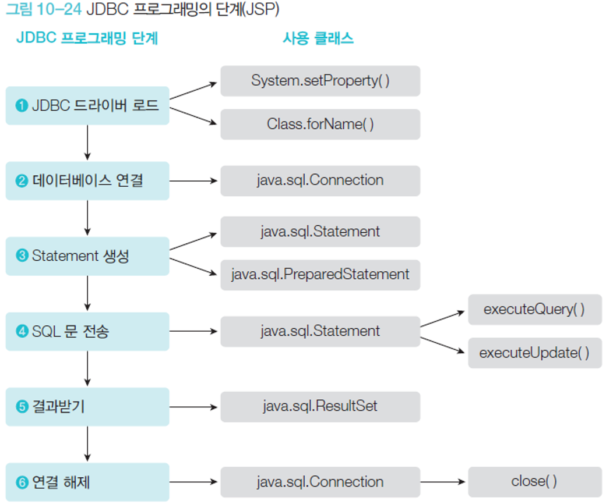

# jdbc 사용 해보기
```
export NLS_LANG=KOREAN_KOREA.AL32UTF8
colima start --arch x86_64 --memory 4
docker run -d -p 1521:1521 -e ORACLE_PASSWORD=oracle -v oracle-volume:/opt/oracle/oradata gvenzl/oracle-xe
sqlplus system/oracle@//localhost:1521
create user c##human identified by human;
grant connect,resource,dba to c##human;
conn c##human/human@//localhost:1521
```
```
-- 1. 다음 human table sql를 c##human/human 계정에 만들어 보자.
drop table human;
create table human(
name nvarchar2(30),
age number(3),
height number(7,3),
birthday date
);
insert into human(name,age,height,birthday) 
values('김수호',20,160.4,to_date('2005:05:05 02:25:50','YYYY:MM:DD HH24:MI:SS'));
insert into human(name,age,height,birthday) 
values('나수호',24,170.8,to_date('2000:10:15 12:25:10','YYYY:MM:DD HH24:MI:SS'));
insert into human(name,age,height,birthday) 
values('박수호',27,188.6,to_date('1995:12:04 13:45:14','YYYY:MM:DD HH24:MI:SS'));
commit; -- 반드시 커밋을 해야 한다.
select * from human;
```
```
package com.human.ex;
import java.sql.Connection;
import java.sql.DriverManager;
import java.sql.ResultSet;
import java.sql.SQLException;
import java.sql.Statement;
import java.time.LocalDateTime;
public class JdbcTest {
    public static void main(String[] args) {
        Connection conn=null;
        String sql=null;
        Statement st=null;
        ResultSet rs=null;
        try {
            Class.forName("oracle.jdbc.driver.OracleDriver");
            String url="jdbc:oracle:thin:@localhost:1521:";
            String user="c##human";
            String pw="human";
            conn=DriverManager.getConnection(url,user,pw);
            sql="select * from human";
            st=conn.createStatement();
            rs=st.executeQuery(sql);
            while(rs.next()) {
                String name =rs.getString("name");
                int age=rs.getInt("age");
                double height=rs.getDouble("height");
                LocalDateTime birthday=rs.getTimestamp("birthday").toLocalDateTime();
                System.out.println("name:"+rs.getString(1));
                System.out.println("age:"+rs.getInt(2));
                System.out.println("height:"+rs.getDouble(3));
                System.out.println("birth:"+rs.getTimestamp(4));
            }
        } catch (Exception e) {
            e.printStackTrace();
        }finally {
            try {
                if(rs!=null)rs.close();
                if(st!=null) st.close();
                if(conn!=null) conn.close();
            } catch (SQLException e) {
                e.printStackTrace();
            }
        }
    }
}
```

```
st.executeQuery() // 리턴값이 있다.
st.executeUpdate() // 리턴값이 없다.
```
