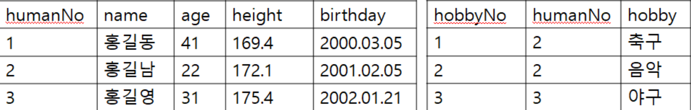
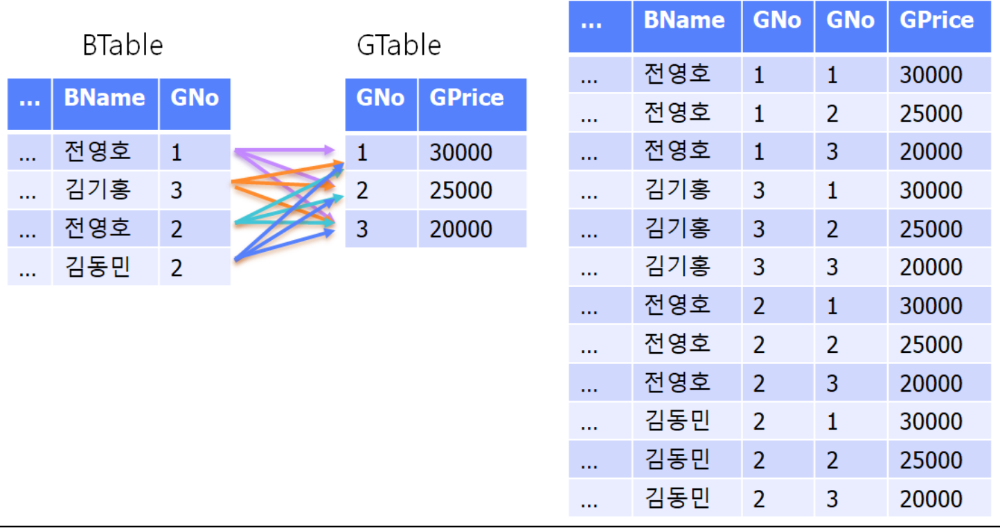
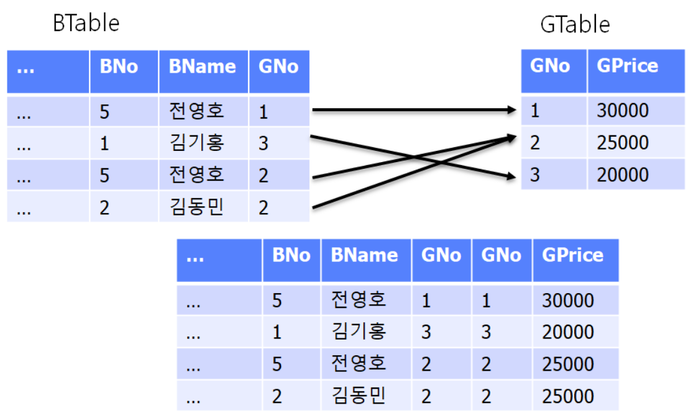
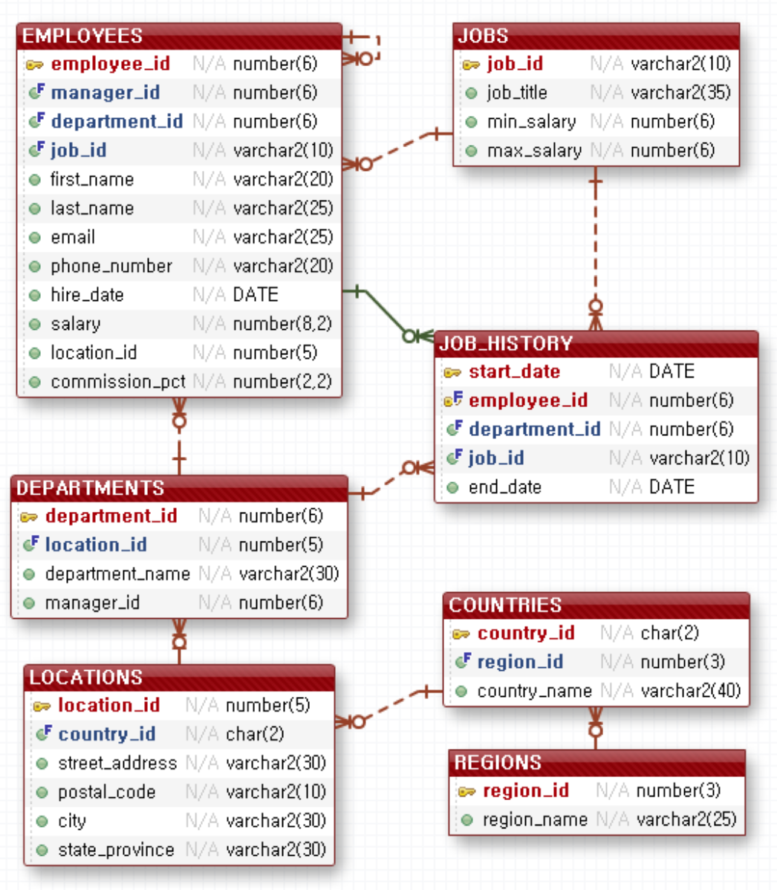

# 함수
- 문자열의 인덱스는 1부터 시작한다.

|함수|내용|예제|
|-|-|-|
|abs|절대값 출력|select -10,abs(-10) from dual;<br>-10과 절대값 10이 출력 된다.|
|floor|소수점 아래를 버림|select floor(11.123) from dual;<br>소수점을 잘라낸 11출력|
|round|소수점 반올림|select round(11.123),round(11.129,2) from dual;<br>11과 소수점 3째자리에서 반올림한 11.13 출력|
|trunc|소수점 버림|select trunc(123.129),trunc(123.129,-1) from dual;<br>123과 1의 자리에서 버림한 120 출력|
|mod|나머지 구하는 함수|select mod(7,2),mod(5,3) from dual;<br>7을 2로 나눈 나머지 1과 5를 3으로 나눈 나머지 2가 출력된다.|
|lower|소문자|select lower(‘HELLO world’) from dual;<br>hello world|
|upper|대문자|select upper('HELLO world') from dual;<br>HELLO WORLD|
|initcap|시작부분만 대문자|select initcap('HELLO world') from dual;<br>Hello World|
|concat|문자열 합치기|select concat(‘he’,’llo’) from dual;<br>두컬럼의 문자열을 합칠수 있다. hello 출력|
|substr|부분문자열 추출|select substr('안녕 HELLO world',2,4) from dual;<br>실행결과 녕 HE 이출력된다. 문자열에서 2번째 인덱스부터 4개의 문자가 출력된다.|
|length|문자열 개수|select length('안녕 HELLO world') from dual;<br>14가 출력 된다.|
|trim|양쪽공백 삭제|select trim(' hello ') from dual;<br>'hello'|
|ltrim|왼쪽공백 삭제|select ltrim(' hello ') from dual;<br>'hello '|
|rtrim|오른쪽공백 삭제|select rtrim(' hello ') from dual;<br>' hello'|
|instr|특정 문자열의 위치를 찾음|select instr(upper('wo 안녕 HELLO world'),'WO',1,2) from dual;<br>실행결과 12<br>첫번째 매개변수 문자열에서 두번째 문자열을 찾음,<br>세번재 매개변수는 첫번째 문자열에서 찾을 때 시작할 위치,<br>네번재 매개변수 찾은 동일한 문자열의 위치 중 해당번째 문자열의 위치 인덱스를 리턴|
|months\_between|두날짜의 월차를 구함|select months\_between(sysdate,sysdate+60) from dual;<br>결과값 -2.03225...|
|add\_months|월을 더함|select add\_months(sysdate,2) from dual;<br>결과값은 오늘 날짜보다 2달 증가한 값이 출력|
|next\_day|다음 요일의 날짜를 구함|select next\_day(sysdate,7) from dual;<br>1은 일요일 2는 월요일 7은 토요일에 해당하는 다음 날짜를 출력한다.|
|last\_day|달의 마지막일을 구함|ct last\_day(sysdate) from dual;<br>해당월의 마지막 일이 출력된다.|
|to\_char|문자로 변환|select to\_char(sysdate, ‘YYYY/MM:dd HH24:MI:SS’) from dual;<br>select to\_char(560, ‘$999,999.99’),to\_char(560, ‘$000,000.00’) from dual;<br>$560.00, $000,560.00<br>select to\_char(50) from dual;<br>웹에서 오라클 숫자 format으로 검색해 보자.|
|to\_date|날짜형으로 변환|select to_date(‘1977:05:06 14:05:06’,‘YYYY:MM:DD HH24:MI:SS’) from dual;<br>시간 포맷에서 대소문자 구분을 안함|
|to_number|숫자형으로 변환|select to_number(‘1’) from dual;|

# 그룹함수
|연산자|의미|
|-|-|
|sum|검색된 총합을 반환<br>select sum(salary) from employees;<br>전체 사원의 급여합|
|avg|검색된 평균을 반환<br>select avg(salary) from employees;<br>전체 사원의 급여 평균|
|count|검색된 총 개수를 반환<br>select count(salary) from employees;<br>급여를 받는 전체 사원의 수|
|max|검색 결과중 가장 큰수 반환<br>select max(salary) from employees;<br>전체 사원중 급여를 가장 많이 받는 사원의 급여|
|min|검색 결과중 가장 작은수 반환<br>select min(salary) from employees;<br>전체 사원중 급여를 가장 적게 받는 사원의 급여|
```
-- 일반 컬럼과 함께 사용하면 출력할 데이터 개수가 달라져서 출력에 문제가 발생하여 사용할 수 없다.
select sum(salary),salary from employees; –- 동작하지 않음
-- 그룹함수는 null 때문에 문제가 발생 할 수 있으니 항상 머리속에 null을 생각하며 사용하자.
select count(*),count(commission_pct) from employees; 
-- 위 쿼리를 실행시켜 보면 다른 결과 107 35가 나오는데 null를 카운팅하지 않아서 그렇다.
select count(*),count(nvl(commission_pct,0)) from employees;
-- nvl(commission_pct,0)은 commission_pct컬럼의 값이 null일때 값이 0으로 바뀌어서 셀 수 있게 되어 결과가 107 107이 된다.
select avg(commission_pct),avg(nvl(commission_pct,0)) from employees;
-- null 때문에 다른 결과가 나온다.
```

# group by 절
```
select department_id,sum(salary),count(*) from employees group by department_id;
```
```
DEPARTMENT_ID SUM(SALARY)   COUNT(*)
------------- ----------- ----------
           90       58000          3
           60       28800          5
          100       51608          6
           30       24900          6
           50      156400         45
           80      304500         34
                     7000          1
           10        4400          1
           20       19000          2
           40        6500          1
           70       10000          1
          110       20308          2

12 rows selected.
```

# having 절
```
SELECT department_id, AVG(salary) 
FROM employees 
GROUP BY department_id 
HAVING AVG(salary) >= 50000;
```
# sql 실행 순서
```
where절은 group by 이전에 필터 된다.
having절은 group by 이후에 필터 된다.
```
```
select 그룹 결과를 가지는 컬럼 --5
from 테이블명 --1
where 조건 --2
group by 컬럼 --3 where절에 위해서 걸러진 데이터만 그룹진다.
having 조건 --4
order by 컬럼 --6
```
```
select department_id,avg(salary),count(*) from employees group by department_id order by avg(salary);
```
```
DEPARTMENT_ID AVG(SALARY)   COUNT(*)
------------- ----------- ----------
	   50  3475.55556	  45
	   30	     4150	   6
	   10	     4400	   1
	   60	     5760	   5
	   40	     6500	   1
		        7000	   1
	  100  8601.33333	   6
	   80  8955.88235	  34
	   20	     9500	   2
	   70	    10000	   1
	  110	    10154	   2

DEPARTMENT_ID AVG(SALARY)   COUNT(*)
------------- ----------- ----------
	   90  19333.3333	   3
```
# join
- 두개의 테이블을 합치는 작업



```
drop table BTable;
create table BTable(
BNO number(10),
BKind nvarchar2(30),
BName nvarchar2(30),
BArea nvarchar2(30),
GNo number(10)
);
drop table GTable;
create table GTable(
GNo number(10),
GPrice number(10)
);
insert into BTable values (1,'왕포도','김명천','번동',1);
insert into BTable values (2,'청포도','김진우','홍일동',3);
insert into BTable values (3,'청포도','김태수','쌍문동',2);
insert into BTable values (4,'왕포도','박지민','상계동',2);
insert into BTable values (5,'청포도','김명천','평창동',1);
insert into BTable values (6,'왕포도','김진우','오류동',3);
insert into BTable values (7,'왕포도','김태수','대림동',1);
insert into BTable values (8,'청포도','김태수','청담동',2);
insert into GTable values (1,'30000');
insert into GTable values (2,'25000');
insert into GTable values (3,'20000');
commit;
select * from BTable;
select * from GTable;
```
```
-- PK(Primary Key) 테이블에 들어 있는 데이터를 식별하기 위한 컬럼 위의 컬럼 중 BNo 등을 가리킴
-- FK(Falling Key) 다른 테이블의 PK컬럼에 들어있는 값중 하나의 값을 가지는 컬럼
```
```
-- 두 테이블에 관계가 있을때 테이블 만들고 데이터 넣고 삭제하는 순서
-- 1. FK가 없는 테이블을 먼저 만들어야 한다.
-- 2. FK가 있는 테이블을 만든다.
-- 3. FK가 없는 테이블에 먼저 데이터를 넣는다.
-- 4. FK가 있는 테이블에 데이터를 넣는다.
-- 5. FK가 있는 테이블의 데이터를 지운다.
-- 6. FK가 없는 테이블의 데이터를 지운다.
select * from btable;
select * from gtable;

select * from btable,gtable;
select * from btable,gtable where btable.gno = gtable.gno;
select btable.*,gtable.gprice from btable,gtable where btable.gno = gtable.gno;
```
1. 크로스 조인
```
cross Join( 크로스 조인)은 두 테이블이 가지고 있는 모든 데이터를 합쳐서 만들 수 있는 모든 데이터를 만들어 보여주는 작업이다. 
다음은 2개의 테이블을 크로스 조인하는 예제이다.
select * from BTable,Gtable;
```

```
왼쪽 테이블을 BTable 오른쪽 테이블을 GTable이라고 할때 합치는 방법은 상위 처럼
BTable 각각의 모든 데이터를 GTable 각각의 모든 데이터와 일일이 하나씩 합친 모든 결과를 얻는 방법이다. 
크로스 조인이라 한다. 
상위 이미지를 확인해 보자.
select * from BTable,Gtable; 이렇게 하면 두 테이블에서 데이터를 가지고 합칠 수 있는 모든 데이터와 컬럼이 출력 된다.
두 테이블을 합친 결과 데이터는 두 테이블에 있는 모든 컬럼을 하나의 데이터로 표현할 수 있어야 하기 때문에 왼쪽 테이블의 컬럼수가 5개 이고, 
오른쪽 테이블의 컬럼수가 2개라면 양쪽 테이블의 컬럼수를 더한 7이 되어야 한다.
두 테이블의 모든 데이터를 합쳐 나올 수 있는 모든 데이터는 
왼쪽 테이블에 데이터가 4개 
오른쪽 테이블 3개가 있다면 
실행 결과 총 데이터 수는 12개가 된다. 
```
2. 동등조인
```
equi Join(이퀴 조인) 특정 컬럼 값이 일치되는 데이터(row)만 합쳐서 출력하는 방법이다. 
동등조인 이라고도 한다.
```
```
크로스 조인은 두 테이블을 가지고 만들수 있는 모든 데이터를 만들어 보여주지만 이퀴조인은 크로스 조인으로 만들어진 모든 데이터중 특정 컬럼이 같은 데이터만 보여준다.
다음 이미지에서 크로스 조인결과 데이터중에서 GNO컬럼 2개를 확인해 값이 같은 데이터만 출력 하였다. 
두 테이블을 gno 컬럼으로 equi join한 결과이다.
```

```
select * from BTable,GTable; -- 과 같이 크로스 조인하여 만들수 있는 모든 데이터를 만든 다음 
where BTable.GNo = GTable.Gno; -- 과 같이 두 테이블에서 특정 컬럼이 같은 데이터만 뽑아서 출력하면 된다. 
select * from BTable,GTable where BTable.GNo = GTable.Gno;
```
# JoinDto.java
```
package com.the.dto;

import java.util.Objects;

public class JoinDto {
	private int bno;
	private String bkind;
	private String bname;
	private String barea;
	private int gno;
	private int gprice;
	@Override
	public String toString() {
		return "JoinDto [bno=" + bno + ", bkind=" + bkind + ", bname=" + bname + ", barea=" + barea + ", gno=" + gno
				+ ", gprice=" + gprice + "]";
	}
	@Override
	public int hashCode() {
		return Objects.hash(barea, bkind, bname, bno, gno, gprice);
	}
	@Override
	public boolean equals(Object obj) {
		if (this == obj)
			return true;
		if (obj == null)
			return false;
		if (getClass() != obj.getClass())
			return false;
		JoinDto other = (JoinDto) obj;
		return Objects.equals(barea, other.barea) && Objects.equals(bkind, other.bkind)
				&& Objects.equals(bname, other.bname) && bno == other.bno && gno == other.gno && gprice == other.gprice;
	}
	public int getBno() {
		return bno;
	}
	public void setBno(int bno) {
		this.bno = bno;
	}
	public String getBkind() {
		return bkind;
	}
	public void setBkind(String bkind) {
		this.bkind = bkind;
	}
	public String getBname() {
		return bname;
	}
	public void setBname(String bname) {
		this.bname = bname;
	}
	public String getBarea() {
		return barea;
	}
	public void setBarea(String barea) {
		this.barea = barea;
	}
	public int getGno() {
		return gno;
	}
	public void setGno(int gno) {
		this.gno = gno;
	}
	public int getGprice() {
		return gprice;
	}
	public void setGprice(int gprice) {
		this.gprice = gprice;
	}
	public JoinDto(int bno, String bkind, String bname, String barea, int gno, int gprice) {
		super();
		this.bno = bno;
		this.bkind = bkind;
		this.bname = bname;
		this.barea = barea;
		this.gno = gno;
		this.gprice = gprice;
	}
}
```
# JoinDao.java
```
package com.the.dao;

import java.sql.ResultSet;
import java.util.ArrayList;

import com.the.dto.JoinDto;
import com.the.util.DBConn;

public class JoinDao {
	public ArrayList<JoinDto> select() {
		DBConn.getInstance();
		ArrayList<JoinDto> result = new ArrayList<JoinDto>();
		String sql = "select * from btable,gtable where btable.gno = gtable.gno";
		ResultSet rs = DBConn.statementQuery(sql);
		try {
			while (rs.next()) {
				result.add(
					new JoinDto(
						rs.getInt("bno"), 
						rs.getString("bkind"), 
						rs.getString("bname"),
						rs.getString("barea"),
						rs.getInt("gno"),
						rs.getInt("gprice")
					)
				);
			}
		} catch (Exception e) {
			e.printStackTrace();
		} finally {
			DBConn.dbClose();
		}
		return result;
	}
}
```

