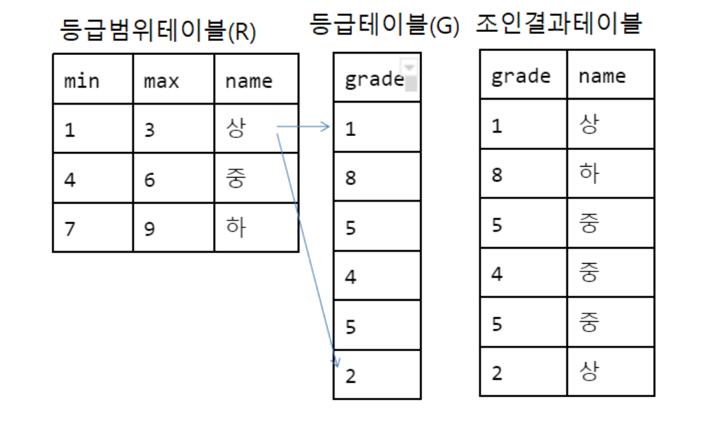

```
-- department_id,location_id,department_name,city 를 출력 해보자
select departments.department_id,departments.location_id,departments.department_name,locations.city 
from departments,locations 
where departments.location_id = locations.location_id;
```
```
-- group by
select * from employees;
select * from employees where salary is null;
select avg(salary) from employees;
select avg(salary) from employees;
select * from employees order by department_id;

select department_id,round(avg(salary)) from employees group by department_id order by department_id;

-- 매니저가 같은 사원들의 총 급여, 매니저가 관리하는 사원 수
select manager_id,sum(salary),count(employee_id) from employees group by manager_id;
```
```
-- 급여가 3000 이상의 사원 중에서 job_id가 같은 사원의 급여 총합이 20000 이상인
-- job_id와 급여의 총합을 job_id 알파벳 순으로 출력
select job_id,sum(salary),count(salary) 
from employees 
where salary >= 3000 
group by job_id 
having sum(salary) >= 20000
order by job_id asc;
```
```
-- self join
select * from employees;
select employee_id,first_name,manager_id from employees 사원 order by employee_id;
select employee_id,first_name from employees 관리자 order by employee_id;

select 사원.employee_id,사원.first_name,관리자.employee_id,관리자.first_name
from employees 사원,employees 관리자 
where 사원.manager_id=관리자.employee_id 
order by 관리자.employee_id;
```
4. outer join
```
outer join(외부 조인)
두 테이블을 이퀴 조인할때 선택된 두 컬럼에 일치하는 값이 들어 있지 않다면 이퀴 조인 결과 매칭되는 데이터가 없으므로 출력 되지 않는다. 
만약 한쪽 테이블에만 있는 데이터를 사라지지 않고 출력을 원한다면 없는쪽 테이블 컬럼의 데이터에 null를 넣어 출력해야 하는데 이렇게 이퀴조인시 일치하는 데이터가 없을때 
한쪽 컬럼에 null를 넣어 출력하는 방법을 외부 조인이라고 한다
```
```
select count(*) from employees;
-- 107

select count(*) from employees,departments
where employees.department_id = departments.department_id;
-- 106
```
```
-- outer join

-- left outer join
-- 178번 부서가 없는 사원도 부서에 null을 채워서 출력
select * from employees,departments
where employees.department_id = departments.department_id(+);
select count(*) from employees,departments
where employees.department_id = departments.department_id(+);
-- 107

select distinct departments.department_id from employees,departments
where employees.department_id = departments.department_id(+); -- 11

select * from departments; -- 27

-- right outer join
select count(*) from employees,departments
where employees.department_id(+) = departments.department_id; -- 122 (27-11=16개 부서가 사원이 없음)
-- 122 = 106 + 16
```
```
-- outer join

-- ansi 표준
-- full outer join
select count(*) from employees full outer join departments
on employees.department_id = departments.department_id; -- 123

-- left outer join
select count(*) from employees left outer join departments
on employees.department_id = departments.department_id;

-- right outer join
select count(*) from employees right outer join departments
on employees.department_id = departments.department_id;
```

- sub쿼리
```
sub 쿼리는 다음 sql처럼 sql안에 sql문이 중복되어 존재 하는 것을 의미한다.
안쪽 소괄호로 묶인 sql이 실행된 결과를 가지고 바깥쪽 sql를 실행한다.
대륙아이디가 2인 지역도시 정보를 출력해 보자.
select * from locations where country_id in (
select country_id from countries where region_id=2
);
2번 대륙에 존재하는 도시를 알고 싶어서 안쪽 sql에서는 2번 대륙에 존재하는 나라 정보를 바깥쪽 sql에서는 안쪽에서 검색된 나라에 존재하는 도시정보를 출력하였다.
```
```
select country_id from countries where region_id=2;
-- AR
-- BR
-- CA
-- MX
-- US
select * from locations where country_id='AR' or country_id='BR';
select * from locations where country_id in ('AR','BR','CA','MX','US');
select * from locations where country_id in (
select country_id from countries where region_id=2
);
-- region_id가 2인 대륙에 존재하는 모든 도시를 출력
select * from regions;

-- 'Asia' 대륙의 모든 도시 출력
select region_id from regions where region_name='Asia';
select city from locations where country_id in (
select country_id from countries where region_id in (
select region_id from regions where region_name='Asia'
)
);
```
```
- 지역 아이디가 1700인 부서들에서 일하지 않는 사원 정보를 출력해 보자.
SELECT * FROM employees
WHERE department_id NOT IN (
SELECT department_id FROM departments WHERE location_id = 1700
)
ORDER BY employee_id;
이렇게 sql안에 sql를 정의 해서 원하는 결과를 얻는 것을 서브 쿼리라고 한다.
- 최대급여를 받는 사원의 정보를 출력해 보자.
select * from employees where salary = (
select max(salary) from employees
);
- 평균보다 급여를 많이 받는 사원의 정보를 출력해 보자.
select * from employees where salary > (
select avg(salary) from employees
);
```
# exists 함수
```
select * from employees where exists(
select * from departments where department_id=10
)
-- 10 부서가 존재하면 20번 부서의 사원을 출력해보자.
select * from employees 
where department_id=20 
and exists(
select * from departments where department_id=10
);
-- 111부서가 존재하지 않으면 20번 부서의 사원을 출력해보자.
select * femployees 
where department_id = 20 and not exists(
select * from departments where department_id=111
);
```
# any, some, all 사용법
```
any,some은 여러 비교 대상중 하나 이상이 일치하면 결과를 출력한다.
any와 some은 같아서 둘중 하나를 사용하면 된다.
all은 여러 비교 대상중 모두가 일치하면 결과를 출력한다.
```
```
select salary from employees where salary<= any(
30,90,170
);
```
# Non-equi join
```
Non-equi join`(범위 조인)는 where절에 범위를 사용하여 테이블을 조인하는 방법이다.
```

```
select G.grade,R.name from R,G
where G.grade>=R.min and G.grade<=R.max;
```
```
select * from jobs;
select * from jobs where job_id in('AD_PRES','SA_MAN','IT_PROG') order by min_salary;
-- 봉급이 4000 이상인 사원중 사원의 급여가 'AD_PRES','SA_MAN','IT_PROG' 직종중 어떤 직종 범위인지 출력해보자.
select employees.employee_id,employees.salary,j.* ,j.job_id as job_range
from employees, (
select * from jobs where job_id in('AD_PRES','SA_MAN','IT_PROG') order by min_salary
) j 
where j.min_salary <= employees.salary and j.max_salary > employees.salary
order by employees.employee_id;

```
