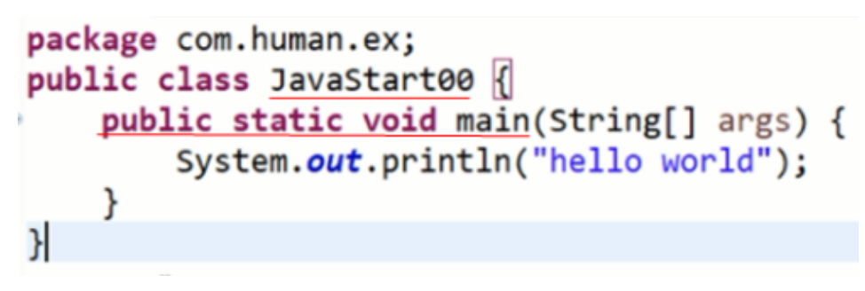

#  문제풀이 

1. 작성한 자바코드의 확장자는 무엇인가? 
```
.java
```

2. 컴파일이란 무엇인가? 
```
자바 코드를 바이트코드로 변환 하는 것
```

3. 자바파일을 컴파일할때 사용하는 파일은 무엇인가? 
```
javac.exe
```

4. 컴파일된 파일에 확장자는 무엇인가? 
```
.class
```

5. 컴파일된 파일을 실행 시킬수 있는 가상머신 화일 이름은 무엇인가? 
```
java.exe
```

6. 자바프로그램을 구현하여 실행하는 방법은 무엇인가? 
```
javac.exe와 java.exe 를 활용한다.
```

7. 패키지의 의미를 설명하시오. 
```
폴더
```

8. 자바코드는 반드시 어디 안에 기술하여야 하는가? 
```
.java로 끝나는 파일 안에 
```

9. 프로그램의 시작위치와 끝나는 위치를 설명해 보자. 
```
시작위치: public static void main(String[] args){
끝나는 위치: }
```

10. 

위쪽 이미지의 소스 코드 파일의 위치와 이름은 src폴더 기준으로 어떻게 되는가? 
```
com\human\ex\JavaStart00.java
```
