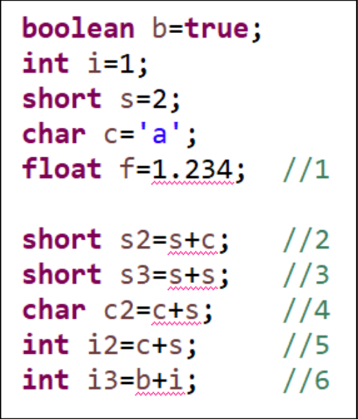

[pdf](./JAVA240812simple148.pdf)
# 다음 문제를 풀어 보자.

문제1. 다음 코드를 보고 1~6번까지 각각 어떤 문제가 있는지 확인하여 설명해 보고 문제가 발생하지 않도록 변경해 보자.
```
boolean b = true;
int i = 1;
short s = 2;
char c = 'a';
float f = 1.234f;

short s2 = (short)(s + c);
short s3 = (short)(s + s);
char c2 = (char)(c + s);
int i2 = c + s;
int i3 = (b ? 1 : 0) + i;
```
문제2. 다음 출력 결과가 무엇인지 확인해 보고 이유를 이야기해 보자.
```
1) 3+3+“hello” => "6hello", 3+3 => 6, "hello"를 만나 문자열이 된다.
2) 3*“hello” => 에러
3)“hello”+4+4 => "hello44", "hello"를 만나 문자열이 된다.
+는 이항연산자로 왼쪽에서 오른쪽으로 2개 항씩 연산된다.
```
문제3. 잘못된 점을 설명하시오.
```
int a= “10”; double d=(double) “123.3”;
```
```
int에 문자열을 넣었다.
문자열은 캐스팅연산자를 사용 할 수 없다.
```
문제4. `String name= “홍길동”; int age=5` 일때 변수에 값을 넣어서 다음과 같이 출력하는 프로그램을 만들어 보자.
```
“이름은 홍길동 나이는 5 입니다.”
```
```
String name = "홍길동";
int age = 5;
System.out.print("이름은 " + name + " 나이는 " + age " 입니다.")
```
문제5. `‘a’+1`의 결과는 어떤 자료형에 저장해야 되는가?
```
int
```
문제6. 다음 계산결과 자료형의 결과는 어떤 자료형인가?
```
1) 2.0+1.0/2.0 => double
2)4.2/2+1 => double
3)5+4/5 => int
4)1+2/3. => double
```
문제7. 모든 자료형을 기술하고 저장 할 수 있는 데이터 종류와 크기를 설명해 보자.
```
byte => 1바이트
char => 1바이트
short => 2바이트
int => 4바이트
long => 8바이트
float => 4바이트
double => 8바이트
```
