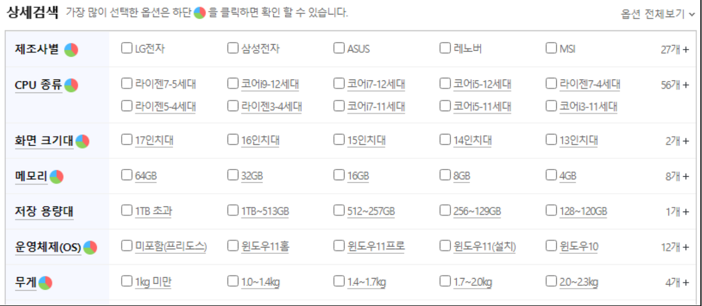

[pdf](./pdf/JAVA240812simple148.pdf)
# 연습문제
1. 클래스, 인스턴스에 대해서 설명하시오.
```
클래스 : 현실 세계의 객체를 프로그램 안에서 사용하기 위해한 방법
객체 : 현실 세계에 존재하는 모든 것을 의미
```
2. 클래스를 선언하고 사용하는 방법을 기술하시오.
```
//1. 클래스 정의 : 사용자 정의 자료형
public class 클래스이름{//클래스이름은 결국 int와 같은 자료형 종류가 된다.
public 기본자료형 변수이름; //클래스 안에 선언된 변수를 필드로 부른다.
public 기본자료형 변수이름;
//본인이 만들 새로운 자료형(클래스)에 포함하고 싶은 자료형(기존 자료형)을 여러개 기술 한다.
}
//2. 클래스 변수 선언
클래스이름 변수명=new 클래스이름(); //선언과 함께 생성
클래스이름 변수명; 변수명=new 클래스이름(); //선언후 생성
//저장하기 원하는 객체 개수만큼 클래스 변수로 선언하여 사용 할 수 있다.
```
3. `Human h3;`와 `new Human();`와 `h3=new Human();`의 의미를 기술 하시오.
```
Human h3; // => Human클래스의 h3인스턴스를 생성 
new Human(); // =>  메모리 힙영역에 Human 데이터를 저장할 수 있는 데이터 공간을 만들고 해당 저장 공간의 주소를 생성해 준다.
h = new Human(); // => new Human()에서 생성된 데이터의 시작 주소 값이 h에 들어간다.
```
4. . 연산자에 대해서 설명하시오.
```
주소연산자
```
5. public class Human 이아닌 class Human이라고 선언한 이유를 설명 하시오.
```
 한
파일에 2개의 클래스가 존재 하려면 public 클래스는 하나만 존재해야 하기 때문
```
6. Human h=new Human()에서 Human클래스는 패키지를 포함한 전체 경로를 사용해야 하는데 해당 코드가 동작하는 이유는 무엇인가?
```
import
```
7. import를 사용하는 이유와 * 의 의미를 기술 하시오.
```
다른 클래스에서 또 다른 클래스를 클래스 명 만으로 호출하기 위함.
import com.human.dto.*; 로 기술하면 com.human.dto패키지 안에 있는 모든 클래스를 해당 파일에서 기술할때 생략해서 사용할 수 있다.
```
8. 우리 주위의 객체를 클래스로 만들어서 데이터를 넣고 출력해 보자. 
클래스 파일을 분리해서 만들어 보자. 
핸드폰, 학생, 자동차, 엘리베이터 본인이 생각한 객체 총 5개를 만들어 보자.
9. 다음 이미지를 보고 데이터를 뽑아 Tree 클래스로 만들어 보자. 어려우면 다음 힌트들을 확인해 보자.

```
힌트 - 필요한 데이터 선정 6개
나무 이름,나무 가격, 키우는데
걸리는 시간, 경험치, 현재 심은
나무수, 최대 심을 수 있는 나무수
```
```
class Tree {
    String name = "";
    int price = 0;
    int growthDuration = 0;
    int exp = 0;
    int currentTrees = 0;
    int maximumTrees = 0;
}
```

10. 상위 이미지는 노트북 관련 데이터들이다. 
원하는 데이터를 뽑아서 클래스를 만들고 다음 이미지의 데이터를 넣어 화면에 출력해 보자.
```

public class SearchOptions {
    public Manufacturer manufacturer = null;
    public CPU cpu = null;
    public Display display = null;
    public RAM ram = null;
    public Storage storage = null;
    public OS os = null;
    public Weight weight = null;
    class Manufacturer {
        bool lgElectronics = false;
        bool samsungElectronics = false;
        bool asus = false;
        bool lenovo = false;
        bool msi = false;
    }
    class CPU {
        bool ryzen7_5 = false;
        bool ryzen7_4 = false;
        bool ryzen5_4 = false;
        bool ryzen3_4 = false;
        bool i9_12 = false;
        bool i7_12 = false;
        bool i5_12 = false;
        bool i7_11 = false;
        bool i5_11 = false;
        bool i3_11 = false;
    }
    class Display {
        bool _17 = false;
        bool _16 = false;
        bool _15 = false;
        bool _14 = false;
        bool _13 = false;
    }
    class RAM {
        bool _64 = false;
        bool _32 = false;
        bool _16 = false;
        bool _8 = false;
        bool _4 = false;
    }
    class Storage {
        bool over1TB = false;
        bool over512GB = false;
        bool over256GB = false;
        bool over128GB = false;
        bool over120GB = false;
    }
    class OS {
        bool freeDOS = false;
        bool windows11Home = false;
        bool windows11Pro = false;
        bool windows11 = false;
        bool windows10 = false;
    }
    class Weight {
        bool under1KG = false;
        bool under1_4KG = false;
        bool under1_7KG = false;
        bool under2KG = false;
        bool under2_3KG = false;
    }
    public SearchOptions SearchOptions(){
        this.manufacturer = new Manufacturer();
        this.cpu = new CPU();
        this.display = new Display();
        this.ram = new RAM();
        this.storage = new Storage();
        this.os = new OS();
        this.weight = new Weight();
        return this;
    }
}
```
