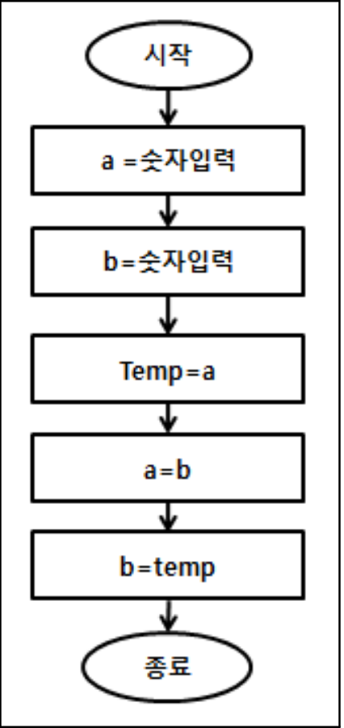
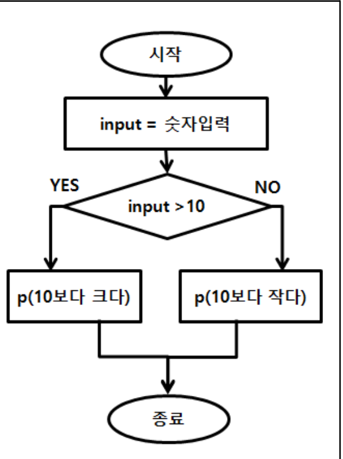
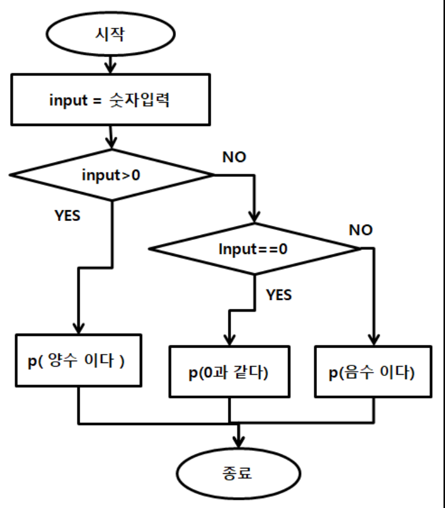

# 다음 문제를 풀어보자.

1. 왼쪽 순서도는 a, b 의 수를 입력 받아 두 수를 교환후 두 수를 출력하는 순서도이다. 
참고 해서 코드를 작성해 보자.
```
java.util.Scanner sc = new java.util.Scanner(System.in);
int a = Integer.parseInt(sc.nextLine());
int b = Integer.parseInt(sc.nextLine());
int temp;
temp = a;
a = b;
b = temp;
System.out.println(a);
System.out.println(b);
```

2. 입력한 숫자가 10보다 큰 수인지 아닌지 출력하는 순서도를 보고 프로그램으로 만들어 보자.
```
java.util.Scanner sc = new java.util.Scanner(System.in);
int input = Integer.parseInt(sc.nextLine());
if(input > 10) {
    System.out.println("10보다 크다.");
} else {
    System.out.println("10보다 크지 않다.");
}
```

3. 입력 받은 숫자가 양수인지 0인지 음수인지 판단하는 순서도와 프로그램을 만들어 보자.
```
java.util.Scanner sc = new java.util.Scanner(System.in);
int input = Integer.parseInt(sc.nextLine());
if(input > 0) {
    System.out.println("양수이다.");
} else if(input == 0) {
    System.out.println("0과 같다.");
} else {
    System.out.println("음수이다.");
}
```
4. 3개의 수를 입력 받아 가장 작은 수를 a, 다음 작은수를 b, 나머지 수를 c에 넣어 작은수 부터 출력해 보자.
변수 a,b,c에 무작위로 각각 숫자를 입력받는다.
가장 작은 변수를 찾아 a값과 교환한다.
남은 변수를 비교해서 c가 더작으면 b와 교환, 그렇지 않으면 교환하지 않는다.
a,b,c를 순서대로 출력한다.
```
java.util.Scanner sc = new java.util.Scanner(System.in);
int a = Integer.parseInt(sc.nextLine());
int b = Integer.parseInt(sc.nextLine());
int c = Integer.parseInt(sc.nextLine());
int tmp;
if(a > b) {
    tmp = a;
    a = b;
    b = tmp;
}
if(b > c) {
    tmp = b;
    b = c;
    c = tmp;
}
System.out.println(a);
System.out.println(b);
System.out.println(c);
```
다음 예제처럼 동작하는지 확인해 보자.
입력값: a, b, c 에 임의수 를 입력받는다.
출력값: a, b, c 값을 출력하면 정렬된 값이 출력된다.
만약에 입력값이 5,1,2이면 출력값은 1,2,5가 된다.
만약에 입력값이 3,7,4이면 출력값은 3,4,7가 된다.
만약에 입력값이 3,5,6이면 출력값은 3,5,6가 된다.
