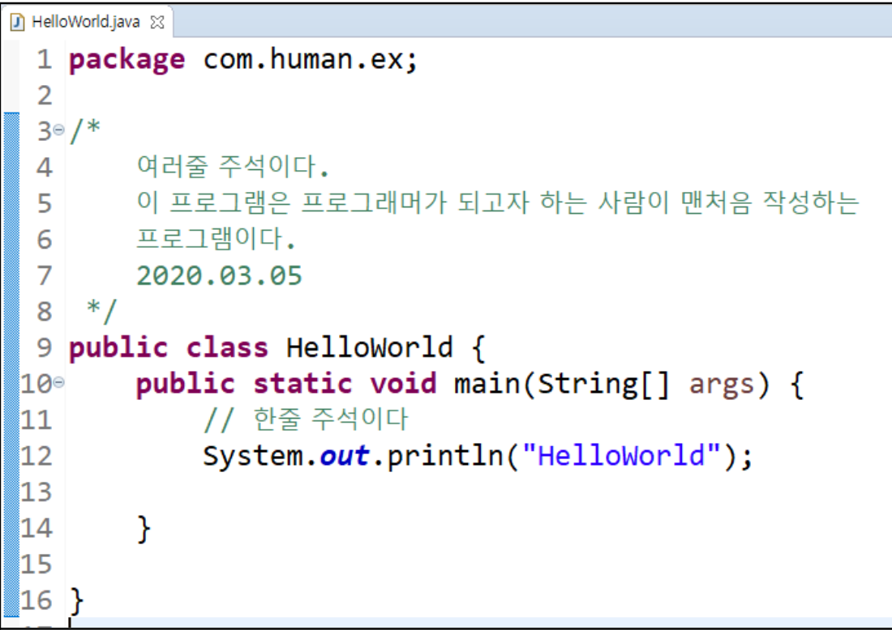

# 연습문제
1. 주석이란? 주석의 종류와 사용방법은? 
```
// 한줄주석 
/*
여러줄
주석
*/
```

2. 위에 있는 코드1, 9, 10번 라인을 설명하시오. 
```
    1 번 라인 : com\human\ex 안에 있다
    9 번 라인 : 클래스 HelloWorld
    10번 라인 : 메소드 main
```
3. 키워드, 예약어, 식별자의 의미를 설명하시오. 
```
    키워드 : class public void와 같이 프로그램에서 문법적으로 사용 하도록 미리 약속된 명령어들
    예약어 : 현재 키워드로 사용되고 있지 않지만 앞으로 키워드로 사용될 예정인 명령어 들
    식별자 : main out System 와 같이 식별의 용도로 사용되는 것들
```
4. 프로그램의 시작점은 어디인지 기술해 보자. 
```
main 메소드의 시작 
```
5. `{}`괄호가 사용되는 용도와 사용되는 곳을 기술하시오.
```
    중괄호는 관련있는 코드를 묶어 놓은 것
    클래스 블럭, 메소드 블럭, 조건문 블럭, 반복문 블럭 등 다양한 관련있는 코드를 묶는다.
```
6. 프로그램에서 사용되는 자료형 4가지를 기술하고 설명하시오.
```
    예 ,아니오(true,false) 형태의 값을 저장할 수있는 불리언 (boolean), 
    소수점이 없는 숫자 정수(int), byte, short, long
    소수점이 있는 숫자 실수 (double), float
    문자(char)
```
7. 프로그램 기초 문법 6개를 기술하시오. 
```
    1. 프로그램은 main 메소드에서 시작해서 main 메소드에서 끝난다. 
    2. 프로그램은 위에서 아래로 실행된다. 
    3. 프로그램 명령문의 끝은 ;(세미콜론)을 붙여야 한다. 
    4. 관련있는 코드는 중괄호로 묶는다. 
    5. 종괄호 안에 있는 코드들은 탭으로 들여 쓰기한다. 
    6. 중괄호 {}는 시작 위치와 같은 위치에서 닫는다. 
```
8. println과 print의 차이를 설명하시오. 
```
    println 은 출력 마지막에 줄바꿈 ,
    print는 줄바꿈 없음 
```
9. 이스케이프시퀀스란 무슨 의미이고 어떻게 사용하는지 기술하시오. 
```
    이스케이프시퀀스란 엔터, 탭, 쌍따옴표와 같이 출력시 문제가 되는 문자열을 특수한 문자를 추가하여 출력 할 수 있도록 할때 사용하는 방법
    \t \n \" \' 등 \를 사용함 
```
10. 다음은 파일 이름은 `helloWorld.java` 이다. 잘못된 부분을 찾아 보자. 
```
public class MyHelloWorld { 
    pubIic static void main(string[] args) { 
        system.Out.print1n( 
            'Hello 
               World~'
         )
     }
 }
```

```
파일명이 대문자로 시작하지 않음,
public class 인 상태로 파일명과 클래스 이름이 일치하지 않음
string의 첫글자가 대문자가 아님 
system의 첫글자가 대문자가 아님
Out이 소문자가 아님
print1n이 l이 아닌 1을 입력함
'Hello
World~'에서 줄바꿈이 필요한 경우 'Hello\nWorld~' 의 형태로 이스케이프시퀀스를 사용하여야 함
세미콜론이 빠짐
```
11. 상위 코드를 정상적으로 변경하였다면 `키워드`,`예약어`,`식별자`를 구분해보자. 
```
키워드 public, class, void, static
식별자 main,args,System,out,println
```
12. 화면에 `안녕자바`를 출력해보자. 

```
public class PrintExample {
    public static void main(String[] args) {
        System.out.print("안녕자바");
    }
}

```

13. 본인의 정보를 출력하는 프로그램을 만들어 보자. 이름 이메일 전화번호등 명암으로 만들어 출력해 보자. 

```
public class PrintExample {
    public static void main(String[] args) {
        System.out.println("홍길동\nexample@example.org\n010-1234-5678");
    }
}

```
