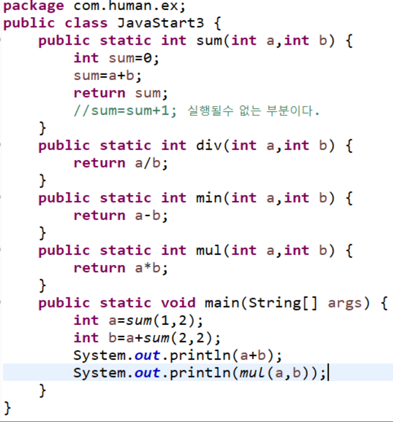
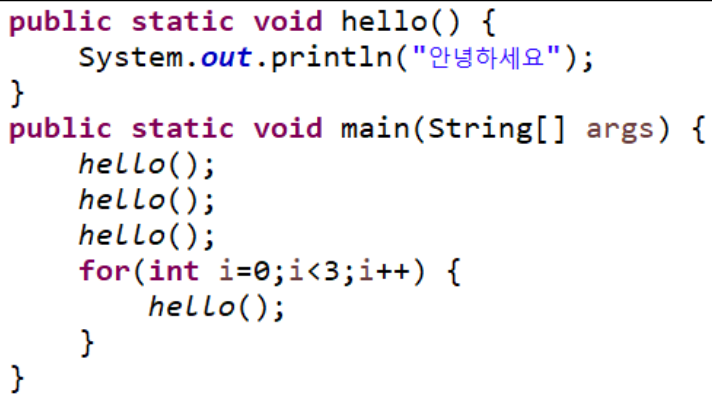
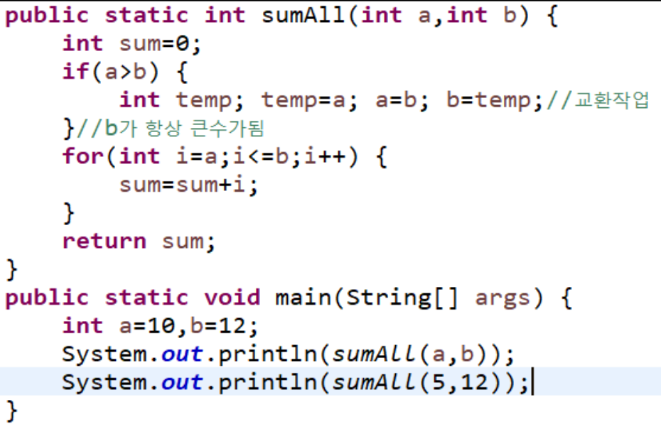

[pdf](./pdf/JAVA240812_323_LOOP.pdf)
# 다음 문제를 메소드로 만들어 보자.
1. 1달러는 1,161원이다. 6달러가 우리나라 돈으로 얼마인지 구하는 함수를 만들어보자.
```
public class Money {
    public static double exchange(double dollar,double exchangeRate) {
        double won=dollar*exchangeRate;
        return won;
    }
    public static void main(String[] args) {
        double dollar=6.2;
        double won=0;
        double exchangeRate=1161;
        won=Money.exchange(dollar, exchangeRate);
        System.out.println(dollar + " 달러를 " + exchangeRate + " 환율로 변환하면 " + won + "원이 된다.");
    }
}
```
2. 구입할 컵의 개수와 가격을 통해 비용을 계산하는 함수를 만들어 보자.
```
public class Cup {
    public static int expense(int cupCount, int cupPrice) {
        int expense = cupCount * cupPrice;
        return expense;
    }
    public static void main(String[] args) {
        int count = 10;
        int price = 2500;
        int expense = 0;
        expense = Cuo.expense(count, price);
        System.out.println("발생하는 비용은 총 " + expense + "원 입니다.");
    }
}
```
3. 온도를 표시하는데에는 섭씨와 화씨 2가지가 있다
```
public class Degree {
    public static double toFahrenheit(double celsius) {
        double fahrenheit = (celsius) * 4 / 9 + 32;
        return fahrenheit;
    }
    public static void main(String[] args) {
        System.out.print("섭씨 온도: ");
        double celsius =30;
        double fahrenheit = Degree.toFahrenheit(celsius);
        System.out.print("섭씨 " + celsius + "도는 화씨" + fahrenheit(celsius) + "°F 입니다.");
    }
}
```
4. 4칙 연산 가능한 메소드를 min mul div 메소드를 사용하여 프로그램으로 만들어 보자.
새로운 메소드는 상위 코드의 8-9라인 사이에 메소드를 추가 해야 한다.
```
public class Calculate {
    int sum(int a, int b){
        return a + b;
    }
    int sub(int a, int b){
        return a - b;
    }
    int div(int a, int b){
        return a / b;
    }
    int mul(int a, int b){
        return a * b;
    }
    int mod(int a, int b){
        return a % b;
    }
}
```
5. System.out.println(sum(sum(1,1),sum(2,1));의 결과 값은 무엇인가? 
```
메소드는 실행된 리턴값만 남는다고 생각 하면 된다. 
결과를 생각한 후 쳐서 확인해 보자.
```
```
5
```
6. 매개변수와 리턴 값이 없는 함수를 이용해서 “안녕하세요” 라는 내용을 출력하는 함수 hello를 만들고 프로그램 시작을 의미 하는 메인 함수에서 헬로 함수를 여러 번 호출하여 “안녕하세요”를 출력하는 프로그램을 만들어 사용해 보자.


7. 입력받은 숫자가 7의 배수인지 아닌지 true, false값을 리턴하는 메소드를 구현해 보자.
```
class Multiple {
    boolean of7(){
        java.util.Scanner sc = new java.util.Scanner(System.in);
        int a = Integer.parseInt(sc.nextLine());
        return a % 7 == 0;
    }
}
```
8. 문자열과 숫자를 입력 받아 해당문자열을 숫자만큼 반복 출력하는 메소드를 만들어 보자.
```
class Repeat {
    void repeat(){
        java.util.Scanner sc = new java.util.Scanner(System.in);
        String str = sc.nextLine();
        int rep = Integer.parseInt(sc.nextLine());
        for(int i = 0;i < rep;i++){
            System.out.println(str);
        }
    }
}
```
9. 두 수의 사이 수의 합을 구하는 함수를 만들어 사용해 보자.
```
ex)다음과 같은 입력에도 5,2 2,5 결과가 14가 나오게 만들어 보자
```



```
다음 처럼 메소드 안에서 다른 메소드를 호출할 수 있다.
메소드가 호출되면 메소드 선언부로 이동해 위에서 아래로 순서대로 실행을 이어 나가다
메소드가 종료되면 이전에 호출한 코드 부분으로 복귀 한다.
```
```
public class MethodExampleOutput {
    public static void main(String[] args) {
        System.out.println(“main start");
        methodA();
        System.out.println("main end");
    }
    public static void methodA() {
        System.out.println("Method A start");
        methodB();
        System.out.println("Method A end");
    }
    public static void methodB() {
        System.out.println("Method B");
    }
}
```
```
여기서 순서는 다음과 같다
main 메소드가 호출되면, methodA가 실행됩니다.
methodA 내에서 "Method A start"를 출력한 후 methodB를 호출합니다.
methodB 내에서 "Method B"를 출력합니다.
다시 methodA로 돌아와 "Method A end"를 출력합니다.
main 메소드로 돌아가면서 프로그램이 종료됩니다.
```
```
다음은 출력 결과이다.
```
```
main start
Method A start
Method B
Method A end
main end
```
