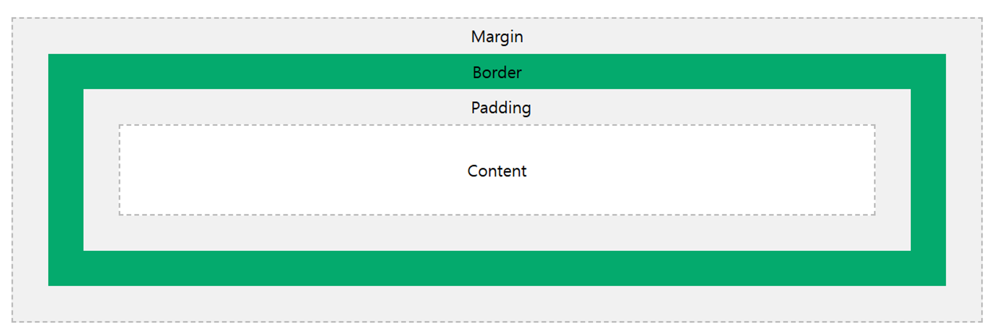
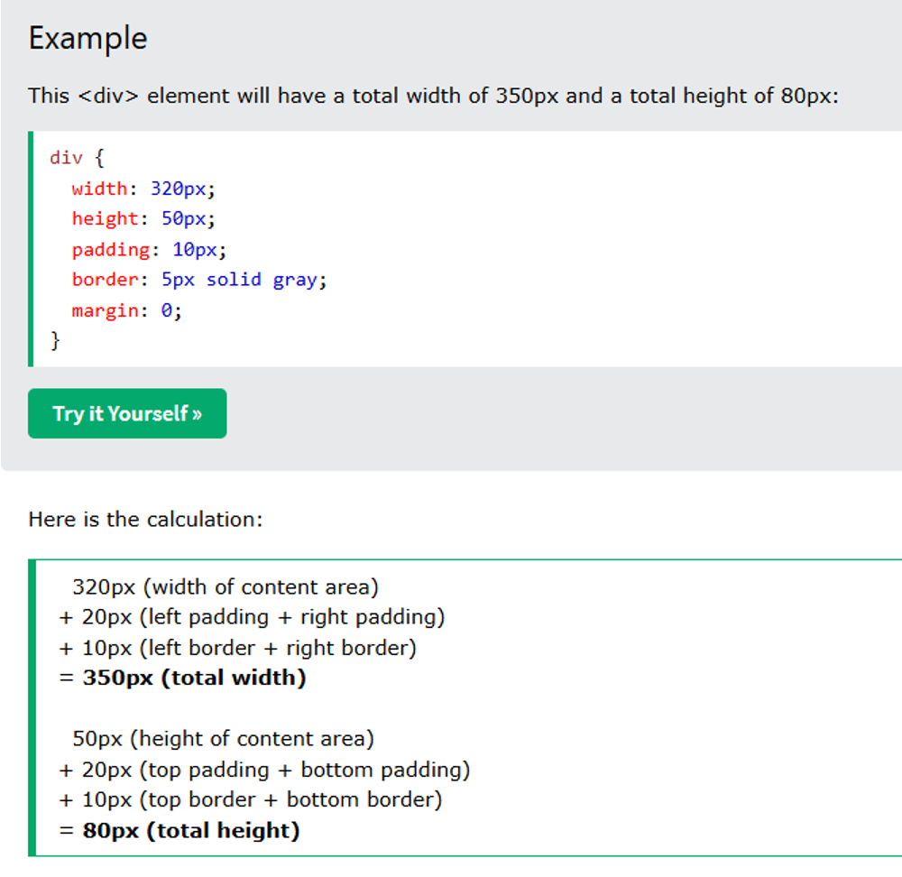

# CSS
## background
```
background (shorthand): 위의 모든 배경 속성을 한 번에 설정.(예: background: red url('image.png') no-repeat fixed center;)
```
### background-color
```
background-color: 요소의 배경색을 설정.(예: background-color: red;)
```
### background-image
```
background-image: 요소의 배경 이미지를 설정.(예: background-image: url('image.png');)
```
### background-repeat
```
background-repeat: 배경 이미지의 반복 방식을 설정.(예: background-repeat: no-repeat;)
```
### background-attachment
```
background-attachment: 배경 이미지의 스크롤 고정 여부를 설정.(예: background-attachment: fixed;)
```
### background-position
```
background-position: 배경 이미지의 위치를 설정.(예: background-position: center;)
```
## border
```
border: 테두리의 두께, 스타일, 색상을 한 줄로 설정.
(예: border: 5px solid red;)
```
### border-width
```
border-width: 테두리의 두께를 설정.
(예: border-width: 5px;)
```
### border-style
```
border-style: 테두리의 스타일을 설정 (개별 방향 포함).
```
### border-top-style
```
border-top-style: 위쪽 테두리 스타일 설정. (예: border-top-style: dotted;)
```
### border-right-style
```
border-right-style: 오른쪽 테두리 스타일 설정. (예: border-right-style: solid;)
```
### border-bottom-style
```
border-bottom-style: 아래쪽 테두리 스타일 설정. (예: border-bottom-style: dotted;)
```
### border-left-style
```
border-left-style: 왼쪽 테두리 스타일 설정. (예: border-left-style: solid;)
```
### border-color
```
border-color: 테두리의 색상을 설정 (개별 방향 포함).
(예: border-color: red;)
```
### border-radius
```
border-radius: 테두리를 둥글게 설정.
(예: border-radius: 10px;)
```
### border-image
```
border-image: 테두리를 이미지로 설정.
```
### border-image-source
```
border-image-source: 사용할 이미지 경로. (예: border-image-source: url('image.png');)
```
### border-image-slice
```
border-image-slice: 이미지 잘라내기 위치. (예: border-image-slice: 10;)
```
### border-image-width
```
border-image-width: 테두리 이미지 두께. (예: border-image-width: 5px;)
```
### border-image-outset
```
border-image-outset: 이미지가 바깥으로 벗어나는 크기. (예: border-image-outset: 10px;)
```
### border-image-repeat
```
border-image-repeat: 테두리 이미지 반복 방식. (예: border-image-repeat: round;)
```
### border-top
```
border-top: 위쪽 테두리를 설정. (예: border-top: 2px solid blue;)
```
### border-right
```
border-right: 오른쪽 테두리를 설정. (예: border-right: 3px dashed green;)
```
### border-bottom
```
border-bottom: 아래쪽 테두리를 설정. (예: border-bottom: 4px dotted orange;)
```
### border-left
```
border-left: 왼쪽 테두리를 설정. (예: border-left: 5px double purple;)
```
## margin
```
margin: 모든 방향(위, 오른쪽, 아래, 왼쪽)의 여백을 한 줄로 설정.
(예: margin: 10px 20px 15px 5px;)
```
### margin-top
```
margin-top: 위쪽 여백을 설정.
(예: margin-top: 10px;)
```
### margin-right
```
margin-right: 오른쪽 여백을 설정.
(예: margin-right: 20px;)
```
### margin-bottom
```
margin-bottom: 아래쪽 여백을 설정.
(예: margin-bottom: 15px;)
```
### margin-left
```
margin-left: 왼쪽 여백을 설정.
(예: margin-left: 5px;)
```
## padding
```
padding 속성을 이용해 모든 방향의 패딩을 한 줄로 설정 가능:

4개 값: 위, 오른쪽, 아래, 왼쪽 순서로 설정.
(예: padding: 10px 15px 20px 25px;)

3개 값: 위, 좌우, 아래 순서로 설정.
(예: padding: 10px 15px 20px;)

2개 값: 위아래, 좌우 순서로 설정.
(예: padding: 10px 15px;)

1개 값: 모든 방향을 동일한 값으로 설정.
(예: padding: 10px;)
```
### padding-top
```
padding-top: 위쪽 패딩(안쪽 여백)을 설정.
(예: padding-top: 10px;)
```
### padding-right
```
padding-right: 오른쪽 패딩을 설정.
(예: padding-right: 15px;)
```
### padding-bottom
```
padding-bottom: 아래쪽 패딩을 설정.
(예: padding-bottom: 20px;)
```
### padding-left
```
padding-left: 왼쪽 패딩을 설정.
(예: padding-left: 25px;)
```
## CSS Dimension
### width
```
width: 요소의 너비를 설정 (기본 내용 영역).
(예: width: 100px;)
```
### min-width
```
min-width: 요소가 가질 수 있는 최소 너비를 설정.
(예: min-width: 200px;)
```
### max-width
```
max-width: 요소가 가질 수 있는 최대 너비를 설정.
(예: max-width: 400px;)
```
### height
```
height: 요소의 높이를 설정.
(예: height: 300px;)
```
### min-height
```
min-height: 요소가 가질 수 있는 최소 높이를 설정.
(예: min-height: 100px;)
```
### max-height
```
max-height: 요소가 가질 수 있는 최대 높이를 설정.
(예: max-height: 500px;)
```


## text
### text-align
```
text-align: 텍스트의 수평 정렬 방식 설정 (예: left, right, center, justify).	(예: text-align: center;)
```
### vertical-align
```
vertical-align: 텍스트나 인라인 요소의 수직 정렬 설정.			(예: vertical-align: middle;)
```
### text-decoration
```
text-decoration: 텍스트에 여러 장식 속성을 한 번에 설정.		(예: text-decoration: underline dotted red;)
```
#### text-decoration-line
```
text-decoration-line: 텍스트에 적용할 장식 종류 설정 (underline, overline, line-through, none).
(예: text-decoration-line: underline;)
```
#### text-decoration-color
```
text-decoration-color: 텍스트 장식의 색상 설정.			(예: text-decoration-color: red;)
```
#### text-decoration-style
```
text-decoration-style: 텍스트 장식의 스타일 설정 (solid, dotted, dashed, wavy).	(예: text-decoration-style: dotted;)
```
#### text-decoration-thickness
```
text-decoration-thickness: 텍스트 장식의 두께 설정.			(예: text-decoration-thickness: 2px;)
```
### text-transform
```
text-transform: 텍스트의 대소문자 변환 설정 (uppercase, lowercase, capitalize).	(예: text-transform: uppercase;)
```
### text-indent
```
text-indent: 텍스트 첫 줄의 들여쓰기 설정.				(예: text-indent: 20px;)
```
### text-shadow
```
text-shadow: 텍스트에 그림자 효과 추가.
(예: text-shadow: 2px 2px 4px rgba(0, 0, 0, 0.5);)
```
### letter-spacing
```
letter-spacing: 텍스트 문자 간의 간격 설정.				(예: letter-spacing: 1px;)
```
### word-spacing
```
word-spacing: 단어 간의 간격 설정.
(예: word-spacing: 5px;)
```
### white-space
```
white-space: 텍스트의 공백 처리 방식을 설정 (normal, nowrap, pre, pre-wrap, pre-line).
(예: white-space: nowrap;)
white-space 속성은 텍스트가 화면에 표시될 때 공백과 줄바꿈을 어떻게 처리할지 결정합니다.
```
### line-height
```
line-height: 텍스트 줄 간격 설정.					(예: line-height: 1.5;)
```
## Font
### font-family
```
font-family: 글꼴을 지정합니다.
```
### font-size
```
font-size: 글자 크기를 설정합니다.
```
### font-weight
```
font-weight: 글자의 두께를 설정합니다 (예: normal, bold, lighter).
```
### font-style
```
font-style: 글자의 스타일을 설정합니다 (예: normal, italic, oblique).
```
### font-variant
```
font-variant: 글꼴의 변형을 설정합니다 (예: small-caps).
```
### font-stretch
```
font-stretch: 글꼴의 폭을 조정합니다 (예: normal, condensed).
```
## Icon
### Google Material Icon
```html
<link href="https://fonts.googleapis.com/icon?family=Material+Icons" rel="stylesheet">
```
#### Bookmark Icon
```html
<span class="material-icons">
bookmark
</span>
```
## 크기 단위 
### px
```
px  점 하나 크기
```
### em
```
em 부모의 비율
```
### rem
```
rem 최상위 비율
```
### %
```
%   전체 화면기준
```
## Viewport
### Viewport 지정하기
```html
<meta name="viewport" content="속성1=값1, ...">
```
|종류|설명|사용 가능한 값|기본 값|
|-|-|-|-|
|width|뷰포트 너비|device-width 또는 크기|브라우저 기본값|
|height|뷰포트 높이|device-height 또는 크기|브라우저 기본값|
|user-scalable|확대,축소 가능 여부|yes 또는 no<br>(yes는 1로, device-width와 device-height값은 10으로 간주)|yes|
|initial-scale|초기 확대,축소 값|1~10|1|
#### 일반적인 사용법
```
뷰포트의 너비를 스마트폰 화면 너비에 맞추고 초기 화면 배율을 1로 지정
```
```html
<meta name="viewport" content="width=device-width, initial-scale=1">
```
### Viewport 단위
#### vw (viewport width)
```
1vw는 뷰포트 너비의 1%와 같습니다.
```
#### vh (viewport height)
```
1vh는 뷰포트 높이의 1%와 같습니다.
```
#### vmin (viewport minimum)
```
1vmin은 뷰포트의 너비와 높이 중에서 작은 값의 1%와 같습니다.
```
#### vmax (viewport maximum)
```
1vmax는 뷰포트의 너비와 높이 중에서 큰 값의 1%와 같습니다.
```
### Viewport 단위를 사용해 글자 크기 조절하기
```html
<style>
h1 {
    font-size: 5vw;
    text-align:center;
}
</style>
<h1>안녕하세요?</h1>
```
## 예제
```
<!DOCTYPE html>
<html>
<head>
<style>
#customers {
  font-family: Arial, Helvetica, sans-serif;
  border-collapse: collapse;
  width: 100%;
}

#customers td, #customers th {
  border: 1px solid #ddd;
  padding: 8px;
}

#customers tr:nth-child(even){background-color: #f2f2f2;}

#customers tr:hover {background-color: #ddd;}

#customers th {
  padding-top: 12px;
  padding-bottom: 12px;
  text-align: left;
  background-color: #04AA6D;
  color: white;
}
</style>
</head>
<body>

<h1>A Fancy Table</h1>

<table id="customers">
  <tr>
    <th>Company</th>
    <th>Contact</th>
    <th>Country</th>
  </tr>
  <tr>
    <td>Alfreds Futterkiste</td>
    <td>Maria Anders</td>
    <td>Germany</td>
  </tr>
  <tr>
    <td>Berglunds snabbköp</td>
    <td>Christina Berglund</td>
    <td>Sweden</td>
  </tr>
  <tr>
    <td>Centro comercial Moctezuma</td>
    <td>Francisco Chang</td>
    <td>Mexico</td>
  </tr>
  <tr>
    <td>Ernst Handel</td>
    <td>Roland Mendel</td>
    <td>Austria</td>
  </tr>
  <tr>
    <td>Island Trading</td>
    <td>Helen Bennett</td>
    <td>UK</td>
  </tr>
  <tr>
    <td>Königlich Essen</td>
    <td>Philip Cramer</td>
    <td>Germany</td>
  </tr>
  <tr>
    <td>Laughing Bacchus Winecellars</td>
    <td>Yoshi Tannamuri</td>
    <td>Canada</td>
  </tr>
  <tr>
    <td>Magazzini Alimentari Riuniti</td>
    <td>Giovanni Rovelli</td>
    <td>Italy</td>
  </tr>
  <tr>
    <td>North/South</td>
    <td>Simon Crowther</td>
    <td>UK</td>
  </tr>
  <tr>
    <td>Paris spécialités</td>
    <td>Marie Bertrand</td>
    <td>France</td>
  </tr>
</table>

</body>
</html>
```
[내비게이션 바](https://www.w3schools.com/css/css_navbar.asp)

[Viewport Grid View](https://www.w3schools.com/css/css_rwd_templates.asp)
