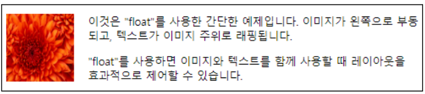

# CSS
## float
```
"float" 속성은 웹 페이지에서 블럭 태그로 인해 발생한 빈공간을 다른 블록 요소로 왼쪽 또는 오른쪽으로 이동시켜서 채우게 만드는 CSS 속성입니다. 
이것을 사용하여 이미지와 텍스트를 한줄에 함께 표시하거나 여러 div를 한줄에 생성 할 수 있습니다.
float: left; 왼쪽으로 요소를 부동시킵니다. 요소는 페이지에서 왼쪽에 배치됩니다.
float: right; 오른쪽으로 요소를 부동시킵니다. 요소는 페이지에서 오른쪽에 배치됩니다.
float: none; 부동을 해제한다. 기본 값으로 한줄에 하나의 div를 배치합니다.
다음 예제는 float를 이용해서 한줄에 이미지와 글씨를 배열한 것이다.
```

## div 사용한 화면 구성
### 1. 기본 레이아웃
```
예제 1: 기본 레이아웃
첫 번째 예제는 가장 기본적인 웹 페이지 레이아웃을 설정합니다.
#wrap라는 ID를 가진 <div> 요소를 사용하여 웹 페이지를 감싸는 컨테이너를 생성합니다.
이 컨테이너는 특정 폭(610px), 높이(430px), 여백 및 테두리 스타일을 가지며 밝은 회색 배경색을 가집니다.
```
```html
<!DOCTYPE HTML>
<html>

<head>
    <title>DIV Layout Coding</title>
    <style>
        #wrap {
            width: 610px;
            height: 430px;
            margin: auto;
            border: 2px solid #333;
            background-color: #f0f0f0;
            /* 밝은 회색 배경색 */
        }
    </style>
</head>

<body>
    <div id="wrap">
    </div>
</body>

</html>
```
### 2. 헤더와 푸터 추가
```
예제 2: 헤더와 푸터 추가
두 번째 예제는 첫 번째 예제에서 레이아웃을 확장하여 헤더와 푸터를 추가합니다.
#header와 #footer라는 두 개의 새로운 <div> 요소가 #wrap 컨테이너 내에 추가됩니다.
헤더와 푸터는 특정 높이(50px), 청록색 배경, 및 테두리 스타일을 가지며, 푸터는 상단 여백도 가집니다.
```
```html
<!DOCTYPE HTML>
<html>

<head>
    <title>DIV Layout Coding</title>
    <style>
        #wrap {
            width: 610px;
            height: 430px;
            margin: auto;
            border: 2px solid #333;
            background-color: #f0f0f0;
            /* 밝은 회색 배경색 */
        }

        #header {
            height: 50px;
            background: #00a0a0;
            /* 밝은 청록색 */
            border: 1px solid #333;
        }

        #footer {
            height: 50px;
            margin-top: 10px;
            background: #00a0a0;
            /* 밝은 청록색 */
            border: 1px solid #333;
        }
    </style>
</head>

<body>
    <div id="wrap">
        <div id="header"></div>
        <div id="footer"></div>
    </div>
</body>

</html>
```
### 3. 본문 내용 추가 영역 설정
```
예제3:본문 내용 추가 영역설정
#main라는 <div> 요소가 추가되어 본문의 중앙에 위치하며 상단 여백과 높이를 가집니다.
중앙에 2개의 div를 float를 이용해서 넣을 예정이어서 문제가 생기지 않도록 #main div로 감싸는 작업을 하였다.
```
```html
<!DOCTYPE HTML>
<html>

<head>
    <title>DIV Layout Coding</title>
    <style>
        #wrap {
            width: 610px;
            height: 430px;
            margin: auto;
            border: 2px solid #333;
            background-color: #f0f0f0;
            /* 밝은 회색 배경색 */
        }

        #header {
            height: 50px;
            background: #00a0a0;
            /* 밝은 청록색 */
            border: 1px solid #333;
        }

        #main {
            margin-top: 10px;
            height: 300px;
        }

        #footer {
            height: 50px;
            margin-top: 10px;
            background: #00a0a0;
            /* 밝은 청록색 */
            border: 1px solid #333;
        }

        .clear {
            clear: both;
        }
    </style>
</head>

<body>
    <div id="wrap">
        <div id="header"></div>
        <div id="main">
        </div>
        <div id="footer"></div>
    </div>
</body>

</html>
```
### 4. 최종 완성
```
예제 4: 최종 완성
#main안에 다음 작업을 하였습니다.
#left_main과 #right_main이라는 두 부분으로 본문 내용을 나눕니다. 
이러한 부분은 왼쪽으로 부유(floating)하여 높이와 백분율로 너비를 가집니다.
부유된 요소를 올바르게 정리하기 위해 .clear 클래스를 사용하였습니다.
```
```html
<!DOCTYPE HTML>
<html>

<head>
    <title>DIV Layout Coding</title>
    <style>
        #wrap {
            width: 610px;
            height: 430px;
            margin: auto;
            border: 2px solid #333;
            background-color: #f0f0f0;
            /* 밝은 회색 배경색 */
        }

        #header {
            height: 50px;
            background: #00a0a0;
            /* 밝은 청록색 */
            border: 1px solid #333;
        }

        #main {
            margin-top: 10px;
        }

        #left_main {
            height: 300px;
            width: 25%;
            background: #a0a0a0;
            /* 밝은 회색 배경색 */
            margin-right: 10px;
            float: left;
            border: 1px solid #333;
        }

        #right_main {
            height: 300px;
            width: 70%;
            background: #a0a0a0;
            /* 밝은 회색 배경색 */
            float: left;
            border: 1px solid #333;
        }

        #footer {
            height: 50px;
            margin-top: 10px;
            background: #00a0a0;
            /* 밝은 청록색 */
            border: 1px solid #333;
        }

        .clear {
            clear: both;
        }
    </style>
</head>

<body>
    <div id="wrap">
        <div id="header"></div>
        <div id="main">
            <div id="left_main"></div>
            <div id="right_main"></div>
            <div class="clear"></div>
        </div>
        <div id="footer"></div>
    </div>
</body>

</html>
```