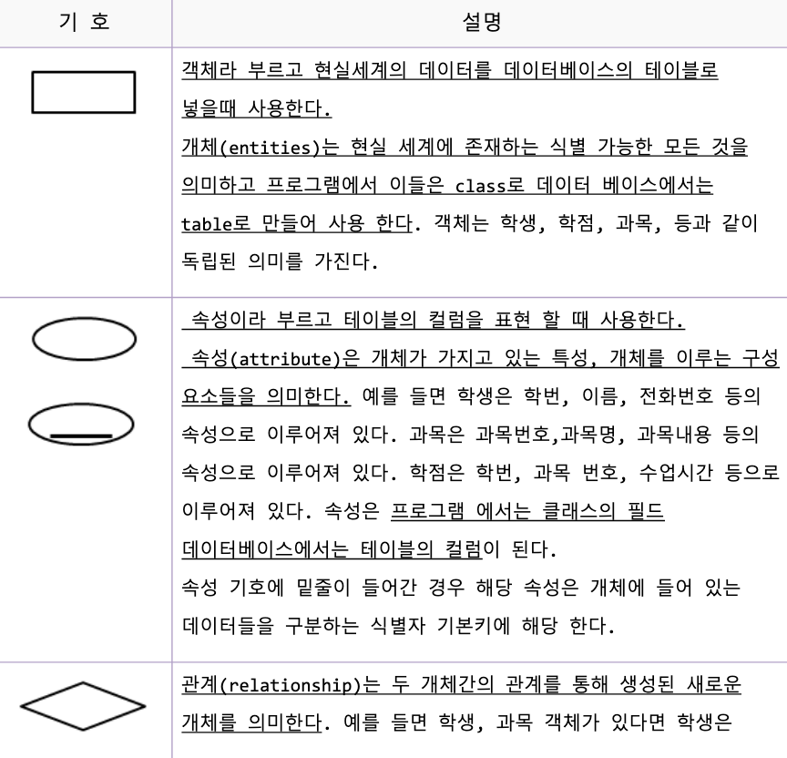
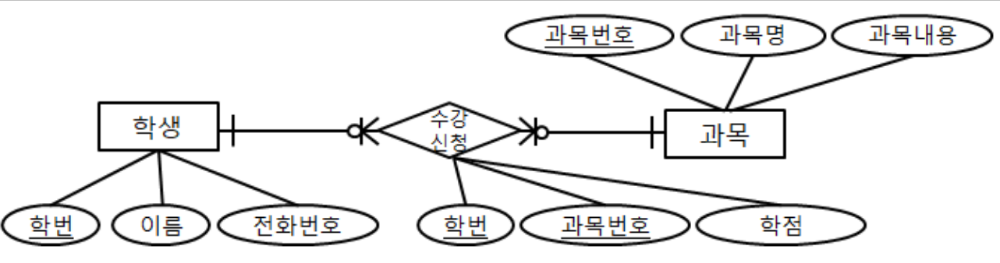

# 무결성 제약 조건
```
잘못된 데이터가 테이블에 들어오는 것을 막아 테이블안에 올바른 데이터가 유지 되도록 하는 것을 의미한다.
```
```
데이터 무결성 제약 조건은 테이블에 잘못된 데이터가 들어가지 못하도록 하기 위해 사용하는 제약 조건이다. 
다음과 같은 것들이 존재하고 아래 5개중 선택된 제약조건을 테이블 제작시 컬럼에 설정하여 적용 한다.
```
|용어|내용|
|-|-|
|primary key|테이블에 들어있는 데이터를 구분하는데 사용하는 대표컬럼으로 사용 하고 싶을때 컬럼에 적용한다.<br>해당 컬럼의 값으로 null과 중복된값을 허용 하지 않는다.<br>기본키라 한다.<br>설정된 컬럼은 중복되지 않는 유일한 값을 가지고 있어서 테이블에 데이터를 식별하는 용도로 사용한다.<br>유일한 값을 가진다.<br>테이블에 한개만 존재하고 중복된 컬럼을 하나의 키로 사용할 수 있다.|
|foreign key|설정된 컬럼은 다른 테이블의 primary key 컬럼에 존재하는 값중 하나의 값을 값으로 가지는 컬럼 이다.<br>외래키라 한다.|
|not null|null을 허용하지 않는다.|
|unique|중복된 값을 허용하지 않는다.<br>같은 값이 들어갈수 없다.|
|check|선택된 컬럼에 설정한 범위의 값만 허용한다.|
```sql
-- 1. primary key 기본키 pk
-- 데이터베이스 테이블에서 유일하게 식별하는 컬럼
-- 해당 컬럼은 중복된 값을 가질 수 없고,
-- null도 가질 수 없다.
-- 하나의 테이블에 한개만 생성 할 수 있다.
create table pkTable1(
col1 number primary key, --컬럼 col1은 기본키가 된다.
col2 number,
col3 number
);
insert into pkTable1 values(1,1,1);
insert into pkTable1 values(2,1,1); --col1컬럼에 2값이 없어서 들어 간다.
insert into pkTable1 values(2,3,4); --col1컬럼에 2값이 이미 있어서 안 들어 간다.
commit;
select * from pkTable1;

create table pkTable2(
col1 number,
col2 number,
col3 number,
primary key(col1,col2) --col1,col2 2개의 컬럼이 합쳐져서 하나의 키가 된다.
-- col1, col2 모두 같아야 같은 것으로 취급
);
insert into pkTable2 values(1,1,1);
insert into pkTable2 values(2,1,1);
insert into pkTable2 values(2,3,4);
insert into pkTable2 values(2,3,6); -- col1,col2컬럼에 2,3이 있어서 안 들어간다.
insert into pkTable2 values(1,1,6); -- col1,col2컬럼에 1,1이 있어서 안 들어간다.
insert into pkTable2 values(1,2,4); -- 1,2는 col1,col2컬럼에 없어서 들어가 진다.
commit;
select * from pkTable2;

create table pkTable3(
col1 number,
col2 number,
col3 number
);
alter table pkTable3 add primary key(col1,col2);

create table fkTable2(
col1 number,
col2 number,
col3 number primary key --컬럼 col3은 기본키가 된다.
);
create table fkTable1(
col1 number primary key, --컬럼 col1은 기본키가 된다.
col2 number,
col3 number references fkTable2(col3 ) -- fkTable2의 col3과 fkTable1의 col3을 foreign key로 이용한다.
);
-- insert 할 때 fkTable2부터 데이터를 넣어 줘야 한다.
insert into fkTable2 values(1,1,1);
insert into fkTable2 values(2,1,2);
insert into fkTable2 values(2,1,2); --col3이 pk여서 제약조건 위배로 실행되지 않음
insert into fkTable1 values(1,1,1);
insert into fkTable1 values(2,1,1);
insert into fkTable1 values(2,1,1); -- pk 때문에 들어가지 않는다.
insert into fkTable1 values(3,1,5); -- fk 설정되어 있어서 들어가지 않는다.
--fkTable2테이블에 col3컬럼에는 1과 2만 들어 있어서 5를 넣을 수 없다.
select col3 from fkTable2; --의 결과는 1,2 만들어 있다.
insert into fkTable1 values(3,1,2); -- fk 설정되어 있어서 들어간다.
insert into fkTable1 values(4,1,5); -- 와 같은 데이터를 넣으려면 fkTable2 테이블에 다음 데이터를 넣어야 들어 갈 수 있다.
insert into fkTable2 values(3,1,5);
-- delete 할 때는 fkTable1부터 데이터를 지워 줘야 한다.
delete from fkTable2;
delete from fkTable1;
delete from fkTable2;

- fkTable2 테이블의 기본키 추가
ALTER TABLE fkTable2
ADD CONSTRAINT pk_fkTable2_col3 PRIMARY KEY (col3);
-- fkTable1 테이블의 기본키 및 외래키 추가
ALTER TABLE fkTable1
ADD CONSTRAINT pk_fkTable1_col1 PRIMARY KEY (col1);
ALTER TABLE fkTable1
ADD CONSTRAINT fk_fkTable1_col3 FOREIGN KEY (col3)
REFERENCES fkTable2(col3);
-- drop
drop table fkTable2; -- 지울 수 없다.
drop table fkTable1; -- fkTable1 먼저 지우고,
drop table fkTable2; -- fkTable2를 지워야 한다.

create table test4(
a1 number unique, --해당 컬럼에 같은 값을 넣지 못한다.
a2 number not null, --null를 허용하지 않음.
a3 number not null unique, --유일한 값을 가지고 null를 허용하지 않음.
a4 number check (a4>0), --0보다 큰수만 가진다. 도메인
a5 number default 1 --입력시 값이없으면 1로 들어간다.
);
```
# view 사용하기
```
view는 기존 존재하는 여러 테이블이나 뷰를 조합하여 새로운 가상 테이블로 만든 것을 view라 한다.
view는 복잡한 내용의 sql문이나 특정 사용자에게 보여주고 싶지 않은 내용을 감추기 위해서 사용 한다.
view를 만드는 방법은 create view 뷰이름 as 쿼리 형태로 뷰로 만들고 만들어진 뷰의 내용은 뷰를 만들 때 기술한 쿼리를 기술 하면 된다.
view 자체가 실제 데이터를 가지고 있는 것은 아니지만 테이블과 같다고 생각하고 동일하게 사용하면된다.
테이블의 데이터가 변경되면 이를 사용하는 view의 데이터도 변경된다.
view를 통해서 CRUD작업이 가능하지만 되도록 select할때만 사용하자.
```
```sql
-- view 가상 테이블
-- 1. 많이 사용되는 복잡한 쿼리를 간단히 사용하고 싶을때 사용
-- 2. 특정 컬럼을 다른사람에게 보여주고 싶지 않을때

-- 1. 사원의 이름과 해당 사원이 일하는 부서 이름을 출력해 보자.
select employees.first_name,departments.department_name 
from employees,departments
where employees.department_id=departments.department_id;
-- 2. 상위 복잡한 쿼리의 결과 와 같은 결과를 가지는 테이블을 만들 필요성이 있다면 
-- view로 만들어 테이블 처럼 사용할 수 있다. 아래 예제를 처럼 view를 만들어 보자.
create view view_ed as
select employees.first_name,departments.department_name from
employees,departments
where employees.department_id=departments.department_id;
-- 3. 앞에서 만든 view를 이용해서 사원의 이름과 해당 사원이 일하는 부서 이름을 출력해 보자.
select first_name,department_name from view_ed;
select * from view_ed;
-- view를 삭제하고 싶으면 drop view view이름; 하면된다.
drop view view_ed;
```
# sequence 사용하기
```
시퀀스는 스스로 하나씩 증가하는 카운터를 관리하는 객체이다.
create sequence 시퀀스명; 으로 시퀀스를 생성할 수 있고 삭제 하고 싶다면 
drop sequence 시퀀스명;을 사용하면된다.
시퀀스 객체는 다음과 같은 값들을 가진다.
.nextval 시컨스가 가지고 있는 현재 카운트수에서 하나를 증가시켜 반납한다.
.currval 현재 시컨스가 가지고 있는 카운트수를 리턴한다.
```
```sql
-- 시퀀스 자동으로 카운트 되는 객체
-- .nextval 카운터를 하나 증가시켜서 값을 읽어 온다.
-- .currval 현재 시퀀스가 가지고 있는 카운터수를 리턴한다.

-- 1. 시퀀스를 testSequence라는 이름으로 만들어 보자
create sequence testSequence;
-- 2. testSequence가 가지고 있는 카운트를 하나 증가시켜 찍어보자.
select testSequence.nextval from dual;
-- 상위 쿼리를 여러번 실행시켜 카운터가 증가하는것을 확인해보자.
-- 현재 카운트를 하나 증가시킨후 증가된 값을 출력한다.
-- 3.testSequence가 가지고 있는 현재 카운트를 찍어보자.
select testSequence.currval from dual;
-- 상위 쿼리를 여러번 실행시켜 현대 카운트가 지속 적으로 출력되는 것을 확인해 보자.
-- 카운터의 현재 값을 출력한다.
-- 3.testSequence를 삭제해 보자.
drop sequence testSequence;
-- 시퀀스는 간단히 카운트를 할때 사용하는 것이지 안전성을 보장받아 카운트하는 용도로는 사용하면 안된다.
-- 테이블을 만들어 카운터를 이용하여 데이터를 넣어보자.
create sequence ctable_seq;
select ctable_seq.nextval from dual;
select ctable_seq.currval from dual;
create table ctable(
c_count number,
c_comment nvarchar2(10)
);
insert into ctable values (ctable_seq.nextval,'시작');
insert into ctable values (ctable_seq.nextval,'2번째 데이터');
insert into ctable values (ctable_seq.nextval,'마지막');
commit;
select * from ctable;
drop sequence ctable_seq;

-- 12 이상에서는 시퀀스 없이 자동 증가시키는 방법도 제공한다.
create table ctable2 (
c_count number generated always as identity primary key,
c_comment varchar(10)
);
insert into ctable2 (c_comment) values ('첫번째');
insert into ctable2 (c_comment) values ('두번째');
insert into ctable2 (c_comment) values ('세번째');
commit;
select * from ctable2;
```
# 오라클 인덱스 사용하기

## 인덱스란?
인덱스(Index)는 우리나라 말로 "색인"이라 하며, 데이터를 좀 더 빠르게 검색하기 위해 사용합니다. 원본 데이터에서 검색에 필요한 부분을 뽑아서 인덱스로 만들고, 이를 통해 조회 속도를 향상시킵니다.

- 책의 목차와 비슷한 개념으로, 데이터베이스에서 인덱스는 테이블의 특정 컬럼에 대해 생성됩니다.
- 오라클 데이터베이스의 경우, `PRIMARY KEY`, `FOREIGN KEY`, `UNIQUE` 제약 조건을 사용하면 자동으로 인덱스가 생성됩니다.

## 인덱스의 종류

### 1. Non-unique Index (비고유 인덱스)
- 중복값을 허용합니다.
- 주로 `FOREIGN KEY`에서 사용됩니다.

### 2. Unique Index (고유 인덱스)
- 중복값을 허용하지 않습니다.
- `PRIMARY KEY`, `UNIQUE` 제약 조건에서 사용됩니다.

## 인덱스 생성 방법

```sql
-- Non-unique Index 생성
create index 인덱스이름 on 테이블명(컬럼명);

-- Unique Index 생성
create unique index 인덱스이름 on 테이블명(컬럼명);
```

- `PRIMARY KEY`, `UNIQUE`에는 자동으로 Unique Index가 생성됩니다.
- `FOREIGN KEY`에는 자동으로 Non-unique Index가 생성됩니다.

## 인덱스 예제

```sql
drop table test7;

create table test7(
    a1 number,
    a2 number,
    a3 number,
    a4 number
);

-- a1, a2 컬럼에 Non-unique Index 생성
create index idx_test7_a1a2 on test7(a1, a2);

-- a3 컬럼에 Unique Index 생성
create unique index idx_test7_a3 on test7(a3);
```

- `idx_test7_a1a2`, `idx_test7_a3`는 인덱스의 이름이며, 중복되지 않게 임의로 지정합니다.

## 인덱스 사용 여부

```sql
select * from test7;                 -- 인덱스를 사용하지 않음
select * from test7 where a1=1;      -- 인덱스 사용
select * from test7 where a1=1 and a2=1; -- 인덱스 사용
select * from test7 where a2=1;      -- 인덱스를 사용하지 않음
select * from test7 where a3=1;      -- 인덱스 사용
select * from test7 where a4=1;      -- 인덱스를 사용하지 않음
select a3 from test7 where a3=1;     -- 인덱스를 사용함
```

## 인덱스 사용 시 주의점

- 인덱스를 사용하면 SELECT 성능이 향상됩니다.
- 하지만 DML(INSERT, UPDATE, DELETE) 작업에서는 오히려 성능 저하의 원인이 될 수 있습니다.
- 너무 많은 인덱스를 만들면 성능이 저하되므로, 반드시 필요한 컬럼에만 인덱스를 생성하는 것이 좋습니다.
- 잘못 사용하면 오히려 성능 저하의 원인이 되기 때문에, 기본적인 Non-unique와 Unique 인덱스를 잘 이해하고 활용하는 것이 중요합니다.
✨ 인덱스를 잘 활용하면 데이터베이스 성능을 크게 향상시킬 수 있습니다! 🚀


# ER 다이어그램
```
ER다이어그램(ERD)란? 현실세계의 객체를 데이터베이스의 테이블에 넣는 과정에서 여러 사람이 알아보기 쉽게 기호로 그려 표현한 것이다.
테이블은 사각형 컬럼은 동그라미 
기본키는 동그라미에 밑줄로 표시한다.
ER다이어그램은 개체 속성 관계 등을 다음과 같은 기호들을 사용하여 그림으로 표현한다.
다음 표를 보고 각각의 기호를 이해해 보자.
```


```
다음은 현실 세계의 수강 신청을 ERD로 옮긴 것이다.
```


```
-- 1. 주제 선정
-- 2. 엔티티 추출
-- 3. 속성 추출 기본키 설정
-- 4. 테이블에 데이터를 넣어보고 관계확인
-- 5. sql작성
```
```sql
-- 사용자 테이블 생성
CREATE TABLE users (
    id INT AUTO_INCREMENT PRIMARY KEY,
    username VARCHAR(50) NOT NULL,
    email VARCHAR(100) NOT NULL UNIQUE,
    created_at TIMESTAMP DEFAULT CURRENT_TIMESTAMP
);

-- 상품 테이블 생성
CREATE TABLE products (
    id INT AUTO_INCREMENT PRIMARY KEY,
    product_name VARCHAR(100) NOT NULL,
    price DECIMAL(10,2) NOT NULL,
    created_at TIMESTAMP DEFAULT CURRENT_TIMESTAMP
);

-- 주문 테이블 생성
CREATE TABLE orders (
    id INT AUTO_INCREMENT PRIMARY KEY,
    user_id INT NOT NULL,
    product_id INT NOT NULL,
    order_date TIMESTAMP DEFAULT CURRENT_TIMESTAMP,
    -- 외래 키 설정: users 테이블과 products 테이블의 id와 연결
    FOREIGN KEY (user_id) REFERENCES users(id),
    FOREIGN KEY (product_id) REFERENCES products(id)
);
```
