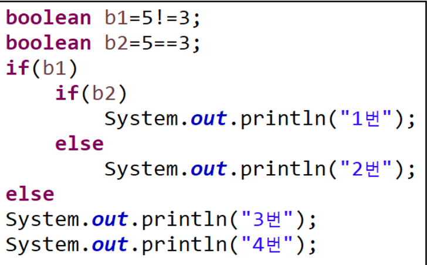

[pdf](../pdf/JAVA240812simple254.pdf)
if문 문제풀이가 어렵다면 책이나 웹에 있는 if문 예제를 여러개 실행해보고 문제를 천천히 풀어 보고 해결이 안되면 답안을 보고 풀어 보거나 gpt를 이용해 보자.


1. 왼쪽 순서도를 프로그램으로 구현해서 출력 결과를 확인해보자.
```java
java.util.Scanner sc = new java.util.Scanner(System.in);
int input = Integer.parseInt(sc.nextLine());
int a = Integer.parseInt(sc.nextLine());
int b = Integer.parseInt(sc.nextLine());
if(input == 0){
    a = 5;
} else {
    b = a + 3;
}
System.out.println(a);
System.out.println(b);
```
```
// input이 0일때 
5
(b에 입력된 값)

// input이 0이 아닐때
(a에 입력된 값)
((a에 입력된 값) + 3)
```
2. 입력 받은 숫자의 절대값을 출력하는 프로그램을 만들어 보자. 
(힌트: 0보다 작으면 -1를 곱하면 양수가 된다.)
```java
java.util.Scanner sc = new java.util.Scanner(System.in);
int a = Integer.parseInt(sc.nextLine());
if(a < 0){
    a *= -1;
}
System.out.println(a);
```
3. 어떤 수를 나누어 떨어지게 하는 수를 약수라고 한다. 
100을 2로 나누면 0이된다.
따라서, 2는 100의 약수이다. 
사용자에게 숫자를 하나 입력받아 126의 약수인지 아닌지 출력해 보자. 
(힌트: 126을 사용자가 입력한 수로 나눈 나머지가 0이면 약수이다. 126%x==0 이 true이면 x는 126의 약수이다.)
```java
java.util.Scanner sc = new java.util.Scanner(System.in);
int a = Integer.parseInt(sc.nextLine());
System.out.println((126 % a) == 0 ? "약수임" : "약수가 아님");
```
4. 두수를 입력받아 첫번째수가 두번째수의 약수인지 아닌지 확인하는 프로그램을 구현해 보자.
```java
java.util.Scanner sc = new java.util.Scanner(System.in);
int a = Integer.parseInt(sc.nextLine());
int b = Integer.parseInt(sc.nextLine());
System.out.println((b % a) == 0 ? "약수임" : "약수가 아님");
```
5. 국영수과목의 점수를 입력받아 평균이 80이상이면 합격 이하면 불합격을 출력해 보자.
(힌트: 과목수만큼 과목점수를사용자 입력을 받아 평균을 구한후 80보다 작으면 불합격 크면 합격)
```java
java.util.Scanner sc = new java.util.Scanner(System.in);
int kor = Integer.parseInt(sc.nextLine());
int eng = Integer.parseInt(sc.nextLine());
int math = Integer.parseInt(sc.nextLine());
System.out.println(((kor + eng + math) / 3) > 80 ? "합격" : "불합격");
```
6. 사용자에게 입력받은 수 x가 5이하이면 x+15의 계산결과가, 
5초과 이면 x+5의 계산 결과가 출력되는 프로그램을 만들어 보자.
(힌트: 상황에 따라 x=x+5나 x=x+15를 사용하면 된다. 
중괄호 안에 선언한 변수는 해당 중괄호 안에서만 사용 할 수 있다. 
되도록 메인 메소드 시작 부분에 변수를 선언해서 사용하자. 
if문 안의 블럭에 x를 선언하면 if문 밖에서 접근할 수 없다.)
```java
java.util.Scanner sc = new java.util.Scanner(System.in);
int x = Integer.parseInt(sc.nextLine());
if(x <= 5){
    System.out.println(x + 15);
} else {
    System.out.println(x + 5);
}
```


7. 왼쪽의 if문이 어떻게 출력되는지 생각해보고 출력 결과를 확인해 보자.
생각과 다른 예매한 결과가 나올 수 있으니 if문의 중괄호를 생략하지 말자.
```
2번
4번
```

8. 변수 a에 20, b에 0를 넣은 다음 만약에 a가 10보다 크면 a에 b를 넣고 
아니면 b에 a를 넣어서 a,b값을 출력하는 프로그램을 만들어 보자.
```java
int a = 20;
int b = 0;
if(a > 10){
    a = b;
} else {
    b = a;
}
System.out.println(a);
System.out.println(b);
```
9. 입력한 숫자가 10보다 큰 수인지 아닌지 출력하는 코드를 만들어 보자.
```java
java.util.Scanner sc = new java.util.Scanner(System.in);
int a = Integer.parseInt(sc.nextLine());
System.out.println("입력한 수는 10보다 " + (a > 10 ? "큽니다." : "크지 않습니다."))
```
10. result라는 변수를 선언하고 사용자에게 수를 입력 받아 0이 면 0을
0이 아니면 1을 넣어서 출력하는 프로그램을 구현해 보자.
```java
java.util.Scanner sc = new java.util.Scanner(System.in);
int result = Integer.parseInt(sc.nextLine());
if(result == 0){
    result = 0;
} else {
    result = 1;
}
System.out.println(result);
```
11. 두수를 입력해서 큰수에서 작은수를 뺀 차이를 출력하는 프로그램을 구현해 보자.
```java
java.util.Scanner sc = new java.util.Scanner(System.in);
int a = Integer.parseInt(sc.nextLine());
int b = Integer.parseInt(sc.nextLine());
int result = 0;
if(a > b){
    result = a - b;
} else {
    result = b - a;
}
System.out.println(result);
```
12. 입력받은 3개의 숫자 중 가장 큰 수를 출력하는 코드를 구현하시오. 
3개중에서 2개를선택해서 큰수를 구한후 나머지 하나를 비교해 보면된다.
```java
java.util.Scanner sc = new java.util.Scanner(System.in);
int big  = 0;
int a = Integer.parseInt(sc.nextLine());
int b = Integer.parseInt(sc.nextLine());
int c = Integer.parseInt(sc.nextLine());
if(a > b){
    big = a;
} else {
    big = b;
}
if(big < c){
    big = c;
}
System.out.println(big);
```

답안 3번
```java
import java.util.Scanner;
public class Main {
    public static void main(String[] args) {
        Scanner scanner = new Scanner(System.in);
        System.out.print("약수를 판별할 수를 입력하세요: ");
        String input = scanner.nextLine();
        int num = Integer.parseInt(input);
        if (126 % num == 0) {
            System.out.println(num + "은/는 126의 약수입니다.");
        } else {
            System.out.println(num + "은/는 126의 약수가 아닙니다.");
        }
        scanner.close();
    }
}
```
답안 10번.
```java
Scanner scanner = new Scanner(System.in);
System.out.print("숫자를 입력하세요: ");
String input = scanner.nextLine();
int num = Integer.parseInt(input);
int result;
if (num == 0) {
    result = 0;
} else {
    result = 1;
}
System.out.println(result);
scanner.close();
```
