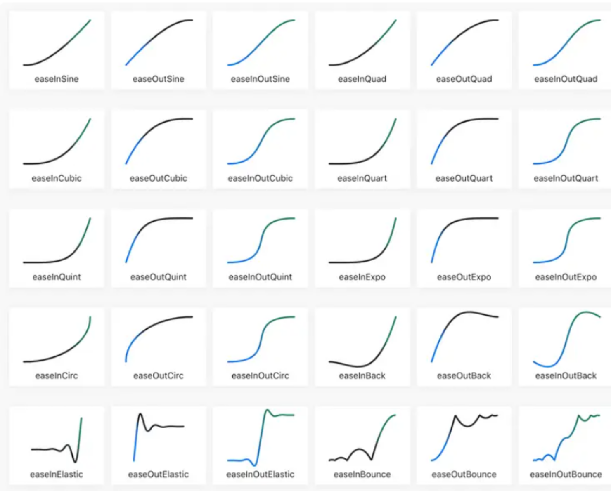

# CSS
## [transition](https://developer.mozilla.org/en-US/docs/Web/CSS/transition)
### [transition-timing-function](https://developer.mozilla.org/en-US/docs/Web/CSS/transition-timing-function)

```html
<!DOCTYPE html>
<html lang="ko">
<head>
    <meta charset="UTF-8">
    <meta name="viewport" content="width=device-width, initial-scale=1.0">
    <title>CSS 애니메이션 예제</title>
    <style>
        /* 모든 div에 공통 스타일 적용 */
        .box {
            width: 100px;
            height: 50px;
            background: red;
            color: yellow;
            border: 1px solid black;
            text-align: center;
            line-height: 50px;
            font-weight: bold;
            position: relative; /* 위치 조정을 위해 relative 설정 */
            transition: width 3s;
        }


        /* transition-timing-function을 개별적으로 적용 */
        #div1 { transition-timing-function: linear; }
        #div2 { transition-timing-function: ease; }
        #div3 { transition-timing-function: ease-in; }
        #div4 { transition-timing-function: ease-out; }
        #div5 { transition-timing-function: ease-in-out; }
        #div6 { transition-timing-function: cubic-bezier(0.1, 0.0, 0.1, 1.0); }


        /* 마우스를 올리면 모든 박스가 동시에 변화 */
        body:hover .box {
            width: 400px;
        }
    </style>
</head>
<body>
    <div id="div1" class="box" style="top: 20px;">linear</div>
    <div id="div2" class="box" style="top: 40px;">ease</div>
    <div id="div3" class="box" style="top: 60px;">ease-in</div>
    <div id="div4" class="box" style="top: 80px;">ease-out</div>
    <div id="div5" class="box" style="top: 100px;">ease-in-out</div>
    <div id="div6" class="box" style="top: 120px;">cubic-bezier</div>
</body>
</html>
```
## [transform](https://developer.mozilla.org/ko/docs/Web/CSS/transform)
|함수|설명|예제|
|-|-|-|
|[translate](https://developer.mozilla.org/en-US/docs/Web/CSS/transform-function/translate)(x, y)|요소를 x축, y축으로 평행 이동|`transform: translate(50px, 100px);`|
|[rotate](https://developer.mozilla.org/en-US/docs/Web/CSS/transform-function/rotate)(angle)|요소를 시계 방향으로 회전|`transform: rotate(20deg);`|
|[scale](https://developer.mozilla.org/en-US/docs/Web/CSS/transform-function/scale)(x, y)|요소 크기 확대/축소|`transform: scale(2, 3);`|
|[skewX](https://developer.mozilla.org/en-US/docs/Web/CSS/transform-function/skewX)(angle)|요소를 X축 기준으로 기울이기|`transform: skewX(20deg);`|
|[skewY](https://developer.mozilla.org/en-US/docs/Web/CSS/transform-function/skewY)(angle)|요소를 Y축 기준으로 기울이기|`transform: skewY(20deg);`|
|[skew](https://developer.mozilla.org/en-US/docs/Web/CSS/transform-function/skew)(x-angle,y-angle)|X,Y 축 둘 다 기울이기|`transform: skew(20deg);`|
|[matrix](https://developer.mozilla.org/en-US/docs/Web/CSS/transform-function/matrix)(a,b,c,d,e,f)|2D 변형을 행렬로 표현|`transform: matrix(1, -0.3, 0, 1, 0, 0);`|
```html
<!DOCTYPE html>
<html lang="ko">

<head>
    <meta charset="UTF-8">
    <meta name="viewport" content="width=device-width, initial-scale=1.0">
    <title>CSS Transform 예제</title>
    <style>
        .container {
            display: flex;
            flex-direction: column;
            gap: 20px;
        }

        .box {
            width: 100px;
            height: 50px;
            background: tomato;
            color: white;
            text-align: center;
            line-height: 50px;
            font-weight: bold;
            border: 1px solid black;
            transition: transform 0.5s ease-in-out;
        }

        .box:hover {
            transform: translate(50px, 100px);
        }

        #rotate:hover {
            transform: rotate(20deg);
        }

        #scale:hover {
            transform: scale(2, 3);
        }

        #skewX:hover {
            transform: skewX(20deg);
        }

        #skewY:hover {
            transform: skewY(20deg);
        }

        #skew:hover {
            transform: skew(20deg, 10deg);
        }

        #matrix:hover {
            transform: matrix(1, -0.3, 0, 1, 0, 0);
        }
    </style>
</head>

<body>
    <div class="container">
        <div class="box" id="translate">translate</div>
        <div class="box" id="rotate">rotate</div>
        <div class="box" id="scale">scale</div>
        <div class="box" id="skewX">skewX</div>
        <div class="box" id="skewY">skewY</div>
        <div class="box" id="skew">skew</div>
        <div class="box" id="matrix">matrix</div>
    </div>
</body>

</html>
```
## CSS Animation Property
### [@keyframes](https://developer.mozilla.org/en-US/docs/Web/CSS/@keyframes)
```
애니메이션의 단계별 스타일을 정의합니다.
```
```css
@keyframes move {
    0% {
        transform: translateX(0);
    }
    100% {
        transform: translateX(100px);
    }
}
```
```
위 코드는 0%에서는 원래 위치에 있고, 100%에서는 X축으로 100px 이동하도록 설정합니다.
```
### [animation](https://developer.mozilla.org/en-US/docs/Web/CSS/animation)
|속성|설명|예제|
|-|-|-|
|[animation-name](https://developer.mozilla.org/en-US/docs/Web/CSS/animation-name)|사용할 애니메이션 이름|`animation-name: move;`|
|[animation-duration](https://developer.mozilla.org/en-US/docs/Web/CSS/animation-duration)|애니메이션 지속 시간|`animation-duration: 2s;`|
|[animation-timing-function](https://developer.mozilla.org/en-US/docs/Web/CSS/animation-timing-function)|속도 곡선 설정|`animation-timing-function: ease-in-out;`|
|[animation-delay](https://developer.mozilla.org/en-US/docs/Web/CSS/animation-delay)|애니메이션 시작 전 지연 시간|`animation-delay: 1s;`|
|[animation-iteration-count](https://developer.mozilla.org/en-US/docs/Web/CSS/animation-iteration-count)|애니메이션 반복 횟수|`animation-iteration-count: infinite;`|
|[animation-direction](https://developer.mozilla.org/en-US/docs/Web/CSS/animation-direction)|애니메이션 진행 방향 설정|`animation-direction: alternate`|
|[animation-fill-mode](https://developer.mozilla.org/en-US/docs/Web/CSS/animation-fill-mode)|애니메이션 전후 상태|`animation-fill-mode: forwards;`|
#### [animation-fill-mode](https://developer.mozilla.org/en-US/docs/Web/CSS/animation-fill-mode) 란?
```
애니메이션이 시작 전이나 종료 후에 스타일을 어떻게 유지 할 지 결정하는 속성
```
#### [animation-fill-mode](https://developer.mozilla.org/en-US/docs/Web/CSS/animation-fill-mode) 속성 값 종류
|속성 값|설명|
|-|-|
|none|(기본값) 애니메이션이 끝난 후 원래 상태로 돌아감|
|forwards|애니메이션이 끝난 후 마지막 키프레임 상태 유지|
|backwards|애니메이션이 시작되기 전에 첫 번째 키프레임 상태 유지|
|both|`fowards` + `backwards` 효과를 모두 적용|
```css
* {
    animation: move 2s ease-in-out infinite alternate;
}
```
```
위 코드는 move라는 애니메이션을 2초 동안 실행하며, 
ease-in-out 효과를 적용하고, 
무한 반복(infinite)되며, 
한 방향으로 실행 후 반대로 실행(alternate)됩니다.
```
### [animation](https://developer.mozilla.org/en-US/docs/Web/CSS/animation),[@keyframes](https://developer.mozilla.org/en-US/docs/Web/CSS/@keyframes) Example
```html
<!DOCTYPE html>
<html lang="ko">

<head>
    <meta charset="UTF-8">
    <meta name="viewport" content="width=device-width, initial-scale=1.0">
    <title>CSS Animation Example</title>
    <style>
        /* 애니메이션 정의 */
        @keyframes move {
            0% {
                transform: translateX(0);
            }

            100% {
                transform: translateX(100px);
            }
        }

        /* 애니메이션 적용 */
        .box {
            width: 100px;
            height: 100px;
            background-color: tomato;
            position: relative;
            animation: move 2s linear infinite alternate;
        }
    </style>
</head>

<body>
    <div class="box"></div>
</body>

</html>
```
### 1. 버튼에 호버하면 크기 커지기
```html
<!DOCTYPE html>
<html lang="ko">

<head>
    <meta charset="UTF-8">
    <meta name="viewport" content="width=device-width, initial-scale=1.0">
    <title>Button Animation</title>
    <style>
        /* 애니메이션 정의 */
        @keyframes grow {
            from {
                transform: scale(1);
            }

            to {
                transform: scale(1.2);
            }
        }

        /* 버튼 스타일 */
        button {
            padding: 15px 30px;
            font-size: 16px;
            background-color: tomato;
            color: white;
            border: none;
            border-radius: 5px;
            cursor: pointer;
            transition: background-color 0.3s;
        }

        /* 버튼에 마우스를 올렸을 때 애니메이션 적용 */
        button:hover {
            animation: grow 0.3s ease-in-out forwards;
            background-color: darkred;
            /* 즉시 변경 */
        }
    </style>
</head>

<body>
    <button>Hover Me!</button>
</body>

</html>
```
### 2. 무한 회전하는 로딩 아이콘
```html
<!DOCTYPE html>
<html lang="ko">

<head>
    <meta charset="UTF-8">
    <meta name="viewport" content="width=device-width, initial-scale=1.0">
    <title>Loading Spinner</title>
    <style>
        /* 회전 애니메이션 정의 */
        @keyframes spin {
            0% {
                transform: rotate(0deg);
            }

            50% {
                transform: rotate(180deg);
            }

            100% {
                transform: rotate(360deg);
            }
        }

        /* 로딩 스피너 스타일 */
        .loader {
            width: 50px;
            height: 50px;
            border: 5px solid #ccc;
            /* 회색 테두리 */
            border-top: 5px solid blue;
            /* 상단만 파란색 */
            border-radius: 50%;
            animation: spin 1s linear infinite;
            /* 무한 회전 */
            position: absolute;
            top: 50%;
            left: 50%;
            transform: translate(-50%, -50%);
        }
    </style>
</head>

<body>
    <div class="loader"></div>
</body>

</html>
```
## [transition](https://developer.mozilla.org/en-US/docs/Web/CSS/transition) vs [animation](https://developer.mozilla.org/en-US/docs/Web/CSS/animation)
|속성|설명|
|-|-|
|[transition](https://developer.mozilla.org/en-US/docs/Web/CSS/transition)|시작과 끝 상태만 지정 할 때 사용<br>(호버 효과 등)|
|[animation](https://developer.mozilla.org/en-US/docs/Web/CSS/animation)|여러 단계의 애니메이션이 필요 할 때 사용<br>([@keyframes](https://developer.mozilla.org/en-US/docs/Web/CSS/@keyframes) 활용)|