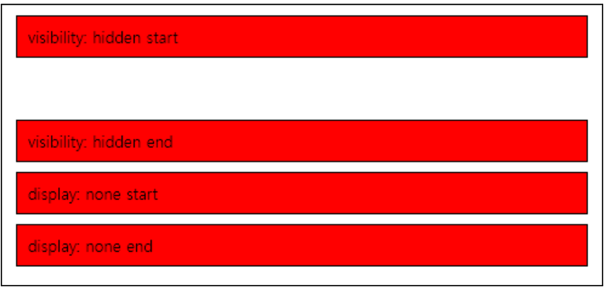
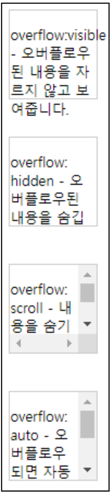

# CSS
## Block 요소
```
블록 요소는 페이지의 레이아웃을 만드는 데 사용되며, 
보통 새로운 줄에서 시작하여 가로 전체의 공간을 차지합니다. 
```
### div
```
<div>: 구획을 나누기 위해 사용되는 일반적인 블록 요소.
```
### p
```
<p>: 단락을 나타내는 블록 요소.
```
### h1,h2,h3,...,h6
```
<h1>, <h2>, <h3>, ... <h6>: 제목 요소.
```
### ul,ol,li
```
<ul>, <ol>, <li>: 목록 요소.
```
### table,tr,td
```
<table>, <tr>, <td>: 표를 나타내는 요소.
```
## Inline 요소
```
인라인 요소는 블록 요소 안에 들어갈 수 있으며, 
새로운 줄에서 시작하지 않고 필요한 공간만 차지합니다. 
```
### span
```
<span>: 인라인 컨테이너 요소로, 텍스트나 다른 인라인 요소를 둘러싸기 위해 사용됩니다.
```
### a
```
<a>: 하이퍼링크를 만드는 데 사용되는 인라인 요소.
```
### strong, em
```
<strong>, <em>: 텍스트 강조를 나타내는 요소.
```
### img
```
: 이미지를 나타내는 요소.
```
### br
```
<br>: 줄 바꿈 요소.
```
## 블록 태그 영역에 적용 할 수 있는 css
###  border-radius
```
border-radius: 요소의 모서리를 둥글게 만드는 속성.
```
### background
```
background: 요소의 배경 색상 또는 이미지를 설정하는 속성.
```
### padding
```
padding: 요소 내부의 여백을 지정하여 요소 내부 콘텐츠와 테두리 사이의 간격을 조절하는 속성.
```
```
padding 속성에 값을 지정할 때, 여러 가지 방식으로 값을 설정할 수 있습니다.
padding: 10px;: 이 설정은 모든 네 면(위, 오른쪽, 아래, 왼쪽)에 10px의 내부 여백을 설정합니다. 네 면이 모두 동일한 값으로 설정됩니다.
padding: 10px 20px;: 이 설정은 위와 아래 면에 10px의 내부 여백을, 그리고 왼쪽과 오른쪽 면에 20px의 내부 여백을 설정합니다.
padding: 10px 20px 30px;: 이 설정은 위 면에 10px, 왼쪽과 오른쪽 면에 20px, 아래 면에 30px의 내부 여백을 설정합니다.
padding: 10px 20px 30px 40px;: 이 설정은 위 면에 10px, 오른쪽 면에 20px, 아래 면에 30px, 왼쪽 면에 40px의 내부 여백을 설정합니다.
따라서 padding 속성을 사용하여 각 면의 내부 여백을 설정할 때, 순서에 따라 위, 오른쪽, 아래, 왼쪽 순서로 값을 지정하면 됩니다.
```
#### padding-top
```
padding-top: 요소의 위쪽 패딩을 설정합니다.
```
#### padding-right
```
padding-top: 요소의 위쪽 패딩을 설정합니다.
```
#### padding-bottom
```
padding-bottom: 요소의 아래쪽 패딩을 설정합니다.
```
#### padding-left
```
padding-left: 요소의 왼쪽 패딩을 설정합니다
```
#### padding 예제
```css
div {
    padding-top: 10px; /* 위쪽 패딩을 10px로 설정 */
    padding-right: 20px; /* 오른쪽 패딩을 20px로 설정 */
    padding-bottom: 30px; /* 아래쪽 패딩을 30px로 설정 */
    padding-left: 40px; /* 왼쪽 패딩을 40px로 설정 */
    padding: 10px; /* 이 값만 적용됨 */
    padding: 10px 20px; /* 이 값만 적용됨 */
    padding: 10px 20px 30px; /* 이 값만 적용됨 */
    padding: 10px 20px 30px 40px; /* 이 값만 적용됨 */
}
```
### width
```
width: 요소의 가로 크기를 설정하는 속성.
```
### height
```
height: 요소의 세로 크기를 설정하는 속성.
```
### margin
```
margin: 요소 주위의 외부 여백을 지정하여 요소 사이의 간격을 조절하는 속성.
```
#### margin 예제
```css
div {
    margin-top: 10px; /* 위쪽 마진을 10px로 설정 */
    margin-right: 20px; /* 오른쪽 마진을 20px로 설정 */
    margin-bottom: 30px; /* 아래쪽 마진을 30px로 설정 */
    margin-left: 40px; /* 왼쪽 마진을 40px로 설정 */
    margin: 10px; /* 이 값만 적용됨 */
    margin: 10px 20px; /* 이 값만 적용됨 */
    margin: 10px 20px 30px; /* 이 값만 적용됨 */
    margin: 10px 20px 30px 40px; /* 이 값만 적용됨 */
}
```
### border
```
border: 요소 주위에 테두리를 추가하는 속성으로, 두께, 스타일 및 색상을 설정하여 요소 외형을 변경하는 데 사용 됩니다.
```
#### border 예제
```css
div {
    border-top: 10px solid red; /* 위쪽 테두리를 10px 높이로 설정하고 빨간색*/
    border-right: 20px solid blue; /*오른쪽 테두리를 20px 너비로 설정하고 파란색*/
    border-bottom: 30px solid green; /*아래쪽 테두리를 30px 높이로 설정하고 녹색*/
    border-left: 40px solid orange; /*왼쪽 테두리를 40px 너비로 설정하고 주황색*/
    border: 5px dashed purple; /* 모든 테두리를 5px 높이의 점선 */
}
```
## 예제
```
다음은 간단한 예제이다.
```
```
<style>
div {
    border-radius: 25px; /* 모서리를 둥글게 만듭니다. */
    background: #73AD21; /* 배경 색상을 녹색으로 설정합니다. */
    padding: 20px; /* 내부 여백을 20px로 설정합니다. */
    width: 200px; /* 너비를 200px로 설정합니다. */
    height: 150px; /* 높이를 150px로 설정합니다. */
    margin: 10px; /* 마진을 10px로 설정합니다. */
    border: 2px solid #333; /* 2px두께의 실선 테두리, 색상은 #333 */
}
</style>
<div>이것은 스타일이 적용된 div 요소입니다.</div>
```
## display
### block
```
block: 이 값은 요소를 블록 레벨 요소로 표시하며, 
요소는 다음 줄에 표시되고 가로 너비 전체를 차지합니다. 
다른 요소와 수직으로 쌓입니다.
```
### inline
```
inline: 이 값은 요소를 인라인 요소로 표시하며, 
요소는 다른 인라인 요소와 같은 줄에 표시되며 필요한 만큼의 너비만 차지하여 width, height 같은 속성이 적용되지 않는다.
```
### inline-block
```
inline-block: 이 값은 요소를 인라인 블록 요소로 표시하며, 
다른 인라인 요소와 같은 줄에 표시되지만 가로 너비와 세로 높이를 지정할 수 있습니다.
```
### none
```
none: 이 값은 요소를 화면에서 숨기는 역할을 합니다. 
요소는 화면에 나타나지 않고, 
레이아웃에 차지하는 공간도 없습니다. 
이것은 JavaScript를 사용하여 상호작용하는 요소를 처리할 때 유용하게 쓰입니다.
```
### 예제
```html
<style>
.block-example {
    display: block;
    width: 100px;
    height: 100px;
    background-color: lightblue;
}
.inline-example {
    display: inline;
    width: 100px;
    height: 100px;
    background-color: lightgreen;
}
.inline-block-example {
    display: inline-block;
    width: 100px;
    height: 100px;
    background-color: lightcoral;
}
.none-example {
    display: none; /* 이 부분을 추가하여 요소를 숨깁니다. */
}
</style>
<div class="block-example">이것은 블록 수준 요소입니다.</div>
<div class="block-example">또 다른 블록 수준 요소입니다.</div><br><br>
<div class="inline-example">이것은 인라인 요소입니다.</div>
<div class="inline-example">또 다른 인라인 요소입니다.</div><br><br>
<div class="inline-block-example">이것은 인라인 블록 요소입니다.</div>
<div class="inline-block-example">또 다른 인라인 블록 요소입니다.</div>
<div class="none-example">이것은 숨겨진 요소입니다.</div> 
<!-- 이 부분을 추가하여 숨긴 요소를 나타냅니다. -->
```
## visibility
```
visibility"는 CSS 속성 중 하나로, HTML 요소의 가시성 여부를 제어하는 데 사용됩니다. 
이 속성을 사용하면 요소를 숨기거나 다시 표시할 수 있습니다.

"visibility" 속성은 두 가지 주요 값이 있습니다:
visible: 기본값입니다. 요소가 보이도록 설정됩니다.
hidden: 요소가 숨겨집니다. 그러나 요소의 공간은 여전히 유지됩니다.
다시 말해, 요소는 화면에서 사라지지만 다른 요소의 레이아웃에는 영향을 주지 않습니다.
아래 코드를 실행한 결과를 보면 start와 end 사이에 div를 어떻게 보여 줄지 결정 한다. 
visibility:hidden 같은 경우 존재하는데 안보여주는 것이고 display:none 경우에는 화면에 존재하지도 않는 상태이다.
```

```html
<style>
    .hidden-visibility {
        visibility: hidden;
    }

    .none-display {
        display: none;
    }

    .visible {
        border: 1px solid #000;
        padding: 10px;
        margin: 10px;
        background-color: red;
    }
</style>
<div class="visible">visibility: hidden start</div>
<div class="visible hidden-visibility">이 요소는 visibility: hidden</div>
<div class="visible">visibility: hidden end</div>
<div class="visible">display: none start</div>
<div class="visible none-display">이 요소는 display: none</div>
<div class="visible">display: none end</div>
```
### overflow-x
```
overflow-x: 수평 오버플로우를 제어하는 속성입니다.
```
### overflow-y
```
overflow-y: 수직 오버플로우를 제어하는 속성입니다.
```
### overflow
```
overflow: 수평 및 수직 오버플로우를 동시에 제어하는 속성입니다.
```
### visible
```
visible: 오버플로우된 내용을 자르지 않고 보여줍니다.
```
### hidden
```
hidden: 오버플로우된 내용을 숨깁니다.
```
### scroll
```
scroll: 오버플로우된 내용을 숨기고 스크롤바를 표시합니다.
```
### auto
```
auto: 내용이 오버플로우되면 자동으로 스크롤바를 표시합니다.
```
### visibility 예제

```html
<style>
    .container {
        width: 100px;
        /* 컨테이너의 너비를 100px로 설정 */
        height: 100px;
        /* 컨테이너의 높이를 100px로 설정 */
        border: 1px solid #ccc;
        /* 테두리를 그림 */
    }

    .overflow-visible {
        overflow: visible;
        /* 오버플로우된 내용을 자르지 않고 보여줍니다. */
    }

    .overflow-hidden {
        overflow: hidden;
        /* 오버플로우된 내용을 숨깁니다. */
    }

    .overflow-scroll {
        overflow: scroll;
        /* 오버플로우된 내용을 숨기고 스크롤바 표시*/
    }

    .overflow-auto {
        overflow: auto;
        /* 내용이 오버플로우되면 자동으로 스크롤바 표시*/
    }
</style>
<div class="container overflow-visible">
    <p>overflow:visible - 오버플로우된 내용을 자르지 않고 보여줍니다.</p>
</div>
<br><br>
<div class="container overflow-hidden">
    <p>overflow: hidden - 오버플로우된 내용을 숨깁니다.</p>
</div>
<br><br>
<div class="container overflow-scroll">
    <p>overflow: scroll - 내용을 숨기고 수평 및 수직 스크롤바를 표시</p>
</div>
<br><br>
<div class="container overflow-auto">
    <p>overflow: auto - 오버플로우되면 자동으로 수평 수직 스크롤바 표시</p>
</div>
```
## position
### static
```
static: 이 값은 요소를 일반 문서 흐름에 따라 배치하며 위치를 추가로 조정할 수 없습니다.
static은 top,left속성이 전혀 적용되지 않습니다.
```
#### static 예제
```html
<style>
    .box {
        width: 50px;
        height: 50px;
        position: static;
    }

    .box1 {
        background: red;
        top: 0px;
        left: 0px;
    }

    .box2 {
        background: blue;
        top: 50px;
        left: 50px;
    }

    .box3 {
        background: green;
        top: 100px;
        left: 100px;
    }
</style>
<div class="box box1"></div>
<div class="box box2"></div>
<div class="box box3"></div>
```
### relative
```
relative: 이 값은 요소를 일반 문서 흐름에 따라 배치하면서 상대적으로 위치를 조정할 수 있습니다.
```
#### relative 예제
```html
<style>
    .box {
        width: 50px;
        height: 50px;
        position: relative;
    }

    .box1 {
        background: red;
        top: 0px;
        left: 0px;
    }

    .box2 {
        background: blue;
        top: 50px;
        left: 50px;
    }

    .box3 {
        background: green;
        top: 100px;
        left: 100px;
    }
</style>
<div class="box box1"></div>
<div class="box box2"></div>
<div class="box box3"></div>
```
### absolute
```
absolute: 이 값은 요소를 가장 가까운 위치 지정 부모을 기준으로 배치하며, 일반 문서 흐름에서 제거됩니다.
```
### fixed
```
fixed: 이 값은 요소를 뷰포트(브라우저 창)를 기준으로 배치하며 스크롤에 관계 없이 위치가 고정됩니다.
fixed를 사용하면 스크롤이 움직여도 div가 고정되어 있는 것을 확인할 수 있습니다.
```
#### fixed 예제
```html
<style>
    body {
        margin: 0;
        padding: 0;
    }

    .header {
        background-color: #333;
        color: #fff;
        text-align: center;
        padding: 10px;
        position: fixed;
        top: 0;
        left: 0;
        width: 100%;
    }

    .logo {
        font-size: 24px;
        font-weight: bold;
    }

    .content {
        padding: 80px 20px 20px;
    }

    .ad {
        background-color: #f2f2f2;
        width: 200px;
        height: 400px;
        position: fixed;
        top: 0;
        right: 0;
        padding: 20px;
    }
</style>
</head>

<body>
    <div class="header">
        <div class="logo">My Website</div>
    </div>
    <div class="content">
        <h1>내 웹사이트에 오신 것을 환영합니다</h1>
        <p>이것은 고정된 헤더의 간단한 예제입니다.</p>
        <!-- 내용 부분에 더 많은 내용을 추가하세요 -->
    </div>
    <div class="ad">
        <h2>광고</h2>
        <p>여기에 광고 내용을 추가하세요.</p>
    </div>
    <br><br><br><br><br><br><br><br><br><br><br><br><br><br><br><br><br><br><br><br><br><br>
    <br><br><br><br><br><br><br><br><br><br><br><br><br><br><br><br><br><br><br><br><br><br>
    맨하단
</body>

</html>
```
### sticky
```
sticky: 이 값은 요소를 일반 문서 흐름에 따라 배치하면서 스크롤되면 지정된 위치에 고정됩니다.
```
#### sticky 예제
```html
<style>
    body {
        margin: 0;
        padding: 0;
        font-family: Arial, sans-serif;
    }

    .header {
        background-color: #333;
        color: #fff;
        text-align: center;
        padding: 10px;
        position: sticky;
        top: 0;
    }

    .logo {
        font-size: 24px;
        font-weight: bold;
    }

    .content {
        padding: 80px 20px;
    }

    .sticky-element {
        background-color: #f2f2f2;
        padding: 10px;
        position: sticky;
        top: 60px;
        /* 스티키가 적용될 위치 (헤더 아래) */
    }
</style>
<div class="header">
    <div class="logo">My Sticky Website</div>
</div>
<div class="content">
    <h1>스티키 예제</h1>
    <p>이것은 스티키 요소를 사용한 간단한 예제입니다.</p>
    <div class="sticky-element">
        <h2>스티키 요소</h2>
        <p>이 스티키 요소는 스크롤 시 헤더 아래로 고정됩니다.</p>
    </div>
    <p>내용을 스크롤하면 스티키 요소는 스크롤하면서 헤더 아래에 고정됩니다.</p>
    <p>더 많은 내용을 추가할 수 있습니다.</p>
    <br><br><br><br><br><br><br><br><br><br><br><br><br><br><br><br><br><br><br>
    <br><br><br><br><br><br><br><br><br><br><br><br><br><br><br><br><br><br><br><br><br><br><br><br><br>
</div>
```
## z-index
```
z-index는 div가 겹쳤을때 누구를 위에 놓을 것인지 결정하는 속성이다.
position 속성이 기본값 static일때는 사용할 수 없다.
숫자가 클수록 위에 나타난다.
```
```html
<style>
    .box {
        width: 200px;
        height: 100px;
        position: absolute;
        top: 50px;
        color: white;
        font-size: 18px;
        text-align: center;
        line-height: 100px;
    }

    .box1 {
        left: 50px;
        background-color: #3498db;
        /*
    파란색 배경 */
        z-index: 1;
    }

    .box2 {
        left: 100px;
        background-color: #e74c3c;
        /*
    빨간색 배경 */
        z-index: 2;
    }
</style>
<div class="box box1">상자 1</div>
<div class="box box2">상자 2</div>
```