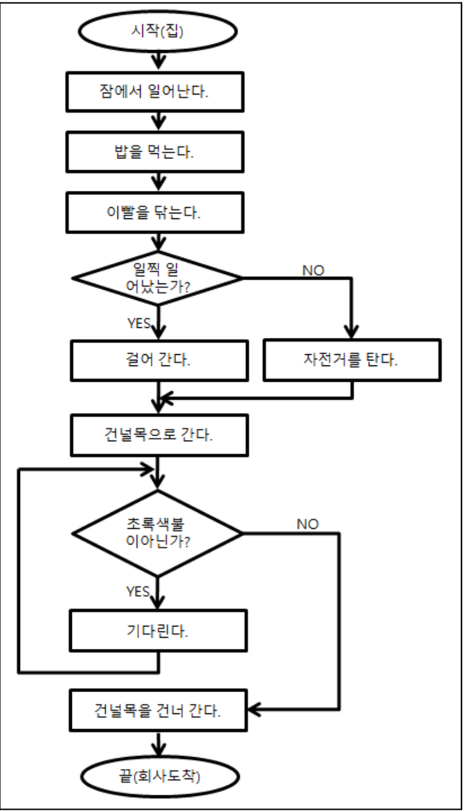
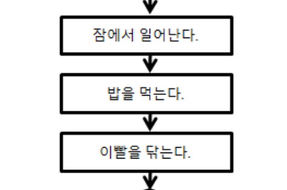
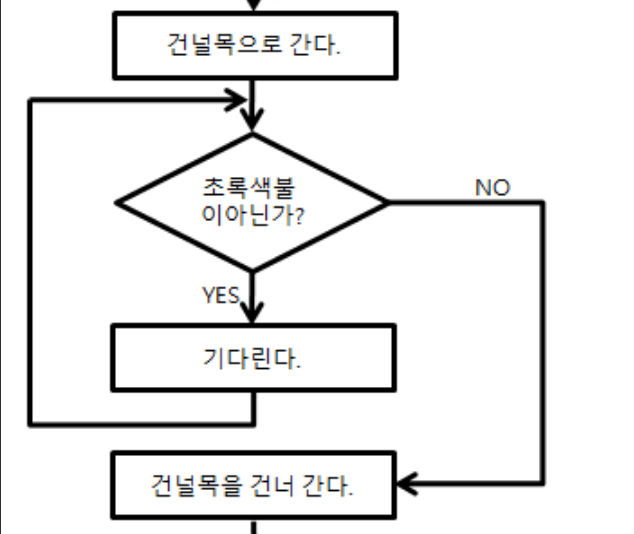
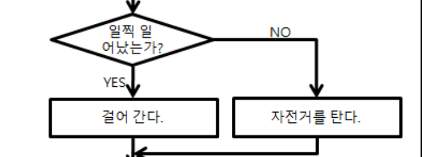
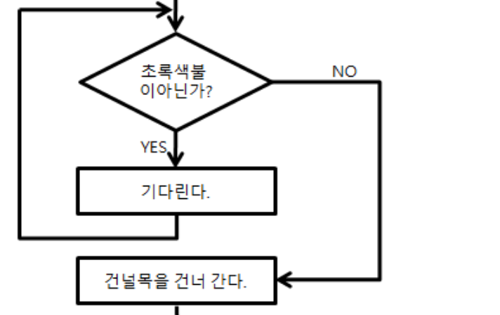
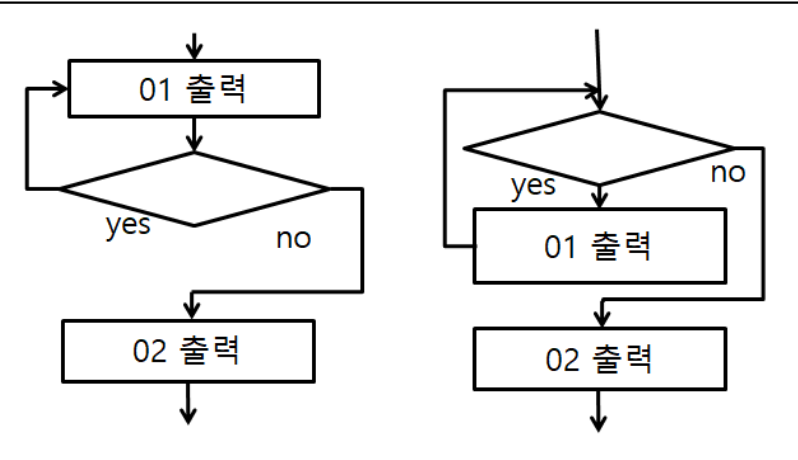

[pdf](../../pdf/JAVA240812simple254.pdf)
# 다음 연습문제를 풀어 보자.

문제1) 다음 페이지의 순서도는 집에서 회사까지 가는
순서도에서 1,2,3번 기찻길처럼 
동작하는 부분을 각각 찾아 보자.
- 1번 기찻길 (절차문)
> 
- 2번 기찻길 (조건문)
> 
- 3번 기찻길 (반복문)
> 


문제2) 직사각형 부분이 화면에 출력된다고 가정 할때 
만약, 일찍 일어나고 초록색불을 처음 확인하였을때는 
빨간불이고 2번째 확인 하였을때는 초록불이 이였다면 
화면에 출력되는 결과를 기술하시오.
```
건널목을 건너간다.
```
문제3)왼쪽 순서도에서 조건문과 반복문을 찾아보자.
- 조건문
> 
- 반복문
> 


문제4) 왼쪽 이미지에서 각각의 다이아몬드가 조건인지 반복인지 정의해 보자.
```
i < 7 => 반복
a[i] > max => 조건
a[i] < min => 조건
```

```
첫 번째 다이아몬드는 Yes 쪽을 따라가다 보면 
결국에는 조건식 다이아몬드로 다시 돌아오는 것을 확인할 수 있다. 
No 쪽으로 따라가보면 결국 프로그램이 종료되는 것을 확인할 수 있다. 
따라서 첫 번째 다이아몬드는 반복문이다.
두 번째 다이아몬드 와 세 번째 다이아몬드는 어느 쪽으로 이동 하든 결국에 한 곳에서 만난다.
순서도 그릴때 주의해야 하는 부분을 확인해 보자. 
반복문을 순서도로 그릴 때 왼쪽 이미지의 두 순서도 처럼 그리는 일이 있는데 초보자들은 두 순서도를 같은 결과가 나올 것으로 생각하는 경우가 있는데 실질적으로는 다르다. 
기찻길 따라가듯 잘 따라가보면 왼쪽의 경우 01이 반드시 1번 이상 출력되지만 오른쪽 순서도는 한번도 출력되지 않는 결과를 얻을 수 있다. 
따라서 전혀 다른 순서도이고 프로그램으로 구현 할 때 반복문은 보통 while이나 for문을 사용 하는데 왼쪽의 경우 do~while문을 사용 해야 하는 경우이다. 
반드시 1번 꼭 출력되어야 할 경우는 왼쪽 순서도를 사용 해야 하지만, 그렇지 않을 경우에는 오른쪽 순서도를 사용하여야 한다.
실질적으로 do while문을 프로그램에서 구현할 경우는 거의 없다. 
아무 생각 없이 잘못 그린 경우가 대부분이니 1번 보다는 2번 형태의 반복문으로 그리자.
do~while은 1~N번까지 반복할때 while은 0~N번까지 반복할 때 사용한다.
```
