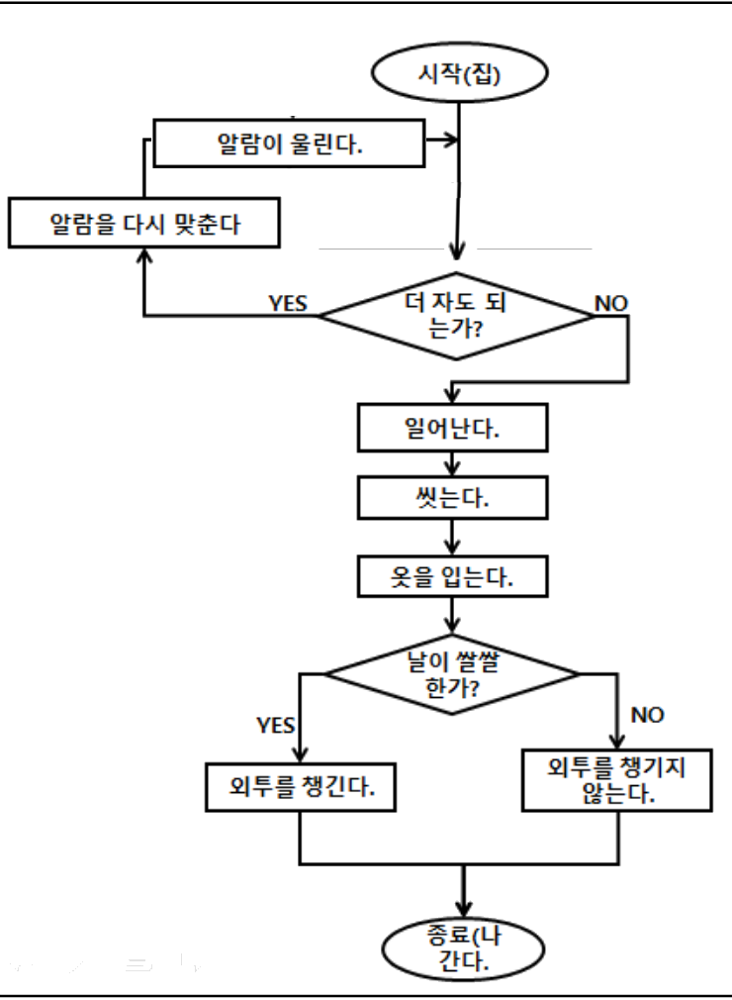
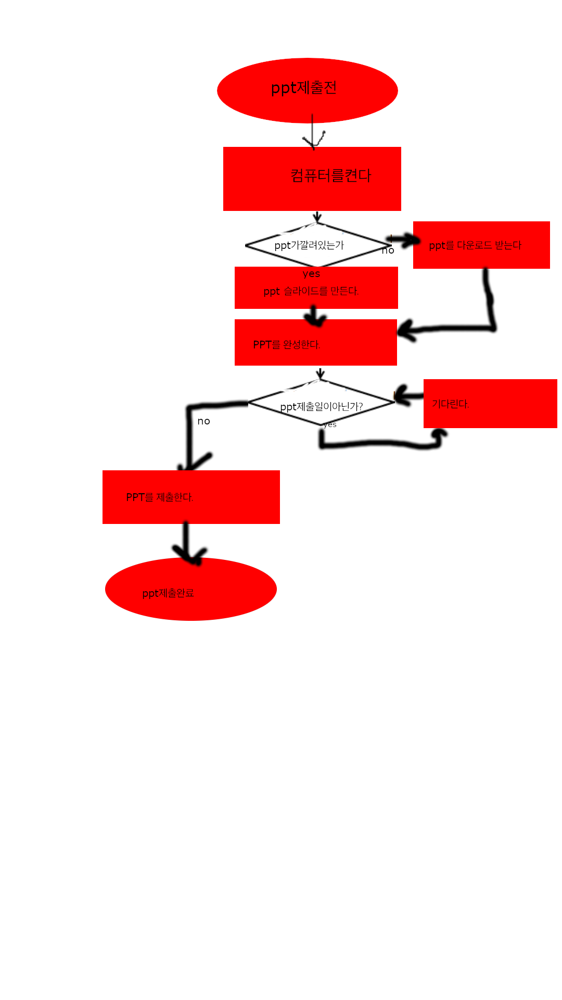
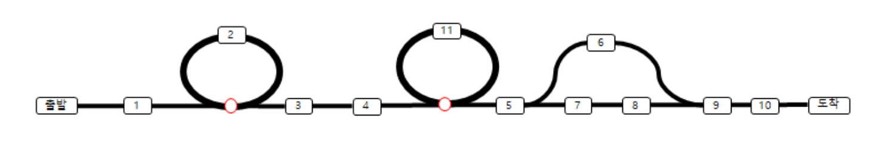
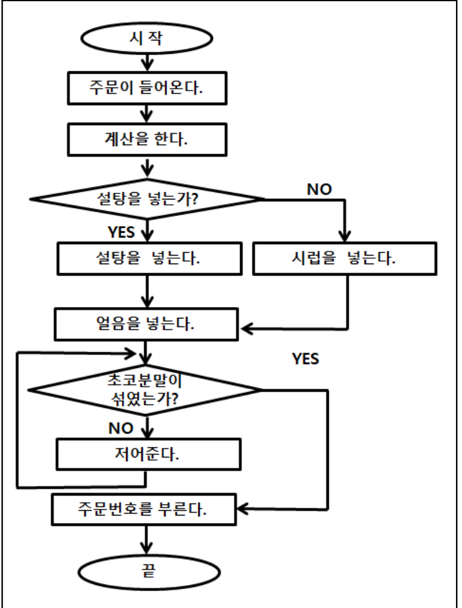
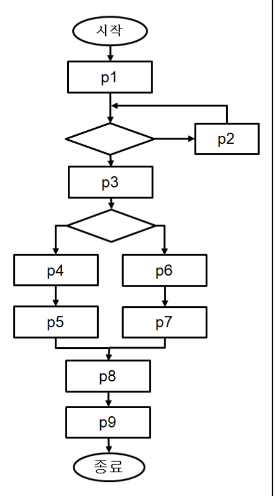

[pdf](../../pdf/JAVA240812simple254.pdf)

문제1. 왼쪽 순서도 의사코드를 작성하시오.
```
while(더 자도 되는가?){
    p(알람을 다시 맞춘다.)
    p(알람이 울린다.)
}
p(일어난다.)
p(씻는다.)
p(옷을 입는다.)
if(날이 쌀쌀한가?){
    p(외투를 챙긴다.)
} else {
    p(외투를 챙기지 않는다.)
}
p(나간다.)

```
문제2. 다음 의사코드를 순서도로 만드시오.
```
p(PPT제출 전)
p(컴퓨터를 켠다)
If(PPT가 깔려 있는가?){
p(PPT 슬라이드를 만든다.)
}else{
p(PPT를 다운로드 받는다.)
}
p(PPT를 완성한다.)
While(PPT 제출일이 아닌가?){
p(기다린다.)
}
p(PPT를 제출한다)
p(PPT 제출 완료)
```
> 


문제3. 다음 기찻길의 순서도와 의사코드를 작성해 보자. 
조건안의 질의로 스위치가 오른쪽인가?, 반복할 것인가?를 사용해 보자.

```
1;
while(true인가?){
    2;
}
3;
while(true인가?){
    11;
}
5;
if(true인가?){
    6;
} else {
    7;
    8;
}
9;
10;
```

문제5. 왼쪽 순서도에서 잘못된 부분은 반복문이 false일때 반복된다는 것이다. 찾아서
true가 반복되게 고친 다음 의사코드를 만들어 보자.
```
초코 분말이 섞였는가? 를 초코 분말이 섞이지 않았는가? 로 변경 후 해당 yes,no를 반전
```
```
주문이 들어온다.
계산을 한다.
if(설탕을 넣는가?){
    설탕을 넣는다.
} else {
    시럽을 넣는다.
}
얼음을 넣는다.
while(초코 분말이 섞이지 않았는가?){
    저어준다.
}
주문번호를 부른다.
```

문제6. 오른쪽 순서도를 보고 기찻길과 의사 코드를 만들어 보자 .
```
p1;
while(){
    p2;
}
p3;
if(){
    p4;
    p5;
} else {
    p6;
    p7;
}
p8;
p9;
```
문제7. 라면끓이는 방법을 순서도와 의사코드로 만들어 보자.
```
면,분말스프,건더기스프를 물에 넣는다.
물을 끓인다.
3분을 기다린다.
끝
```
