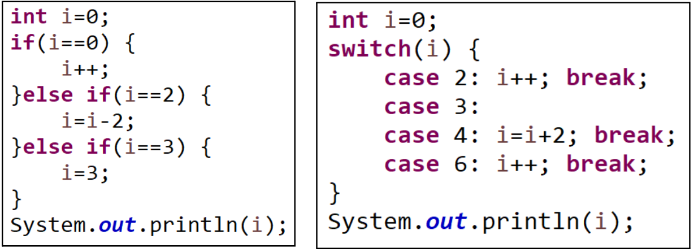
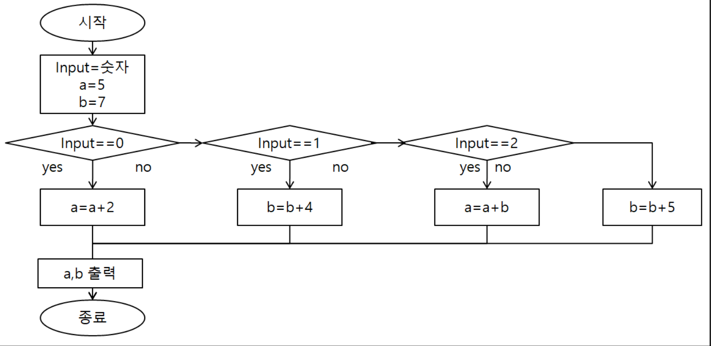

[pdf](../../pdf/JAVA240812simple254.pdf)
# 연습문제
1. 다음 else if문은 switch문으로 switch문은 elseif문으로 변경해보자.

```java
int i = 0;
switch(i){
    case 0: i++; break;
    case 2: i = i - 2; break;
    case 3: i = 3; break;
}
System.out.println(i);
```
```java
int i = 0;
if(i == 2){
    i++;
} else if(i == 3 || i == 4){
    i = i + 2;
} else if(i == 6){
    i++;
}
System.out.println(i);
```
2. 1~5사이의 숫자를 변수 c에 저장하여 한글로 출력하는 switch문을 만들어 보자.
```java
int c = (int)(Math.random * 100) % 5 + 1;
String result = "";
switch(c){
    case 1: result = "일"; break;
    case 2: result = "이"; break;
    case 3: result = "삼"; break;
    case 4: result = "사"; break;
    case 5: result = "오"; break;
}
System.out.println(result);
```
3. 다음 순서도와 동일하게 실행되도록 else if문과 switch문으로 기술하시오.

```java
java.util.Scanner sc = new java.util.Scanner(System.in);
int input = Integer.parseInt(sc.nextLine());
int a = 5;
int b = 7;
switch(input){
    case 0: a = a + 2; break;
    case 1: b = b + 4; break;
    case 2: a = a + b; break;
    default: b = b + 5;
}
System.out.println(a);
System.out.println(b);
```
4. 점수를 입력받아 90점이상은 수, 80점이상은 우, 70점 이상은 미 ..로 출력하는 프로그램을 else if문과 switch문으로 만들어 보자. 
범위 조회여서 switch문으로 처리하기 어려울 것 처럼 보이지만 %연산자를 사용하면 switch문을 사용할 수 있다. 
100/10==10이고 99~90/10==9이다. 
정수 연산이기 때문에 소수점이 없다. 
89~80/10==8이다. 
74/10==7이 된다. 
이를 이용하면 충분히 switch문으로 구현할 수 있다. 
수우미양가를 출력하는 프로그램을 switch문으로 구현해 보자.
```java
java.util.Scanner sc = new java.util.Scanner(System.in);
int score = Integer.parseInt(sc.nextLine());
String result = "";
switch(score / 10){
    case 10:
    case 9: result = "수"; break;
    case 8: result = "우"; break;
    case 7: result = "미"; break;
    case 6: result = "양"; break;
    default:
    case 5: result = "가"; break;
}
System.out.println(result);
```
5. 1~5사이의 숫자를 입력받아 해당 숫자를 한글로 출력하는 프로그램을 작성해 보자.
```java
java.util.Scanner sc = new java.util.Scanner(System.in);
int input = Integer.parseInt(sc.nextLine());
while(input > 5 || input < 1){
    input = Integer.parseInt(sc.nextLine());
}
switch(input){
    case 1: result = "일"; break;
    case 2: result = "이"; break;
    case 3: result = "삼"; break;
    case 4: result = "사"; break;
    case 5: result = "오"; break;
}
```
6. 달을 입력받아 해당달이 28일인지 30일인지 31일인지 출력하는 프로그램을 구현해 보자.
```java
java.util.Scanner sc = new java.util.Scanner(System.in);
int month = Integer.parseInt(sc.nextLine());
while(month > 12 || month < 1){
    System.out.println("Invalid month value, retry with valid value.");
    month = Integer.parseInt(sc.nextLine());
}
int year = java.time.LocalDate.now().getYear();
int daysInMonth = java.time.YearMonth.of(year,month).lengthOfMonth();
System.out.println(year + "년 " + month + "월은 " + daysInMonth + "일 까지 있습니다.");

```
7. 나이를 입력 받아 해당 나이의 때의 학력이 초,중,고 중 어디에 해당하는지 출력해보자.
```java
java.util.Scanner sc = new java.util.Scanner(System.in);
int age = Integer.parseInt(sc.nextLine());
String result = "";
if(age > 7 && age < 14){
    result = "초";
} else if(age > 13 && age < 17){
    result = "중";
} else if(age > 16 && age < 20){
    result = "고";
}
System.out.println(result);
```
또는 
```
나이로는 초,중,고 를 알 수 없음
```
