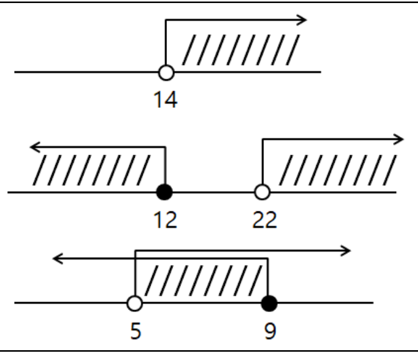
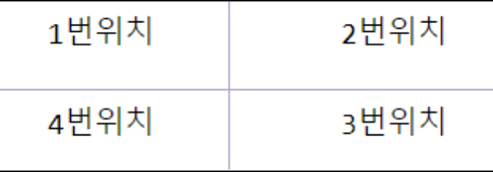
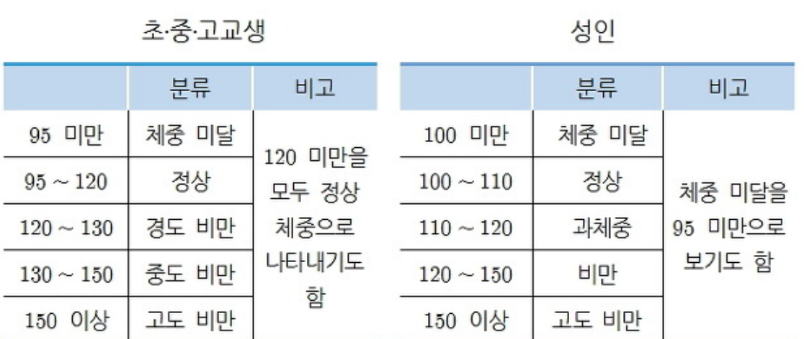
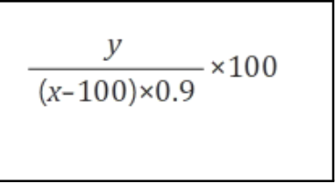
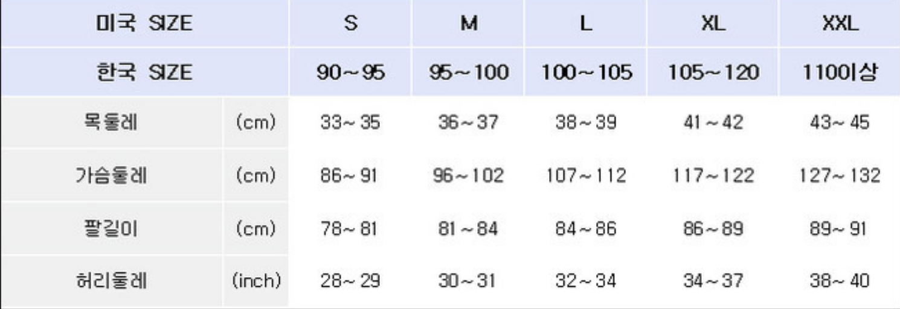
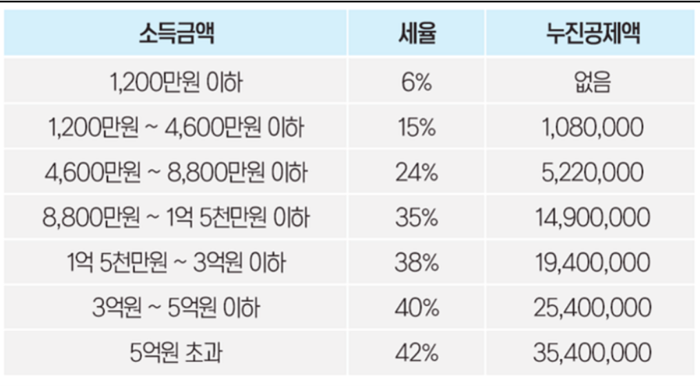

[pdf](../../pdf/JAVA240812simple254.pdf)
# 다음 문제를 풀어보자. 
```
문자열의 비교는 .equals를 사용해야 한다. 
복잡한 내용이 있는데 일단은 참조 데이터는 .equals로 비교한다고 생각하면된다. 
scanner를 이용해서 사용자 입력으로 얻어온 데이터는 모두 문자열이므로 .equal 를 사용해야 한다.
```
```java
String str1 = "Hello"; 
String str2 = "Hello";
if (str1.equals(str2) == true) {
    System.out.println("str1과 str2는 같습니다.");
} else {
    System.out.println("str1과 str2는 다릅니다.");
}
```

1. 왼쪽 이미지에서 색칠한 부분의 값들이 들어 왔을때 true가출력 되는 조건식을 가진 if문을 각각 3개 만들어 
색칠한 부분인지 아닌지 출력하는 프로그램 형태로 구현해 보자.
```java
java.util.Scanner sc = new java.util.Scanner(System.in);
int a = Integer.parseInt(sc.nextLine());
if(a > 14){
    System.out.println(true);
}
```
```java
java.util.Scanner sc = new java.util.Scanner(System.in);
int a = Integer.parseInt(sc.nextLine());
if(a <= 12 && a > 22){
    System.out.println(true);
}
```
```java
java.util.Scanner sc = new java.util.Scanner(System.in);
int a = Integer.parseInt(sc.nextLine());
if(a > 5 && a <= 9){
    System.out.println(true);
}
```
2. 왼쪽 이미지에서 색칠 안한 부분의 값들이 들어 왔을때 true가되는 조건식을 만들어 보자.
not연산자를 사용하는 방법과 not연산자를 사용하지 않는 방법 각각 2개씩 총 6개 if문 수식에 넣어서 만들어 보자.
```java
java.util.Scanner sc = new java.util.Scanner(System.in);
int a = Integer.parseInt(sc.nextLine());
if(!(a > 14)){
    System.out.println(true);
}
```
```java
java.util.Scanner sc = new java.util.Scanner(System.in);
int a = Integer.parseInt(sc.nextLine());
if(a <= 14){
    System.out.println(true);
}
```
```java
java.util.Scanner sc = new java.util.Scanner(System.in);
int a = Integer.parseInt(sc.nextLine());
if(!(a <= 12 && a > 22)){
    System.out.println(true);
}
```
```java
java.util.Scanner sc = new java.util.Scanner(System.in);
int a = Integer.parseInt(sc.nextLine());
if(a > 12 && a <= 22){
    System.out.println(true);
}
```
```java
java.util.Scanner sc = new java.util.Scanner(System.in);
int a = Integer.parseInt(sc.nextLine());
if(!(a > 5 && a <= 9)){
    System.out.println(true);
}
```
```java
java.util.Scanner sc = new java.util.Scanner(System.in);
int a = Integer.parseInt(sc.nextLine());
if(a <= 5 && a > 9){
    System.out.println(true);
}
```
3. 입력받은 수가 3의 배수 이거나 7의 배수이면 ‘3또는 7의 배수’가 출력되고, 
2의 배수도 되고 5의 배수도 되면 ‘2와 5의 배수’를 출력하고 
두가지 경우 다 만족하면 2가지 다 출력하는 프로그램을 만들어 보자.
```java
java.util.Scanner sc = new java.util.Scanner(System.in);
int n = Integer.parseInt(sc.nextLine());
if(n % 3 == 0 || n % 7 == 0){
    System.out.println("3 또는 7의 배수");
}
if(n % 2 == 0 && n % 5 == 0){
    System.out.println("2 와 5의 배수");
}
```

4. 왼쪽 이미지는 하나의 점이 x,y좌표를 가질때 위치할 수 있는 장소를 4개로 구분한 것이다. 
```
x,y가 모두 양수이면 2번 위치에 점이 존재하게 될것이고
모두 음수이면 4번위치에 점이 위치하게 될것이다.
해당 점의 좌표를 입력받아 해당 점이 어느 위치에 있는지 출력해 보자. 
x,y축 위에 있을 때는 x,y축 위에 있다고 출력하면 된다.
```
```java
java.util.Scanner sc = new java.util.Scanner(System.in);
String input = sc.nextLine();
String side = "";
int x = Integer.parseInt(input.split(",")[0].trim());
int y = Integer.parseInt(input.split(",")[1].trim());

if(x == 0 && y == 0){
    side = "x,y축";
} else if(x == 0){
    side = "x축";
} else if(y == 0){
    side = "y축";
} else if(x < 0 && y > 0){
    side = "1번 위치";
} else if(x > && y > 0){
    side = "2번 위치";
} else if(x > 0 && y < 0){
    side = "3번 위치";
} else if(x < 0 && y < 0){
    side = "4번 위치";
} else {
    side = "null";
}
System.out.println(side + " 위에 있습니다.");
```
5. 버스요금계산하는 프로그램을 구현해 보자. 
```
15세 이하는 1300원 초과는 1600원이고 버스카드로 결제하면 100원 할인해 준다.
문자열을 boolean형으로 변경하는 방법은 다음과 같다.
Boolean a= Boolean.parseBoolean("true");
입력: 16엔터 true엔터
출력: 버스요금은 1500원 입니다.
```
```java
java.util.Scanner sc = new java.util.Scanner(System.in);
int age = Integer.parseInt(sc.nextLine());
boolean isCard = Boolean.parseBoolean(sc.nextLine());
int price = 0;
if(age <= 15){
    price = 1300;
} else {
    price = 1600;
}
if(isCard){
    price -= 100;
}
System.out.println("버스요금은 " + price + "원 입니다.");
```
6. 다음을 구현하려면 어떤문을 사용해야 하는지 고민해 보고 사용자 입력을 받아 결과가 출력되도록 구현해 보자. (if elseif ifelse 논리연산자)
```
a. 밥을 먹었으면 ‘밥을 먹었음’ 이 출력 되고 밥을 먹지 않았으면 아무것도 출력되지
않는 형태의 프로그램구현.
b. 빵을 먹었으면 ‘빵을 먹었음’이 출력되고 빵을 먹지 않았으면 ‘밥을 먹었음’이
출력되는 형태의 프로그램 구현.
c. 밥을 먹었으면 ‘밥을 먹었음’, 빵을 먹었으면 ‘빵을 먹었음’ 아무것도 먹지 않았으면
'아무것도 먹지 않음'이 이 출력 되도록 프로그램 구현.
d. 식사로 ‘밥’과 ‘빵’이 있고 후식으로 국,우유, 아이스크림, 커피가 있는데 밥을 먹으면
국과 아이스크림중 하나를 빵을 먹으면 우유 커피 중 하나를 후식으로 먹을수 있도록 구현해 보자.
```
```java
java.util.Scanner sc = new java.util.Scanner(System.in);
boolean ateRice = false, ateBread = false;
boolean milk = false;
boolean coffee = false;
boolean soup = false;
boolean icecream = false;
boolean validInput = false;
System.out.println("밥을 먹었는가? (true/false)");
ateRice = Boolean.parseBoolean(sc.nextLine());
System.out.println("빵을 먹었는가? (true/false)");
ateBread = Boolean.parseBoolean(sc.nextLine());
if(!ateBread){
    ateRice = true;
}
if(!ateRice && !ateBread){
    System.out.println("아무것도 먹지 않음");
    System.out.println("후식을 고를 수 없음");
    return;
}
if(ateRice){
    System.out.println("밥을 먹었음");
    String input = sc.nextLine();
    do {
        System.out.println("국,아이스크림 중 하나를 고르세요.");
        switch(input.trim()){
            case "국": soup = true; validInput = true; break;
            case "아이스크림": icecream = true; validInput = true; break;
            default: System.out.println("Invalid input"); continue;
        }
        if(validInput){
            break;
        }
    } while(!(soup || milk || icecream || coffee) || !validInput);
}
if(ateBread){
    System.out.println("빵을 먹었음");
    String input = sc.nextLine();
    do {
        System.out.println("우유,커피 중 하나를 고르세요.");
        switch(input.trim()){
            case "우유": milk = true; validInput = true; break;
            case "커피": coffee = true; validInput = true; break;
            default: System.out.println("Invalid input"); continue;
        }
        if(validInput){
            break;
        }
    } while(!(soup || milk || icecream || coffee) || !validInput);
}
System.out.println("선택한 후식 : " + input);
```
7. 다음과 같이 기술하면 오늘의 요일이 i에 숫자로 들어간다. 
```
i가 7일 경우 일요일이고 월화수목금토일은 1234567과 같다. 
i값을 가지고 오늘의 요일을 출력하는 프로그램을 만들어 보자.
```
```java
//빨간줄에 마우스를 올리면 임포트 할 패키지가 뜬다.
//잘확인해서 해당 클래스를 클릭해서 자동으로 임포트하자.
LocalDateTime now = LocalDateTime.now();
System.out.println(now);//현재시간 출력
DayOfWeek dayOfWeek = now.getDayOfWeek();
//1 (월요일)부터 7 (일요일)까지의 값을 가집니다.
int i = dayOfWeek.getValue();
System.out.println(i);
```
```java
LocalDateTime now = LocalDateTime.now();
System.out.println(now);//현재시간 출력
DayOfWeek dayOfWeek = now.getDayOfWeek();
//1 (월요일)부터 7 (일요일)까지의 값을 가집니다.
int i = dayOfWeek.getValue();
String w = "";
switch(i){
    case 1: w = "월"
    case 2: w = "화";
    case 3: w = "수";
    case 4: w = "목";
    case 5: w = "금";
    case 6: w = "토";
    case 7: w = "일";
}
System.out.println(w + "요일");
```
8. 한국사이즈를 입력받아 미국사이즈로 출력하시오.

```java
java.util.Scanner sc = new java.util.Scanner(System.in);
int kor_size = Integer.parseInt(sc.nextLine());
String us_size = "";
if(kor_size >= 90 && kor_size < 95){
    us_size = "S";
} else if(kor_size >= 95 && kor_size < 100){
    us_size = "M";
} else if(kor_size >= 100 && kor_size < 105){
    us_size = "L";
} else if(kor_size >= 105 && kor_size < 110){
    us_size = "XL";
} else if(kor_size >= 110){
    us_size = "XXL";
} else {
    us_size = "해당하는 사이즈가 없습니다.";
}
System.out.println(us_size);
```
9. java,html,db과목의 점수를 입력받아 
평균이 60점 이상이면 합격, 
평균이 60점 미만이면 불합격, 
40점 이하인 과목이 하나라도 있으면 과락이 출력되도록 프로그램을 구현해 보자. 
최종 결과 화면은 다음과 같다. 
```
java 35 과락,
html 10과락,
db 20과락 
또는 평균 40으로 60점미만 불합격 
또는 과락 없이 평균 60이상 합격이 
출력된다.
```
```java
java.util.Scanner sc = new java.util.Scanner(System.in);
int java = Integer.parseInt(sc.nextLine());
int html = Integer.parseInt(sc.nextLine());
int db = Integer.parseInt(sc.nextLine());
if(java <= 40){
    System.out.println("java " + java + " 과락");
}
if(html <= 40){
    System.out.println("html " + html + " 과락");
}
if(db <= 40){
    System.out.println("db " + db + " 과락");
}
if(((java + html + db) / 3) >= 60){
    System.out.println("합격");
} else {
    System.out.println("불합격");
}
```
10. 왼쪽은 비만도 산출식이다. 
사용자 입력을 받아 결과가 아래 표와 같은 분류가 나오도록 프로그램을 구현하여라.


```java
java.util.Scanner sc = new java.util.Scanner(System.in);
System.out.println("나이를 입력하세요.");
int age = Integer.parseInt(sc.nextLine());
String result = "";
String grade = "";
if(age > 7 && age < 20){
    grade = "초중고";
} else if(age > 19){
    grade = "성인";
}
System.out.println("키를 입력하세요.");
int height = Integer.parseInt(sc.nextLine());
System.out.println("몸무게를 입력하세요.");
int weight = Integer.parseInt(sc.nextLine());
int bmi = (int)((weight / (double)(height - 100) * 0.9)) * 100);
switch(grade){
    case "초중고": 
        if(bmi < 95){
            result = "체중 미달";
        } else if(bmi <= 95 && bmi < 120){
            result = "정상";
        } else if(bmi <= 120 && bmi < 130)}{
            result = "경도 비만";
        } else if(bmi <= 130 && bmi < 150){
            result = "중도 비만";
        } else if(bmi >= 150){
            result = "고도 비만";
        } else {
            System.out.println("해당 분류가 없습니다.");
        }
        break;
    case "성인": 
        if(bmi < 100){
            result = "체중 미달";
        } else if(bmi <= 100 && bmi < 110){
            result = "정상";
        } else if(bmi <= 110 && bmi < 120)}{
            result = "과체중";
        } else if(bmi <= 120 && bmi < 150){
            result = "비만";
        } else if(bmi >= 150){
            result = "고도 비만";
        } else {
            System.out.println("해당 분류가 없습니다.");
        }
    default: System.out.println("유효하지 않은 나이입니다."); return;
}
System.out.println("")
```
11. 다음 표를 확인하여 사용자가 알고 있는 신체사이즈중 하나를 입력받아 해당 미국사이즈와 한국사이즈를 출력하시오. 
겹치는 부분은 본인이 원하는 쪽으로 해석 해서 출력하자. 
명확하지 않은 경계는 본인이 적절히 결정하자.

```java
java.util.Scanner sc = new java.util.Scanner(System.in);
boolean s = false;
boolean m = false;
boolean l = false;
boolean xl = false;
boolean xxl = false;

int neck = 0, chest = 0, arm = 0,waist = 0;
do {
    do {
        try {
            System.out.println("목 둘레를 입력 하세요.");
            neck = Integer.parseInt(sc.nextLine());
            System.out.println("가슴 둘레를 입력 하세요.");
            chest = Integer.parseInt(sc.nextLine());
            System.out.println("팔 길이를 입력 하세요.");
            arm = Integer.parseInt(sc.nextLine());
            System.out.println("허리 둘레를 입력 하세요.");
            waist = Integer.parseInt(sc.nextLine());
            if(
                !(((neck > 32 && neck < 36) || 
                (neck > 35 && neck < 38) ||
                (neck > 37 && neck < 40) ||
                (neck > 40 && neck < 43) ||
                (neck > 42 && neck < 46)) && 
                ((chest > 85 && chest < 92) ||
                (chest > 95 && chest < 103) ||
                (chest > 106 && chest > 113) ||
                (chest > 116 && chest < 123) ||
                (chest > 126 && chest < 133)) &&
                ((arm > 75 && arm < 92) ||
                (arm > 95 && arm < 103) ||
                (arm > 106 && arm < 113) ||
                (arm > 117 && arm < 123) ||
                (arm > 126 && arm < 133)) && 
                ((waist > 27 && waist < 30) || 
                (waist > 29 && waist < 32) ||
                (waist > 31 && waist < 35) ||
                (waist > 33 && waist < 38) ||
                (waist > 37 && waist < 41)))
            ) {
                System.out.println("맞는 사이즈가 없습니다.");
                continue;
            }
        } catch(Exception e){
            System.out.println("유효한 값을 입력하세요.");
            continue;
        }
    } while(
        !(((neck > 32 && neck < 36) || 
        (neck > 35 && neck < 38) ||
        (neck > 37 && neck < 40) ||
        (neck > 40 && neck < 43) ||
        (neck > 42 && neck < 46)) && 
        ((chest > 85 && chest < 92) ||
        (chest > 95 && chest < 103) ||
        (chest > 106 && chest > 113) ||
        (chest > 116 && chest < 123) ||
        (chest > 126 && chest < 133)) &&
        ((arm > 75 && arm < 92) ||
        (arm > 95 && arm < 103) ||
        (arm > 106 && arm < 113) ||
        (arm > 117 && arm < 123) ||
        (arm > 126 && arm < 133)) && 
        ((waist > 27 && waist < 30) || 
        (waist > 29 && waist < 32) ||
        (waist > 31 && waist < 35) ||
        (waist > 33 && waist < 38) ||
        (waist > 37 && waist < 41)))
    );
    if(neck > 32 && neck < 36){
        s = true;
    }
    if(neck > 35 && neck < 38){
        m = true;
    }
    if(neck > 37 && neck < 40){
        l = true;
    }
    if(neck > 40 && neck < 43){
        xl = true;
    }
    if(neck > 42 && neck < 46){
        xxl = true;
    }
    if(chest > 85 && chest < 92){
        s = true;
    }
    if(chest > 95 && chest < 103){
        m = true;
    }
    if(chest > 106 && chest > 113){
        l = true;
    }
    if(chest > 116 && chest < 123){
        xl = true;
    }
    if(chest > 126 && chest < 133){
        xxl = true;
    }
    if(arm > 75 && arm < 92){
        s = true;
    }
    if(arm > 95 && arm < 103){
        m = true;
    }
    if(arm > 106 && arm < 113){
        l = true;
    }
    if(arm > 117 && arm < 123){
        xl = true;
    }
    if(arm > 126 && arm < 133){
        xxl = true;
    }
    if(waist > 27 && waist < 30){
        s = true;
    }
    if(waist > 29 && waist < 32){
        m = true;
    }
    if(waist > 31 && waist < 35){
        l = true;
    }
    if(waist > 33 && waist < 38){
        xl = true;
    }
    if(waist > 37 && waist < 41){
        xxl = true;
    }
    if(xxl){
        System.out.println("XXL");
        System.out.println("110이상");
    } else if(xl){
        System.out.println("XL");
        System.out.println("105 ~ 120");
    } else if(l){
        System.out.println("L");
        System.out.println("100 ~ 105");
    } else if(m){
        System.out.println("M");
        System.out.println("95 ~ 100");
    } else if(s){
        System.out.println("S");
        System.out.println("90 ~ 95");
    } else {
        System.out.println("맞는 사이즈가 없습니다.");
        continue;
    }
    if(
        !(((neck > 32 && neck < 36) || 
        (neck > 35 && neck < 38) ||
        (neck > 37 && neck < 40) ||
        (neck > 40 && neck < 43) ||
        (neck > 42 && neck < 46)) && 
        ((chest > 85 && chest < 92) ||
        (chest > 95 && chest < 103) ||
        (chest > 106 && chest > 113) ||
        (chest > 116 && chest < 123) ||
        (chest > 126 && chest < 133)) &&
        ((arm > 75 && arm < 92) ||
        (arm > 95 && arm < 103) ||
        (arm > 106 && arm < 113) ||
        (arm > 117 && arm < 123) ||
        (arm > 126 && arm < 133)) && 
        ((waist > 27 && waist < 30) || 
        (waist > 29 && waist < 32) ||
        (waist > 31 && waist < 35) ||
        (waist > 33 && waist < 38) ||
        (waist > 37 && waist < 41)))
    ) {
        System.out.println("맞는 사이즈가 없습니다.");
        continue;
    }
} while(
    !(((neck > 32 && neck < 36) || 
    (neck > 35 && neck < 38) ||
    (neck > 37 && neck < 40) ||
    (neck > 40 && neck < 43) ||
    (neck > 42 && neck < 46)) && 
    ((chest > 85 && chest < 92) ||
    (chest > 95 && chest < 103) ||
    (chest > 106 && chest > 113) ||
    (chest > 116 && chest < 123) ||
    (chest > 126 && chest < 133)) &&
    ((arm > 75 && arm < 92) ||
    (arm > 95 && arm < 103) ||
    (arm > 106 && arm < 113) ||
    (arm > 117 && arm < 123) ||
    (arm > 126 && arm < 133)) && 
    ((waist > 27 && waist < 30) || 
    (waist > 29 && waist < 32) ||
    (waist > 31 && waist < 35) ||
    (waist > 33 && waist < 38) ||
    (waist > 37 && waist < 41)))
);
```
12. 다음과 같이 실행되는 계산기 프로그램을 만들어보자. 
```
첫번째수 입력
5
연산자선택 
출력
1. +2. - 3. * 4. /
입력
3 
두번째수 입력
12 
출력
5*12=60 입니다.
```
```java
java.util.Scanner sc = new java.util.Scanner(System.in);
int first = 0,second = 0,result = 0,select = 0;
String _select = "";
do {
    try {
        System.out.println("첫번째 수 입력");
        first = Integer.parseInt(sc.nextLine());
        break;
    } catch (Exception e){
        System.out.println("유효한 숫자를 입력하십시오.");
        continue;
    }
} while (true);
do {
    try {
        System.out.println("연산자 선택");
        System.out.println("1. '+' 2. '-' 3. '*' 4. '/'");
        select = Integer.parseInt(sc.nextLine());
        switch(select){
            case 1: _select = "+"; break;
            case 2: _select = "-"; break;
            case 3: _select = "*"; break;
            case 4: _select = "/"; break;
            default: System.out.println("연산자의 번호가 잘못 입력 되었습니다."); continue;
        }
    } catch(Exception e) {
        System.out.println("유효한 번호를 입력하십시오.");
        continue;
    }
} while (!(select > 0 && select < 5));
do {
    try {
        System.out.println("두번째 수 입력");
        second = Integer.parseInt(sc.nextLine());
        break;
    } catch(Exception e){
        System.out.println("유효한 숫자를 입력하십시오.");
        continue;
    }
} while (true);
switch(select){
    case 1: result = first + second; break;
    case 2: result = first - second; break;
    case 3: result = first * second; break;
    case 4: result = first / second; break;
}
System.out.println(first + " " + _select + " " + second + " = " + result + " 입니다.");
```
13. 가위,바위,보 문자열중 하나를 랜덤하게 화면에 출력하는 프로그램을 구현해보자.
하나를 내는 것 처럼 구현 하려면 0,1,2 3개의 수를 랜덤하게 리턴하게 만든 다음 가위,바위,보 3개에 1:1 매핑하면 된다.
```java
java.util.Scanner sc = new java.util.Scanner(System.in);
java.util.Random random = new java.util.Random();
int a = random.nextInt(3);
String me = "";
String result = "";
switch(a){
    case 0: me = "가위"; break;
    case 1: me = "바위"; break;
    case 2: me = "보"; break;
}
System.out.println(me);
```
14. 가위 바위 보 게임을 만들어서 이겼는지 졌는지 출력하는 프로그램을 만들어 보자.
```java
java.util.Scanner sc = new java.util.Scanner(System.in);
java.util.Random random = new java.util.Random();
int a = random.nextInt(3);
String me = "";
String result = "";
switch(a){
    case 0: me = "가위"; break;
    case 1: me = "바위"; break;
    case 2: me = "보"; break;
}
String you = sc.nextLine();
if(me.equals("가위")){
    if(you.equals"가위")){
        result = "비겼습니다.";
    }
    if(you.equals("바위")){
        result = "비겼습니다.";
    }
    if(you.equals("보")){
        result = "졌습니다.";
    }
}
if(me.equals("바위")){
    if(you.equals("가위")){
        result = "졌습니다.";
    }
    if(you.equals("바위")){
        result = "비겼습니다.";
    }
    if(you.equals("보")){
        result = "이겼습니다.";
    }
}
if(me.equals("보")){
    if(you.equals("가위")){
        result = "이겼습니다.";
    }
    if(you.equals("바위")){
        result = "졌습니다.";
    }
    if(you.equals("보")){
        result = "비겼습니다.";
    }
}
System.out.println(result);
```
15. 6~10사이의 램덤한 수를 만들어 보자. 
```
총 수에 범위는 6,7,8,9,10 5개 이므로 랜덤 함수에 5를 곱하고 시작을 6부터 하니 더하기 6를 하면 될 것이다. 
제대로 동작하는지 확인해 보자.
```
```java
//answer
java.util.Random random = new java.util.Random();
int a = random.nextInt(4) + 6;
System.out.println(a);
```
```java
Random random = new Random();
int number = random.nextInt(10); // 0부터 9까지의 정수를 반환
```
```
● 매개변수를 통해 0 이상 10 미만의 정수를 반환할 수 있습니다.
● 예를 들어, random.nextInt(10)은 0부터 9까지의 랜덤한 정수를 반환합니다. (즉, 10상한값이 아니라 범위의 크기를 지정합니다.)
● 이 형태는 가장 많이 사용되며, 특정 범위의 양의 정수를 얻을 때 유용합니다.
● int randomNum = random.nextInt(3) + 5; //5,6,7를 얻을 수 있다.
```
15. 1~45까지의 수를 랜덤하게 만들어 3개의 수를 뽑은 다음 본인이 입력한 3개의 수와 몇개 같은지 확인하는 프로그램을 배열로 만들어 보자.
```java
java.util.Scanner sc = new java.util.Scanner(System.in);
java.util.Random random = new java.util.Random();
int count = 0;
int a = random.nextInt(44) + 1;
int b = random.nextInt(44) + 1;
int c = random.nextInt(44) + 1;
int d = Integer.parseInt(sc.nextLine());
int e = Integer.parseInt(sc.nextLine());
int f = Integer.parseInt(sc.nextLine());
if(a == d || b == d || c == d){
    count++;
}
if(a == e || b == e || c == e){
    count++;
}
if(a == f || b == f || c == f){
    count++;
}
System.out.println(count + "개 같습니다.");
```

16. 왼쪽표를 기본으로 본인이 낼 새금이 얼마인지 출력하는 프로그램을 구현해 보자. 
만약에 본인이 번돈이 1600만원 이라면 1200만원은 세율이 6%이고 나머지 400만원은 세율이 15%이다.
```java
java.util.Scanner sc = new java.util.Scanner(System.in);
long earn = Long.parseLong(sc.nextLine());
long under1200 = 0,under4600 = 0,under8800 = 0,under15000 = 0,under30000 = 0, under50000 = 0,over50000 = 0;
if(earn > 12000000l){
    under1200 = 12000000l;
    earn -= under1200;
} else if (earn == 0l) {
} else {
    under1200 = earn;
    earn = 0l;
}
if(earn > (46000000l - 12000000l)){
    under4600 = (46000000l - 12000000l);
    earn -= under4600;
} else if(earn == 0l) {
} else {
    under4600 = earn;
    earn = 0l;
}
if(earn > (88000000l - 46000000l)){
    under8800 = (88000000l - 46000000l);
    earn -= under8800;
} else if(earn == 0l){
} else {
    under8800 = earn;
    earn = 0l;
}
if(earn > (150000000l - 88000000l)){
    under15000 = (150000000l - 88000000l);
    earn -= under15000;
} else if(earn == 0){
} else {
    under15000 = earn;
    earn = 0;
}
if(earn > (300000000l - 150000000l)){
    under30000 = (300000000l - 150000000l);
    earn -= under30000;
} else if(earn == 0){
} else {
    under30000 = earn;
    earn = 0;
}
if(earn > (500000000l - 300000000l)){
    under50000 = (500000000l - 300000000l);
    earn -= under50000;
} else if(earn == 0){
} else {
    under50000 = earn;
    earn = 0;
}
if(earn > 500000000l){
    over50000 = earn;
    earn = 0;
}
long result = (under1200 * 6l / 100l) + (under4600 * 15l / 100l) + (under8800 * 24l / 100l) + (under15000 * 35l / 100l) + (under30000 * 38l / 100l) + (under50000 * 40l / 100l) + (over50000 * 42l / 100l);
System.out.println(result + "원");
```
