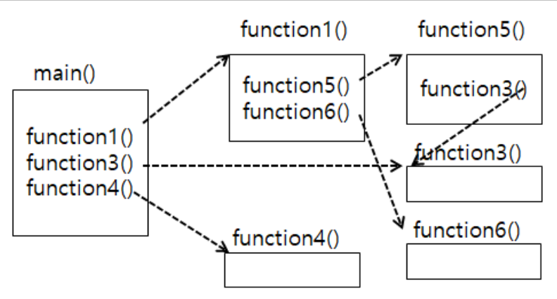

[pdf](../../pdf/JAVA240812_323_LOOP.pdf)
# 연습문제
1. 메소드란? 메소드를 크게 두부분으로 나누면 어떻게 구분되는가?
```
객체지향 언어에서 객체안의 함수를 메소드라고 부른다.
자바 코드에서 메소드 종류는 크게 인스턴스 메소드와 클래스 메소드 2가지가 있다.
```
2. 메소드를 사용하려면 두부분을 어떻게 사용해야 하는가?
```
선언부를 이용해서 선언한 다음 호출부를 이용해서 호출해야 동작한다.
```
3. 메소드 종류 2가지는 무엇이고 어떻게 구별하는가?
```
자바 코드에서 메소드 종류는 크게 인스턴스 메소드와 클래스 메소드 2가지가 있다.
static이 붙은 메소드를 클래스 메소드라고 하고 static이 없는 메소드를 인스턴스 메소드라고 한다.
```
4. 전역과 지역의 의미는?
```
지역은 특정 지역에서만 사용할 수 있는 것 이고 
전역은 모든 지역에서 사용할 수 있는 것 이다.
```
5. 메소드이름의 용도는? 매개변수의 용도는? return의 용도는?
```
메소드 이름은 여러 개의 메소드들 중 특정 메소드를 구분할 때 사용한다.
return의 용도는 값을 반환하기 위함
```
6. 함수 선언시 리턴될자료형의 용도는?
```
리턴될 자료형 위치에는 이때 생성된 데이터의 자료형을 기술한다.
```
7. 리턴될자료형의 자리에 올수 있는 키워드들 기술하고 어느때 오는지 이야기 해보자.
```
메소드가 실행되고 생성된 숫자가 3이면 3이 정수 이므로 int를 써 주면 된다. 
메소드가 실행하고 남은 데이터가 문자열이면 String을 써 주면 된다. 
메소드를 실행하고 남은 데이터가 실수 3.0이면 double을 써 주면 된다. 
여기에서는 정수이므로 int를 사용 하였다. 
혹시 리턴 될 값이 없다면 함수 앞의 리턴될 자료형에는 void라고 입력하면 된다.
```
8. 리턴될 자료형이 없으면 어떻게 하여야 하는가?
```
리턴될 자료형에 void를 입력
리턴 값을 비워둠
```
9. 오버로드란? 메소드 만드는 방법을 설명해 보자.
```
매개변수의 개수가 다르거나 종류가 달라 식별이 가능할 때 메소드 이름 중복을 허용 한다는 의미
```
```java
int sum(int a, int b){
    return a + b;
}
int sum(int a, int b, int c){
    return a + b + c;
}
```
10. 함수와 메소드의 차이는?재귀 호출이란? 무한 루프란?
```
객체 안에 존재하는 함수를 메소드라 부르고,
객체와 관계없이 독립적으로 사용되는 메소드를 함수라한다.
재귀호출이란 함수 자신을 다시 호출 하는 것을 의미한다
무한 루프란 프로그램이 종료되지 않고 계속 반복되는 것을 의미한다.
```
11. 지역변수의 사용 범위에 대하여 설명하시오.
```
특정 지역에서만 사용할 수 있다.
```

12. 왼쪽 이미지 처럼 동작하는 함수들을 만들어 보자.
```java
public class Main{
    void function1(){
        function5();
        function6();
    }
    void function3(){}
    void function4(){}
    void function5(){
        function3();
    }
    void function6(){}
    public static void main(String[] args){
        function1();
        function3();
        function4();
    }

}
```
