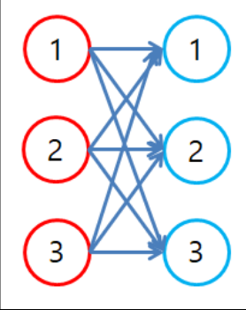

문제 1) 아래처럼 출력될 수 있도록 기찻길을 만들고 순서도를 만든 다음 코드를 작성해보자. 
구현이 어려우면 기찻길을 그려보고 하자. 그래도 어려우면 순서도를 그려보고 하자.
1. 
```
1**********************1
```
```java
System.out.print(1);
for(int i = 0;i < 22;i++){
    System.out.print("*");
}
System.out.print(1);
```
2. 
```
*****1*****1*****1*****1
```
```java
for(int i = 0;i < 4;i++){
    for(int j = 0;j < 5;j++){
        System.out.print("*");
    }
    System.out.print(1);
}
```
3. 
```
2*****2*****2*****2*****
```
```java
for(int i = 0;i < 4;i++){
    System.out.print(2);
    for(int j = 0;j < 5;j++){
        System.out.print("*");
    }
}
```
4. 
```
21**********************1
```
```java
System.out.print(2);
System.out.print(1);
for(int i = 0;i < 22;i++){
    System.out.print("*");
}
System.out.print(1);
```
5. 
```
1****21****21****21****2
```
```java
for(int i = 0;i < 4;i++){
    for(int j = 0;j < 2;j++){
        System.out.print(j + 1);
        if(j == 0){
            for(int l = 0;l < 4;l++){
                System.out.print("*");
            }
        }
    }
}
```
6. 
```
1111****21111****21111****21111****2
```
```java
char arr[] = {'1','*'};
for(int i = 0;i < 4;i++){
    for(int l = 0;l < arr.length;l++){
        for(int j = 0;j < 4;j++){
            System.out.print(arr[l]);
        }
    }
    System.out.print(2);
}
```
7. 
```
1111****22221111****22221111****2222
```
```java
char arr[] = {'1','*','2'};
for(int i = 0;i < arr.length;i++){
    for(int j = 0;j < 4;j++){
        System.out.print(arr[i]);
    }
}
```
8. 
```
111122223333444411112222333344441111222233334444
```
```java
for(int i = 0;i < 3;i++){
    for(int j = 0;j < 4;j++){
        for(int l = 0;l < 4;l++){
            System.out.print(j);
        }
    }
}
```

```
빨간공과 파란공을 모두 짝지어 찍는 프로그램을 구현해 보자. 
빨간공 1,2,3 3개와 파란공 1,2,3 3개를 모두 짝지어 보자. 
모든 결과를 출력해 보면 다음과 같은 결과를 가진다. 
```
```
(1,1), (1,2), (1,3), (2,1), (2,2), (2,3), (3,1), (3,2), (3,3), 
```
```java
for(int i = 0;i < 3;i++){
    for(int j = 0;j < 3;j++){
        System.out.print("(" + (i + 1) + "," + (j + 1) + "), ");
    }
}
```


for 문을 이용한 버블정렬
```java
int arr[] = {6,5,1,8,7,4,2,3};
for(int i = 0;i < arr.length - 1;i++){
    for(int j = 0;j < arr.length - 1 - i;j++){
        if(arr[j] > arr[j + 1]){
            int temp = arr[j];
            arr[j] = arr[j + 1];
            arr[j + 1] = temp;
        }
    }
}
```
