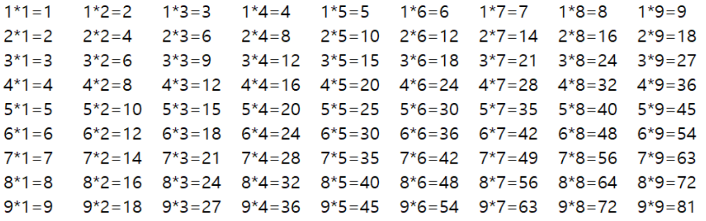
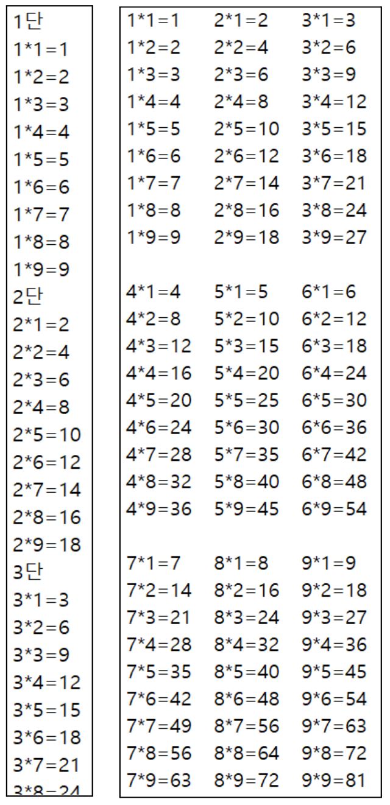

문제 2) 이미지와 같은 형태의 구구단을 출력할 수 있는 코드를 만들어 보자.
```java
for(int i = 1;i < 10;i++){
    for(int j = 1;j < 10;j++){
        System.out.print(i + "*" + j + "=" + (i * j) + "\t");
    }
    System.out.println();
}
```
```java
for(int i = 1;i < 10;i++){
    System.out.println(i + "단");
    for(int j = 1;j < 10;j++){
        System.out.println(i + "*" + j + "=" + (i * j));
    }
}
```
```java
for(int i = 1;(i + 2) < 10;i+=3){
    for(int j = 1;j < 10;j++){
        for(int l = i;l < (i + 3);l++){
            System.out.print(l + "*" + j + "=" + (l * j) + "\t");
        }
        System.out.println();
    }
    System.out.println();
}
```
