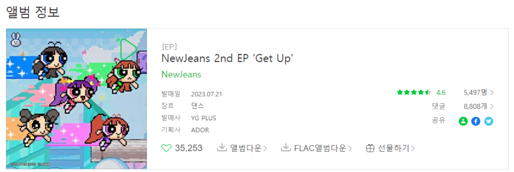

문제1) 다음중 잘못된 부분을 찾아서 올바르게 변경해보자.
```sql
insert into human values ('홍길남,31,156.4,to-date(2001:02:03 00:00:00','YYYY:MM:DD HH24:MI:SS'));
```
```sql
insert into human values ('홍길남',31,156.4,to_date('2001:02:03 00:00:00','YYYY:MM:DD HH24:MI:SS'));
```
문제2) drop table human; 와 같은 sql 작업후 rollback; 가능한가?
```
rollback은 insert update delete 같은 데이터를 조작할때 사용 가능하다.
```
```
불가능 하다.
```
문제3) 다음 데이터를 저장할 수 있는 테이블을 만들고 CRUD 작업 가능한 sql를 만들어 보자. 테이블,컬럼명을 한글이 아닌 영어로 만들어 사용하자.
```
테이블명: 화학물질 재고 현황
```
|화학물질명|재고량(kg)|최소재고량(kg)|입고일자|
|---|---|---|---|
|아세트산|500|100|2023-03-15|
|수산화나트륨|300|50|2023-04-20|
|황산|200|80|2023-05-10|
|염화칼슘|400|120|2023-06-05|
|염산|600|200|2023-07-08|
```sql
create table chemical_quantity_status(
name nvarchar2(100),
quantity number(38),
max_quantity number(38),
income_date date
);
insert into chemical_quantity_status values ('아세트산',500,100,to_date('2023-03-15','YYYY-MM-DD'));
insert into chemical_quantity_status values ('수산화나트륨',300,50,to_date('2023-04-20','YYYY-MM-DD'));
insert into chemical_quantity_status values ('황산',200,80,to_date('2023-05-10','YYYY-MM-DD'));
insert into chemical_quantity_status values ('아세트산',400,120,to_date('2023-06-05','YYYY-MM-DD'));
insert into chemical_quantity_status values ('아세트산',600,200,to_date('2023-07-08','YYYY-MM-DD'));
```
문제4) 다음 데이터를 저장할 수 있는 테이블을 만들고 CRUDE 작업 가능한 sql를 만들어 보자.
```
테이블명: 도서 대출 기록
```
|도서명|저자|대출일|반납예정일|실제반납일|연체료(원)|
|---|---|---|---|---|---|
|죄와 벌|톨스토이|2023-03-01|2023-03-15|2023-03-20|500|
|해리포터와 마법사의 돌|J.K.롤링|2023-04-10|2023-04-24|2023-04-23|0|
|반지의 제왕|J.R.R.톨킨|2023-05-15|2023-05-29|2023-05-29|0|
|빨간 머리 앤|L.M.몽고메리|2023-06-20|2023-07-04|-|-|
|산삼|박완서|2023-07-10|2023-07-24|-|-|
```sql
create table book_borrow_list(
title nvarchar2(100),
author nvarchar2(100),
borrow_date date,
expire_date date,
return_date date,
fee number(38)
);
insert into book_borrow_list values ('죄와 벌','톨스토이',to_date('2023-03-01','YYYY-MM-DD'),to_date('2023-03-15','YYYY-MM-DD'),to_date('2023-03-20','YYYY-MM-DD'),500);
insert into book_borrow_list values ('해리포터와 마법사의 돌','J.K.롤링',to_date('2023-04-10','YYYY-MM-DD'),to_date('2023-04-24','YYYY-MM-DD'),to_date('2023-04-23','YYYY-MM-DD'),0);
insert into book_borrow_list values ('반지의 제왕','J.R.R.톨킨',to_date('2023-05-15','YYYY-MM-DD'),to_date('2023-05-29','YYYY-MM-DD'),to_date('2023-05-29','YYYY-MM-DD'),0);
insert into book_borrow_list values ('빨간 머리 앤','L.M.몽고메리',to_date('2023-06-20','YYYY-MM-DD'),to_date('2023-07-04','YYYY-MM-DD'),NULL,NULL);
insert into book_borrow_list values ('산삼','박완서',to_date('2023-07-10','YYYY-MM-DD'),to_date('2023-07-24','YYYY-MM-DD'),NULL,NULL);
```
문제5) 다음을 테이블로 만들어 보자.
```
테이블명: 고객 주문 기록
```

|주문번호|고객명|주문일|상품명|수량|상품가격(원)|주문금액(원)|
|-|-|-|-|-|-|-|
|2023001|홍길동|2023-03-05|노트북|1|1,200,000|1,200,000|
|2023002|김영희|2023-03-08|스마트폰|2|800,000|1,600,000|
|2023003|박철수|2023-03-15|헤드폰|3|150,000|450,000|
|2023004|이지훈|2023-03-20|마우스|1|30,000|30,000|
|2023005|김민지|2023-03-25|키보드|1|50,000|50,000|
```sql
create table order_list(
order_id number(7),
name nchar(10),
order_date date,
product_name nvarchar2(100),
qty number(38),
product_price number(38),
total_price number(38)
);
insert into order_list values (2023001,'홍길동',to_date('2023-03-05','YYYY-MM-DD'),'노트북',1,1200000,1200000);
insert into order_list values (2023002,'김영희',to_date('2023-03-08','YYYY-MM-DD'),2,800000,1600000);
insert into order_list values (2023003,'박철수',to_date('2023-03-15','YYYY-MM-DD'),3,150000,450000);
insert into order_list values (2023004,'이지훈',to_date('2023-03-20','YYYY-MM-DD'),1,30000,30000);
insert into order_list values (2023005,'김민지',to_date('2023-03-25','YYYY-MM-DD'),1,50000,50000);
```
문제6) 다음 이미지를 보고 데이터 베이스를 만들어 보자. 힌트는 새로운 데이터로 이미지의 내용을 변경하였을때 바뀌어야 하는 부분과 바뀌지 않는 부분을 확인하여 바뀌는 부분을 데이터 베이스로 만들면된다.

```sql
create table game(
game_status nvarchar2(100),
team_a nvarchar2(100),
team_b nvarchar2(100),
team_a_score number(38),
team_b_score number(38),
data_at date
);
insert into game values (
'경기 종료',
'LG트윈스',
'kt wiz',
3,
4,
to_date('2023-07-26 18:30','YYYY-MM-DD HH24:MI')
);
```
문제7)다음 이미지를 보고 데이터 베이스를 만들어 보자.

```sql
create table album_info(
title nvarchar2(100),
artist nvarchar2(100),
release_date date,
genre nvarchar2(100)
);
insert into album_info values (
'NewJeans 2nd EP ''Get Up''',
'NewJeans',
to_date('2023.07.21','YYYY.MM.DD'),
'댄스'
);
```
문제8) 우리 주변의 객체중 우리가 배운 자료형을 모두 사용하는 속성을 가진 객체를 선택해서 테이블을 만들어 데이터를 넣어 보자.
