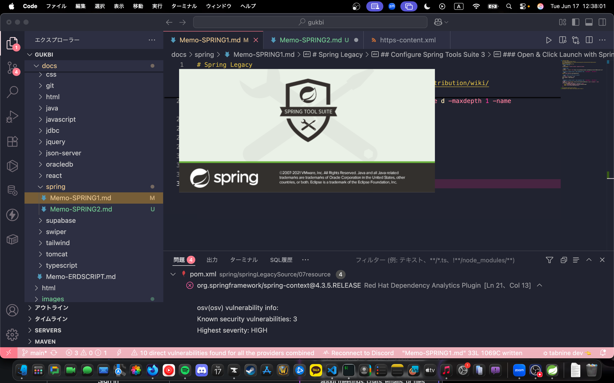

# Spring Legacy
## Install Spring Tools Suite 3
- jdk 11 recommended
### [Installation](https://github.com/spring-attic/toolsuite-distribution/wiki/Spring-Tool-Suite-3)

#### For Apple Sillicon Mac
- Install Rosetta2
```bash
softwareupdate --install-rosetta --agree-to-license
```
- Install brew
```bash
/bin/bash -c "$(curl -fsSL https://raw.githubusercontent.com/Homebrew/install/HEAD/install.sh)"
```
- Add below to default shell's read command(as like, `/etc/bashrc`, `/etc/zshrc`)
```bash
export PATH="${PATH}:/opt/homebrew/bin"
```
- Install temurin via brew with rosetta2
```bash
arch -x86_64 /bin/bash <<'EOF'
brew install --cask temurin@11
EOF
```
- Add below to default shell's read command(as like, `/etc/bashrc`, `/etc/zshrc`)
```bash
TEMURIN_JAVA_PATH="$(find /Library/Java/JavaVirtualMachines -type d -maxdepth 1 -name 'temurin-*' | head -n 1)"
if ( ls "${TEMURIN_JAVA_PATH}" &> /dev/null );then
	export JAVA_HOME="${TEMURIN_JAVA_PATH}/Contents/Home"
	export PATH="${JAVA_HOME}/bin:$PATH"
fi
```
## Configure Spring Tools Suite 3
### Open Spring Tools Suite 3

### Click Launch

### Wait for loading

### Close at dashboard loaded

### Configure metadata
```bash
cd "$HOME/Documents/workspace-sts-3.9.18.RELEASE/"
# Remove metadata
rm -rf ./.metadata
# Remove metadata.zip
rm ./metadata.zip
# Use curl
curl -LsSf https://raw.githubusercontent.com/TaYaKi71751/STS3-metadata/refs/heads/main/metadata.zip -o metadata.zip
# Or wget
wget https://raw.githubusercontent.com/TaYaKi71751/STS3-metadata/refs/heads/main/metadata.zip
# Unzip metadata
unzip metadata.zip
```