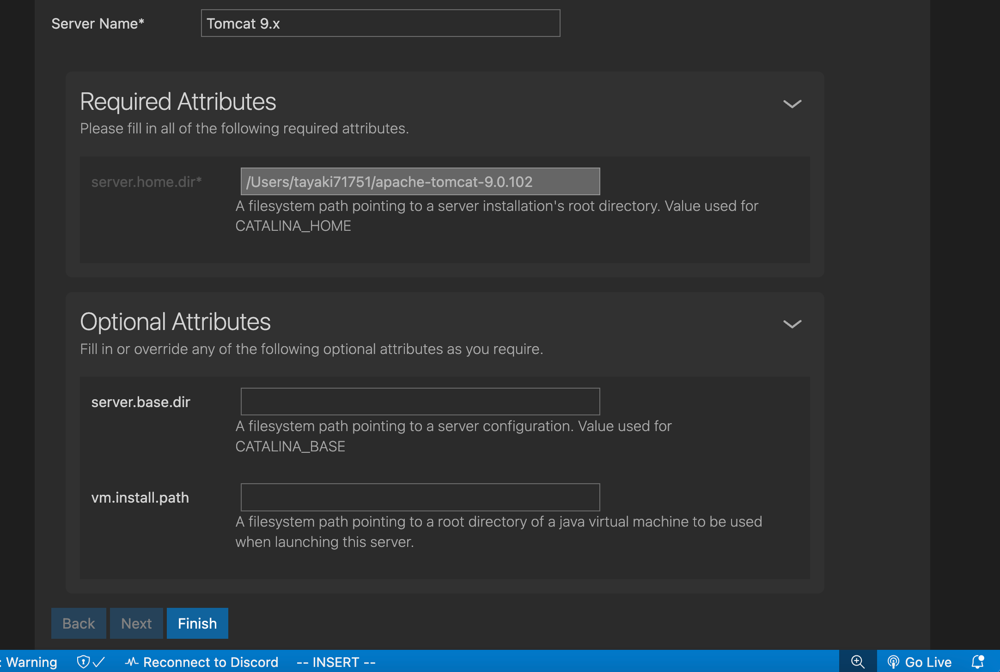

# Tomcat
## Install brew
```shell
/bin/bash -c "$(curl -fsSL https://raw.githubusercontent.com/Homebrew/install/HEAD/install.sh)"
```
## Install vscode
```shell
brew install visual-studio-code
```
## Install openjdk
```shell
brew install openjdk
echo 'export JAVA_HOME="/opt/homebrew/opt/openjdk"' >> ~/.bashrc
echo 'export JAVA_HOME="/opt/homebrew/opt/openjdk"' >> ~/.zshrc
export JAVA_HOME="/opt/homebrew/opt/openjdk"
```
## Install maven
```shell
brew install maven
```
## Install watchexec
```shell
brew install watchexec
```
## Install VSCode Extensions
https://marketplace.visualstudio.com/items?itemName=samuel-weinhardt.vscode-jsp-lang

https://marketplace.visualstudio.com/items?itemName=vscjava.vscode-java-pack

https://marketplace.visualstudio.com/items?itemName=redhat.vscode-rsp-ui

https://marketplace.visualstudio.com/items?itemName=redhat.vscode-community-server-connector

## [mvn create project](https://maven.apache.org/archetypes/maven-archetype-webapp/)
```shell
mvn archetype:generate -DarchetypeGroupId="org.apache.maven.archetypes" -DarchetypeArtifactId="maven-archetype-webapp" -DarchetypeVersion="1.5"
```
- `groupId`: jsp080
- `artifactId`: jsp080
- `version`: 
- `package`: com.the.ex
## Add servlet dependency to pom.xml
```xml
    <dependency>
      <groupId>javax.servlet</groupId>
      <artifactId>javax.servlet-api</artifactId>
      <version>4.0.1</version>
      <scope>provided</scope>
  	</dependency>
```
## Add server
### Click Add button side of SERVERS tab

### Select No to use local tomcat

### Scroll down, then click Finish button

### Auto Build
```shell
watchexec -r -e java,xml,jsp,html,css,js -i 'target/**/*.html' -i 'target/**/*.jsp' -i 'target/**/*.js' -i 'target/**/*.css' -i 'target/**/*.xml' -i 'target/**' -i 'target' -- mvn clean package
```
### Right click on `<PROJECT_NAME>/target/<PROJECT_NAME>.war`, then click `Run on Server`