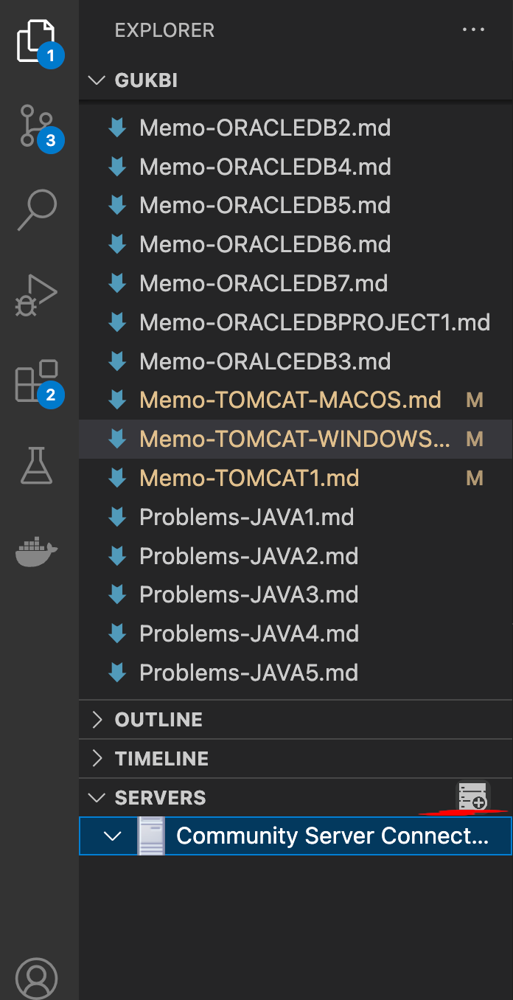
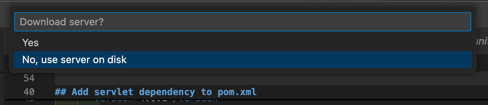
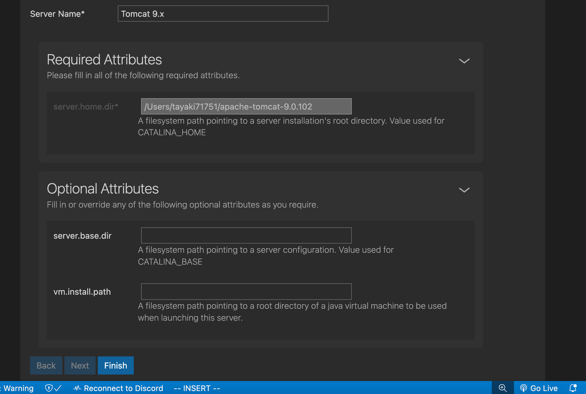

# Tomcat
## Install chocolatey
```powershell
# !! IMPORTANT !! RUN AS ADNIMISTRATOR
Set-ExecutionPolicy Bypass -Scope Process -Force; [System.Net.ServicePointManager]::SecurityProtocol = [System.Net.ServicePointManager]::SecurityProtocol -bor 3072; iex ((New-Object System.Net.WebClient).DownloadString('https://community.chocolatey.org/install.ps1'))
```
Read https://chocolatey.org/install
## Install vscode
```powershell
# !! IMPORTANT !! RUN AS ADNIMISTRATOR
choco install vscode --force -y
```
## Install openjdk
```powershell
# !! IMPORTANT !! RUN AS ADNIMISTRATOR
choco install openjdk --force -y
```
## Install maven
```powershell
# !! IMPORTANT !! RUN AS ADNIMISTRATOR
choco install maven --force -y
```
## Install watchexec
```powershell
# !! IMPORTANT !! RUN AS ADNIMISTRATOR
choco install watchexec --force -y
```
## Install VSCode Extensions
https://marketplace.visualstudio.com/items?itemName=samuel-weinhardt.vscode-jsp-lang

https://marketplace.visualstudio.com/items?itemName=vscjava.vscode-java-pack

https://marketplace.visualstudio.com/items?itemName=redhat.vscode-rsp-ui

https://marketplace.visualstudio.com/items?itemName=redhat.vscode-community-server-connector

## [mvn create project](https://maven.apache.org/archetypes/maven-archetype-webapp/)
```powershell
mvn archetype:generate -DarchetypeGroupId="org.apache.maven.archetypes" -DarchetypeArtifactId="maven-archetype-webapp" -DarchetypeVersion="1.5"
```
- `groupId`: jsp080
- `artifactId`: jsp080
- `version`: 
- `package`: com.the.ex
## Add servlet dependency to pom.xml
```xml
    <dependency>
      <groupId>javax.servlet</groupId>
      <artifactId>javax.servlet-api</artifactId>
      <version>4.0.1</version>
      <scope>provided</scope>
  	</dependency>
```
## Add server
### Click Add button side of SERVERS tab

### Select No to use local tomcat

### Scroll down, then click Finish button

### Auto Build
```powershell
watchexec -r -e java,xml,jsp,html,css,js -i 'target/**/*.html' -i 'target/**/*.jsp' -i 'target/**/*.js' -i 'target/**/*.css' -i 'target/**/*.xml' -i 'target/**' -i 'target' -- mvn clean package
```
### Right click on `<PROJECT_NAME>/target/<PROJECT_NAME>.war`, then click `Run on Server`